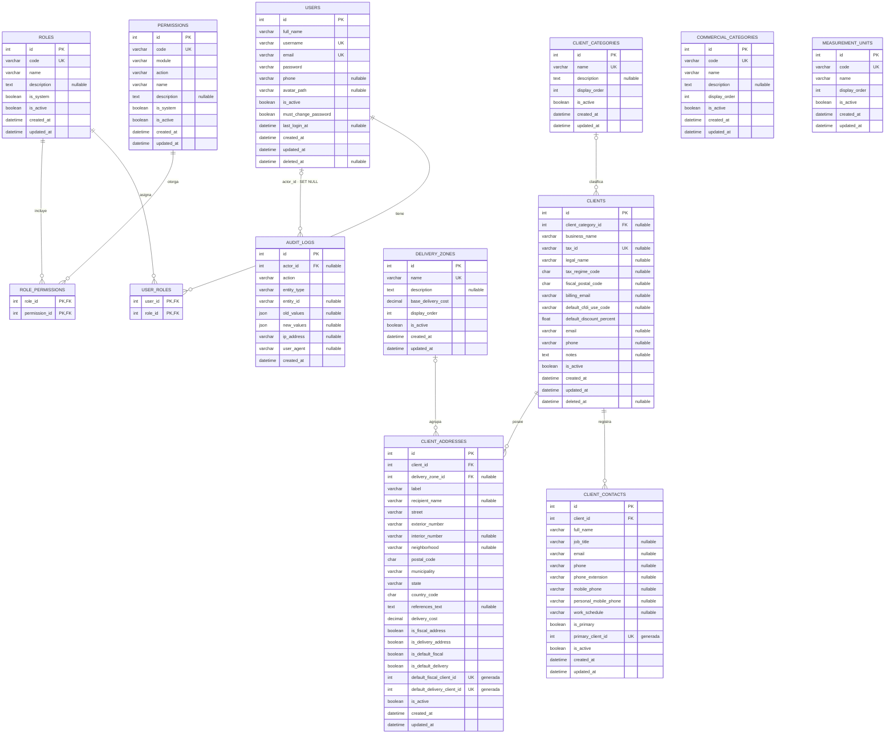

# PrintFlow — Contexto técnico integral

> Documento vivo del proyecto. Consolida el estado funcional y las decisiones confirmadas hasta el **25 de julio de 2026**. Úsalo como referencia antes de desarrollar, revisar, desplegar o modificar módulos.
>
> **Fuente de verdad de código:** el repositorio local `C:\PrintFlow` y su historial Git. Este documento no sustituye el código ni las migraciones; explica cómo están organizados y por qué. Las copias de archivos utilizadas para consolidarlo pueden corresponder a un momento anterior a las últimas correcciones indicadas en la sección [Cambios confirmados recientes](#cambios-confirmados-recientes).

---

## 1. Propósito y alcance

PrintFlow es una plataforma web interna para una empresa de impresión. Su objetivo es convertir el flujo comercial y operativo en un proceso trazable: catálogo de clientes, cotizaciones, órdenes, materiales, producción, usuarios y control administrativo.

El alcance comercial que originó el proyecto contempla:

- Cotizador con generación de PDF, envío por correo e historial.
- Órdenes de servicio y de trabajo, también descargables y notificables.
- Gestión de clientes, proveedores, servicios, operaciones, materiales con stock, equipos y usuarios.
- Trazabilidad interna de los trabajos de impresión por etapas, materiales y destino siguiente.
- Alertas, por ejemplo por bajo inventario.

**Estado de implementación confirmado:** el cimiento técnico, el acceso administrativo, la auditoría, clientes, contactos y direcciones ya existen y funcionan correctamente. Del catálogo de productos y servicios ya están terminadas las bases administrativas: **categorías comerciales** y **unidades de medida**, ambas con alta, edición, búsqueda, filtrado, estado y reordenamiento visual persistente. El siguiente bloque es el de **conceptos comerciales** y, después, sus reglas de precio.

---

## 2. Stack, entorno y decisiones base

| Área | Decisión vigente |
| --- | --- |
| Framework | Symfony **7.4.14 LTS**, aplicación server-rendered |
| PHP | Local: **8.2.31**. Producción Hostinger: **8.2.30** |
| Base de datos | MySQL **8.0.46** local; nombre actual: `printflow_app` |
| Zona de negocio | `America/Mexico_City` |
| Persistencia de fechas | UTC en MySQL y entidades; conversión a zona de negocio para filtros y presentación |
| Vista | Twig, Symfony Forms, Twig Components / UX y Stimulus |
| JavaScript/CSS | AssetMapper; Bootstrap 5, Bootstrap Icons, jQuery, Notyf, SweetAlert2 y SortableJS **locales**. CSS propio con tokens y componentes; no CDN como dependencia operativa |
| Sesión y seguridad | Symfony Security, sesiones, CSRF, rate limiter y RBAC por permisos almacenados en MySQL |
| ORM y esquema | Doctrine ORM + Doctrine Migrations; MySQL/InnoDB/utf8mb4 |
| Pruebas disponibles | PHPUnit, BrowserKit, CSS Selector y entorno `test` configurado |
| Despliegue previsto | Hostinger Business mediante SSH, Git y Composer; sin Docker |

### Identidad visual

- Marca principal: `#27F52E`.
- Hover: `#16C61D`.
- Activo: `#10A816`.
- Fondo suave de marca: `#E8FDEA`.
- Interfaz administrativa: escala de grises, acento verde, jerarquía sobria y componentes reutilizables.

No se debe crear un estilo aislado para cada pantalla. Los módulos nuevos deben construir sobre los tokens, layouts y componentes existentes.

---

## 3. Arquitectura funcional

La regla central es separar HTTP, validación, reglas de negocio y persistencia:

```text
Navegador / Twig
        │
        ▼
Controller ── autorización, request/response, CSRF, flashes
        │
        ▼
DTO + Form ── captura y validación de entrada
        │
        ▼
Manager / Application Service ── reglas de negocio + transacciones + auditoría
        │
        ▼
Entity + Repository ── modelo persistente y consultas especializadas
        │
        ▼
MySQL + AuditLog
```

### Responsabilidad de cada capa

| Capa | Debe hacer | No debe hacer |
| --- | --- | --- |
| Controller | Validar permiso, construir/recibir formulario, delegar, redirigir, mostrar flash | Reglas de negocio, SQL, `flush()` de lógica compleja |
| DTO | Transportar datos del caso de uso y declarar validaciones | Persistencia o autorización |
| Form Type | Definir campos, etiquetas, ayudas, opciones de UI | Regla de negocio transversal |
| Manager | Validar invariantes, coordinar repositorios, usar transacciones, registrar auditoría | Renderizar Twig o depender de detalles de ruta |
| Entity | Estado, normalización local, relaciones, timestamps y pequeñas invariantes | Recibir `Request`, consultar repositorios o generar respuestas |
| Repository | Consultas reutilizables, filtros y paginación | Cambios de negocio no ligados a una consulta |
| AuditLogger | Crear registros de auditoría saneados dentro de la transacción del caso de uso | Ejecutar `flush()` por sí mismo |

---

## 4. Estructura actual del repositorio

La siguiente estructura reúne el inventario confirmado y el lugar canónico para cada responsabilidad. `vendor/` y `var/` no se versionan como fuente y no son puntos de desarrollo.

```text
PrintFlow/
├── assets/
│   ├── app.js                           # Punto de entrada: importa CSS y Stimulus
│   ├── stimulus_bootstrap.js             # Registro de controladores Stimulus
│   ├── controllers/
│   │   ├── csrf_protection_controller.js # Protección complementaria de formularios
│   │   └── ui/
│   │       ├── confirm_action_controller.js
│   │       ├── flash_toast_controller.js
│   │       ├── password_visibility_controller.js
│   │       ├── sidebar_controller.js     # Apertura/cierre responsivo del sidebar
│   │       ├── sortable_controller.js    # Reordenamiento reutilizable con SortableJS
│   │       └── tooltip_controller.js
│   └── styles/
│       ├── app.css                       # Índice global de estilos
│       ├── foundation/
│       │   ├── tokens.css                # Colores, espaciado, fuentes y radios
│       │   ├── base.css                  # Base y normalización visual
│       │   └── bootstrap-overrides.css   # Ajustes globales de Bootstrap
│       ├── layout/
│       │   ├── public-shell.css          # Shell de pantallas públicas, como login
│       │   └── app-shell.css             # Grid autenticado, contenido y responsive
│       ├── components/
│       │   ├── button.css
│       │   ├── card.css
│       │   ├── flash.css
│       │   ├── form.css
│       │   ├── page-header.css
│       │   ├── sidebar.css
│       │   ├── sortable.css
│       │   ├── status-badge.css
│       │   ├── sweetalert.css
│       │   └── table.css
│       └── modules/                      # Estilos exclusivos solo si el módulo lo justifica
│           ├── audit-log/
│           ├── clients/
│           ├── dashboard/
│           ├── roles/
│           ├── security/
│           └── users/
├── config/
│   ├── packages/
│   │   ├── doctrine.yaml                 # Conexión y mapeo Doctrine
│   │   ├── doctrine_migrations.yaml      # Namespace y ruta de migraciones
│   │   ├── framework.yaml                # APP_SECRET, sesiones y entorno test
│   │   ├── security.yaml                 # Provider, firewall, login, logout y acceso
│   │   ├── twig.yaml                     # Configuración Twig
│   │   └── ...
│   ├── routes/                           # Rutas no definidas por atributos
│   ├── bundles.php
│   └── services.yaml                     # Servicios, autowiring y renderer de PDF
├── migrations/
│   ├── Version20260719164200.php         # Acceso, RBAC y auditoría inicial
│   ├── Version20260721223000.php         # Contactos de cliente y permisos asociados
│   ├── Version20260721224500.php         # Primera parte del lote de direcciones
│   ├── Version20260721230000.php         # Direcciones y permisos finales
│   ├── Version20260725163000.php         # Catálogo comercial, precios por cantidad y catalog.*
│   └── Version20260726113000.php         # Folio anual de cotizaciones y permisos PDF
├── public/
│   ├── index.php                         # Front controller Symfony
│   ├── build/                            # Assets publicados por AssetMapper
│   └── vendor/                           # Dependencias frontend locales, si aplica
├── src/
│   ├── Application/
│   │   ├── Access/
│   │   │   ├── RoleManager.php
│   │   │   └── UserManager.php
│   │   ├── Catalog/
│   │   │   ├── CommercialCategoryData.php
│   │   │   ├── CommercialCategoryManager.php
│   │   │   ├── MeasurementUnitData.php
│   │   │   ├── MeasurementUnitManager.php
│   │   │   └── ...                       # Productos/servicios, rangos y resolución de precio
│   │   ├── Clients/
│   │   │   ├── ClientAddressData.php
│   │   │   ├── ClientAddressManager.php
│   │   │   ├── ClientContactData.php
│   │   │   ├── ClientContactManager.php
│   │   │   ├── ClientData.php
│   │   │   └── ClientManager.php
│   │   └── Quotations/
│   │       ├── QuotationManager.php      # Borradores, snapshots, totales y emisión
│   │       └── ...                       # Datos y cálculos de cotización
│   ├── Command/
│   │   └── BootstrapSecurityCommand.php  # Bootstrap idempotente de roles/permisos/admin
│   ├── Controller/
│   │   ├── DashboardController.php
│   │   ├── SecurityController.php
│   │   └── Admin/
│   │       ├── Access/
│   │       │   ├── RoleController.php
│   │       │   └── UserController.php
│   │       ├── Audit/
│   │       │   └── AuditLogController.php
│   │       ├── Catalog/
│   │       │   └── ...                   # Categorías, unidades y productos/servicios
│   │       ├── Clients/
│   │       │   ├── ClientAddressController.php
│   │       │   ├── ClientContactController.php
│   │       │   └── ClientController.php
│   │       └── Quotations/
│   │           └── QuotationController.php # Borrador, emisión y descarga de PDF
│   ├── DTO/
│   │   └── Access/
│   │       ├── CreateRoleData.php
│   │       ├── CreateUserData.php
│   │       ├── ResetUserPasswordData.php
│   │       ├── UpdateRoleData.php
│   │       └── UpdateUserData.php
│   ├── Entity/
│   │   ├── Audit/
│   │   │   └── AuditLog.php
│   │   ├── Catalog/
│   │   │   └── {CommercialCategory, MeasurementUnit, CommercialItem, ItemPriceRule}.php
│   │   ├── Clients/
│   │   │   └── {Client, ClientContact, ClientAddress}.php
│   │   ├── Quotations/
│   │   │   └── {Quotation, QuotationItem}.php
│   │   └── Users/
│   │       └── {User, Role, Permission}.php
│   ├── EventSubscriber/
│   │   └── Security/
│   │       └── AuthenticationAuditSubscriber.php
│   ├── Form/
│   │   └── Admin/
│   │       ├── Access/                  # Formularios de usuarios y roles
│   │       ├── Catalog/                 # Categorías, unidades y productos/servicios
│   │       ├── Clients/                 # Cliente, contacto y dirección
│   │       └── Quotations/              # Formulario de cotización y sus partidas
│   ├── Repository/
│   │   ├── Audit/
│   │   │   └── AuditLogRepository.php
│   │   ├── Catalog/
│   │   │   └── ...                      # Consultas de categorías, unidades y conceptos
│   │   ├── Clients/
│   │   │   └── {Client, ClientContact, ClientAddress}Repository.php
│   │   ├── Quotations/
│   │   │   └── ...                      # Consultas de cotizaciones y partidas
│   │   └── Users/
│   │       └── {User, Role, Permission}Repository.php
│   ├── Security/
│   │   ├── UserChecker.php
│   │   └── Voter/
│   │       └── PermissionVoter.php
│   └── Service/
│       ├── Audit/
│       │   └── AuditLogger.php
│       └── Quotations/
│           ├── QuotationFolioGenerator.php # Consecutivo anual atómico MySQL
│           └── QuotationPdfRenderer.php    # PDF de cotización emitida con Dompdf
├── templates/
│   ├── base.html.twig                   # Documento HTML raíz y assets comunes
│   ├── dashboard/
│   │   └── index.html.twig
│   ├── form/
│   │   └── printflow_theme.html.twig    # Tema único de formularios
│   ├── layouts/
│   │   ├── app.html.twig                # Shell autenticado
│   │   └── public.html.twig             # Layout para login y páginas públicas
│   ├── partials/
│   │   ├── _app_header.html.twig
│   │   ├── _app_sidebar.html.twig       # Administración, Catálogos, Comercial y Control
│   │   └── _flash_messages.html.twig
│   ├── security/
│   │   └── login.html.twig
│   └── admin/
│       ├── access/
│       │   └── {users, roles}/          # Índice, alta, edición y restablecimiento
│       ├── audit/
│       │   └── logs/
│       │       └── index.html.twig
│       ├── catalog/
│       │   ├── categories/{index, form}.html.twig
│       │   ├── items/                   # Productos/servicios y sus reglas de precio
│       │   └── units/{index, form}.html.twig
│       ├── clients/
│       │   ├── {index, form}.html.twig
│       │   ├── addresses/{index, form}.html.twig
│       │   └── contacts/{index, form}.html.twig
│       └── quotations/
│           ├── _form.html.twig
│           ├── edit.html.twig
│           ├── index.html.twig
│           └── pdf.html.twig            # Documento Carta descargable
├── tests/                               # Pruebas automatizadas actuales y futuras
├── .env                                 # Variables no secretas, incluido emisor de cotización
├── .env.local                           # Credenciales y datos reales locales; no versionar
├── composer.json                        # Dependencias PHP, incluido Dompdf
├── composer.lock                        # Versiones reproducibles
└── phpunit.xml.dist                     # Configuración de PHPUnit
```

### Notas importantes de estructura

- El árbol refleja los nombres y ubicaciones confirmados. Si un archivo ya existe con un nombre distinto en `C:\PrintFlow`, se conserva el existente y se ajusta la documentación; no se duplican capas.
- Controladores bajo `Admin` usan rutas con atributos Symfony. El prefijo de URL no implica que toda la lógica viva allí.
- Los módulos se agrupan por dominio (`Access`, `Clients`) y no por tipo técnico global.
- Si un estilo puede vivir en un componente compartido, no debe ir a `styles/modules/*`.
- El layout autenticado usa el bloque `app_content`. Las vistas nuevas deben extender `layouts/app.html.twig` y definir `app_navigation_active`, `app_breadcrumb` y `app_content`.

- Los módulos se agrupan por dominio: Access, Clients, Catalog y Quotations; no por tipo técnico global.
- CommercialItem representa un producto o servicio vendible. ItemPriceRule contiene sus rangos de precio por cantidad. Una partida pertenece a QuotationItem; no existe como catálogo.
- QuotationManager concentra creación, actualización, cálculo de totales, snapshots, auditoría y emisión. El controlador no calcula importes ni asigna folios.
- QuotationFolioGenerator encapsula la secuencia anual en SQL; no existe una entidad QuotationFolioSequence.
- El PDF se genera únicamente para cotizaciones emitidas mediante QuotationPdfRenderer y templates/admin/quotations/pdf.html.twig.
- El sidebar mantiene la organización: Administración, Catálogos (Productos y servicios, Categorías comerciales y Unidades de medida), Comercial (Clientes y Cotizaciones) y Control.
- Las vistas autenticadas extienden layouts/app.html.twig y definen app_navigation_active, app_breadcrumb y app_content.
---

## 5. Seguridad, autenticación y autorización

### Flujo de autenticación

1. `GET /login` muestra el formulario de `SecurityController`.
2. Symfony busca al usuario por `username` mediante el provider `App\Entity\Users\User`.
3. `UserChecker` rechaza cuentas inactivas o no aptas para iniciar sesión.
4. `form_login` valida credenciales y token CSRF `authenticate`.
5. El throttling limita a **5 intentos en 15 minutos**.
6. Tras un login correcto, `AuthenticationAuditSubscriber` actualiza `lastLoginAt` y registra `authentication.login_success`.
7. `POST /logout` invalida la sesión, redirige a login y registra `authentication.logout`.

`security.yaml` deja `PUBLIC_ACCESS` solo en `/login`; el resto de la aplicación requiere `ROLE_USER` como acceso base. La autorización funcional posterior se resuelve con permisos del voter.

### RBAC: roles y permisos

La autorización no depende únicamente de ser `ROLE_ADMIN`. Cada acción se solicita mediante `is_granted('codigo.del.permiso')` o `denyAccessUnlessGranted(...)`.

```text
users ──< user_roles >── roles ──< role_permissions >── permissions
```

- `ROLE_ADMIN` es un rol de sistema, reservado y no editable desde la UI.
- Los roles propios deben usar código `ROLE_` en mayúsculas, por ejemplo `ROLE_SALES`.
- Las asignaciones se hacen a través de `user_roles` y `role_permissions`; no se codifican permisos en un controlador.
- Cambiar roles a un usuario afecta su autorización efectiva y, según el flujo aplicado, se fuerza el cierre de su sesión para que no conserve privilegios anteriores.

### Convención de permisos

Se utilizan códigos minúsculos separados por punto. Ejemplos:

| Dominio | Permisos confirmados |
| --- | --- |
| Dashboard | `dashboard.view` |
| Usuarios | `user.view`, `user.create`, `user.update`, `user.deactivate`, `user.reset_password` |
| Roles | `role.view`, `role.manage` |
| Auditoría | `audit_log.view` |
| Clientes | `clients.view`, `clients.create`, `clients.update`, `clients.toggle_status` |
| Contactos | `clients.contacts.view`, `clients.contacts.create`, `clients.contacts.update`, `clients.contacts.toggle_status` |
| Direcciones | `clients.addresses.view`, `clients.addresses.create`, `clients.addresses.update`, `clients.addresses.toggle_status` |
| Catálogo | `catalog.view`, `catalog.categories.manage`, `catalog.units.manage` |

**Regla crítica:** el `PermissionVoter` debe aceptar permisos de profundidad variable. El patrón correcto es:

```php
return $subject === null
    && preg_match(
        '/^[a-z][a-z0-9_]*(?:\.[a-z][a-z0-9_]*)+$/',
        $attribute,
    ) === 1;
```

No se debe volver al patrón de dos segmentos (`modulo.accion`), ya que bloquearía permisos como `clients.contacts.view` y produciría HTTP 403 aun cuando MySQL los haya asignado correctamente.

### Reglas de seguridad de desarrollo

- Toda mutación debe ser `POST` (o método explícito apropiado) y validar CSRF.
- Las contraseñas nunca se almacenan ni auditan en texto plano. `UserPasswordHasherInterface` genera el hash.
- El alta y el restablecimiento de contraseña requieren mínimo 12 caracteres y marcan `mustChangePassword`.
- Un controlador debe obtener al actor y comprobar que es `User` antes de llamar al manager.
- Nunca confiar en un `id` de URL sin validar pertenencia cuando hay un padre contextual; por ejemplo, una dirección debe pertenecer al `Client` de la ruta.
- Las restricciones de base de datos complementan las reglas del manager; no son reemplazo de ellas.

---

## 6. Auditoría

La bitácora es transversal y debe acompañar toda modificación administrativa relevante.

### `AuditLogger`

Ruta: `src/Service/Audit/AuditLogger.php`.

- Crea un `AuditLog` y lo deja persistido, **sin hacer `flush()`**.
- El manager/caso de uso conserva el control de la transacción completa.
- Guarda actor, acción, tipo/id lógico de entidad, valores anteriores/nuevos, IP, user agent y fecha.
- Sanea claves sensibles de forma recursiva: password, hashes, tokens y equivalentes se reemplazan por `[REDACTED]`.

### Convención de eventos

Usar acción `dominio.verbo`, entidad singular/lógica y snapshots estables. Ejemplos reales:

```text
authentication.login_success
authentication.logout
user.created / user.updated / user.activated / user.deactivated / user.password_reset
role.created / role.updated
client.created / client.updated / client.activated / client.deactivated
client_contact.created / client_contact.updated / client_contact.activated / client_contact.deactivated
client_address.created / client_address.updated / client_address.activated / client_address.deactivated
client_address.default_changed
commercial_category.created / commercial_category.updated / commercial_category.activated / commercial_category.deactivated / commercial_category.reordered
measurement_unit.created / measurement_unit.updated / measurement_unit.activated / measurement_unit.deactivated / measurement_unit.reordered
```

La pantalla `/admin/bitacora` permite consultar acciones, actor, fecha desde/hasta y texto de búsqueda. Los filtros de fecha se reciben en `America/Mexico_City` y se convierten a UTC antes de consultar.

---

## 7. Modelo de datos actual

### Diagrama Mermaid de referencia



### Tablas y reglas relevantes

| Tabla | Propósito | Reglas/índices importantes |
| --- | --- | --- |
| `users` | Cuentas operativas | `username` y `email` únicos; baja lógica; contraseña hasheada; roles M:N |
| `roles` | Agrupación de permisos | `code` único; `ROLE_ADMIN` reservado; `is_system` protege roles internos |
| `permissions` | Capacidades atómicas del sistema | `code` único; se registra por migración, no solo por UI |
| `user_roles` | Asignación usuario–rol | PK compuesta, evita duplicados |
| `role_permissions` | Asignación rol–permiso | PK compuesta, evita duplicados |
| `audit_logs` | Historial transversal | Actor opcional; relación polimórfica lógica por `entity_type` + `entity_id`; JSON de snapshots |
| `client_categories` | Clasificación comercial del cliente | `name` único; orden visual; estado activo/inactivo |
| `delivery_zones` | Zonas de entrega configurables | `name` único; costo base de entrega, orden visual y estado activo/inactivo |
| `clients` | Entidad comercial y fiscal | RFC único si existe; categoría opcional; datos fiscales y condiciones comerciales; baja lógica mediante `is_active`/`deleted_at` |
| `client_contacts` | Personas de contacto de un cliente | FK `client_id` con `RESTRICT`; índices por cliente/activo y cliente/principal; un contacto principal activo por cliente |
| `client_addresses` | Domicilios fiscales y de entrega | FK a cliente y zona de entrega opcional; una predeterminada fiscal activa y una de entrega activa por cliente mediante columnas generadas/índices únicos |
| `commercial_categories` | Agrupación de futuros conceptos cotizables | `code` único; nombre, descripción opcional, orden visual y estado activo/inactivo |
| `measurement_units` | Unidad de venta o cálculo de futuros conceptos | `code` único; nombre, orden visual y estado activo/inactivo |

### Clientes

`Client` es la entidad comercial principal y actúa como padre de contactos y direcciones. Incluye nombre comercial, categoría, correo y teléfono generales, notas internas, estado y baja lógica.

También concentra la información fiscal y comercial reutilizable para futuras cotizaciones:

- Razón social.
- RFC o identificador fiscal.
- Régimen fiscal.
- Código postal fiscal.
- Correo de facturación.
- Uso CFDI predeterminado.
- Categoría comercial.
- Porcentaje de descuento predeterminado.

El RFC se normaliza a mayúsculas, los correos a minúsculas y los valores vacíos se convierten a `null`. Al desactivar al cliente, se registra `deleted_at`; al reactivarlo, se limpia. Sus timestamps son `DateTimeImmutable` en UTC y `updated_at` se actualiza mediante `PreUpdate`.

El código postal fiscal es un dato propio del cliente y no se actualiza automáticamente al crear o modificar una dirección, evitando cambios fiscales involuntarios.

Permisos: `clients.view`, `clients.create`, `clients.update`, `clients.toggle_status`.

### Categorías de cliente y zonas de entrega

`ClientCategory` permite clasificar clientes para fines comerciales y operativos. Cuenta con nombre único, descripción opcional, orden de visualización y estado activo.

`DeliveryZone` representa zonas configurables de entrega. Cada zona define un nombre único, descripción opcional, costo base de entrega, orden y estado activo. Una dirección puede asociarse opcionalmente a una zona; el costo final de entrega queda guardado en la dirección para permitir ajustes específicos por cliente o domicilio.

### Catálogo comercial: categorías y unidades

La primera subfase del catálogo está terminada. `CommercialCategory` agrupa los conceptos que después se cotizarán; `MeasurementUnit` define cómo se venden o calculan (por ejemplo, pieza, m², metro lineal o servicio). Ambos catálogos usan un `code` único, nombre, `displayOrder`, estado y timestamps; las categorías además permiten descripción opcional.

Reglas implementadas:

- La validación de código único funciona en alta y edición: al editar se excluye el propio registro mediante su identificador, por lo que solo se rechaza un código que pertenezca a otro registro.
- Las listas permiten búsqueda por código/nombre, filtros de activas, inactivas o todas, paginación y cambio de estado con `POST`, CSRF, permiso y auditoría.
- La visualización y edición se controlan mediante `catalog.view`, `catalog.categories.manage` y `catalog.units.manage`; el sidebar se muestra solo a quien tiene el permiso de consulta.
- El orden de los registros activos se puede modificar al arrastrar desde una lista sin búsqueda. No se habilita sobre resultados filtrados, páginas o registros inactivos, para evitar reordenamientos parciales o ambiguos.
- `ui--sortable` es un controlador Stimulus genérico. Envía únicamente el registro movido y sus vecinos al endpoint correspondiente, incluye un token CSRF y revierte el DOM si el servidor rechaza la operación.
- Cada manager reordena dentro de una transacción y consulta los activos con bloqueo pesimista. Revalida los vecinos, reenumera `displayOrder` y deja el snapshot anterior/nuevo en `audit_logs`.

### Contactos de cliente

Un contacto pertenece a un solo cliente y no puede existir sin él. Los campos actuales incluyen nombre completo, puesto, correo, teléfono, extensión, móvil laboral, móvil personal, horario de atención, `is_primary`, `is_active` y fechas de creación/actualización.

Reglas de negocio:

- Un contacto inactivo no puede quedar como principal.
- Al seleccionar un nuevo contacto principal, el anterior deja de serlo de forma transaccional.
- No se registran contactos sobre clientes inactivos.
- La consulta y edición validan que el contacto corresponda al cliente indicado en la ruta.
- La base protege que solo exista un contacto principal activo por cliente.

### Direcciones de cliente

Una dirección pertenece a un cliente y puede ser fiscal, de entrega o ambas. El modelo incluye etiqueta, destinatario, calle, número exterior e interior, colonia, código postal, municipio o alcaldía, estado, país, referencias, zona de entrega, costo de entrega y banderas de uso, predeterminadas y estado.

Reglas críticas:

- Una dirección puede marcarse como domicilio fiscal, domicilio de entrega o ambos.
- Solo direcciones activas pueden ser predeterminadas.
- Marcar una dirección como predeterminada fiscal activa automáticamente su uso fiscal; lo mismo aplica para entrega.
- Por cliente puede existir una sola dirección predeterminada fiscal activa y una sola dirección predeterminada de entrega activa.
- Al asignar una nueva predeterminada, el manager retira esa condición de las demás direcciones activas del mismo tipo dentro de una transacción y registra la auditoría `client_address.default_changed`.
- La liberación temporal y el `flush()` previo evitan colisiones de índices únicos MySQL durante el reemplazo.
- Al desactivar una dirección se eliminan sus marcas de predeterminada.
- No se registran direcciones para clientes inactivos.
- El costo de entrega se conserva en la dirección, aunque provenga inicialmente del costo base de su zona.

---

## 8. Módulos implementados

### 8.1 Acceso y usuarios

Rutas principales:

| Función | Ruta | Permiso |
| --- | --- | --- |
| Login | `/login` | Pública |
| Logout | `/logout` (POST) | Sesión activa |
| Inicio | `/` | `dashboard.view` |
| Listado de usuarios | `/admin/usuarios` | `user.view` |
| Nuevo usuario | `/admin/usuarios/nuevo` | `user.create` |
| Editar usuario | `/admin/usuarios/{id}/editar` | `user.update` |
| Activar/desactivar | `/admin/usuarios/{id}/estado` (POST) | `user.deactivate` |
| Restablecer contraseña | `/admin/usuarios/{id}/restablecer-contrasena` | `user.reset_password` |

Características:

- Búsqueda y paginación administrativa de usuarios (20 por página).
- No se permite que un usuario cambie sus propios roles desde el formulario de edición.
- Alta con contraseña temporal y obligación de cambio.
- Restablecimiento seguro mediante `UserPasswordHasherInterface`.
- Cambio de estado con CSRF y auditoría.

### 8.2 Roles y permisos

| Función | Ruta | Permiso |
| --- | --- | --- |
| Listado | `/admin/roles` | `role.view` |
| Crear | `/admin/roles/nuevo` | `role.manage` |
| Editar | `/admin/roles/{id}/editar` | `role.manage` |

Reglas:

- Todo rol nuevo debe incluir al menos un permiso activo.
- El código debe cumplir `ROLE_[A-Z0-9_]{3,75}`.
- No se crea ni modifica `ROLE_ADMIN` desde la UI.
- Cada modificación se registra en auditoría con la lista de permisos ordenada.

### 8.3 Bitácora

- Ruta: `/admin/bitacora`.
- Permiso: `audit_log.view`.
- Paginación de 50 registros.
- Filtros por texto, actor, desde y hasta.
- Búsqueda por acción, tipo de entidad, nombre y usuario del actor.

### 8.4 Clientes

El cliente es el padre de contactos y direcciones. El formulario de edición ofrece accesos a **Administrar contactos** y **Administrar direcciones** cuando el usuario tiene los permisos correspondientes. Esos accesos no se muestran al crear, porque aún no existe el `id` del cliente.

### 8.5 Contactos y direcciones

Rutas anidadas confirmadas:

```text
/admin/clientes/{clientId}/contactos
/admin/clientes/{clientId}/contactos/nuevo
/admin/clientes/{clientId}/contactos/{contactId}/editar
/admin/clientes/{clientId}/contactos/{contactId}/estado

/admin/clientes/{clientId}/direcciones
/admin/clientes/{clientId}/direcciones/nueva
/admin/clientes/{clientId}/direcciones/{addressId}/editar
/admin/clientes/{clientId}/direcciones/{addressId}/estado
```

Los cambios de estado se realizan por `POST`, con token CSRF específico de cada registro.

### 8.6 Catálogo comercial: bases

Rutas principales:

| Función | Ruta | Permiso |
| --- | --- | --- |
| Categorías comerciales | `/admin/catalogo/categorias` | `catalog.view` |
| Nueva categoría | `/admin/catalogo/categorias/nueva` | `catalog.categories.manage` |
| Editar categoría | `/admin/catalogo/categorias/{id}/editar` | `catalog.categories.manage` |
| Estado de categoría | `/admin/catalogo/categorias/{id}/estado` (POST) | `catalog.categories.manage` |
| Reordenar categorías | `/admin/catalogo/categorias/reordenar` (POST/AJAX) | `catalog.categories.manage` |
| Unidades de medida | `/admin/catalogo/unidades` | `catalog.view` |
| Nueva unidad | `/admin/catalogo/unidades/nueva` | `catalog.units.manage` |
| Editar unidad | `/admin/catalogo/unidades/{id}/editar` | `catalog.units.manage` |
| Estado de unidad | `/admin/catalogo/unidades/{id}/estado` (POST) | `catalog.units.manage` |
| Reordenar unidades | `/admin/catalogo/unidades/reordenar` (POST/AJAX) | `catalog.units.manage` |

La tabla muestra el handle de arrastre únicamente si el usuario puede administrar, consulta registros activos y no tiene búsqueda aplicada. SortableJS se instala con `php bin/console importmap:require sortablejs`; queda en `importmap.php` y se importa desde el controlador reutilizable `assets/controllers/ui/sortable_controller.js`. No se utiliza CDN ni se duplica JavaScript por catálogo.

---

## 9. Vistas, UX y componentes

### Layouts

- `base.html.twig`: HTML raíz, metadatos y carga de assets.
- `layouts/public.html.twig`: usa el shell público para login y pantallas sin sesión.
- `layouts/app.html.twig`: shell autenticado. Incluye sidebar, header, mensajes flash y `<main id="main-content">`.

Una pantalla autenticada nueva debe partir de este patrón:

```twig


Título | PrintFlow
clients
Clientes / Título


    <div class="pf-page">
        {# encabezado, tarjetas, tabla o formulario #}
    </div>

```

### Sidebar y navegación

El sidebar se adapta a móvil mediante `ui--sidebar_controller.js`, backdrop y clase de estado. Cada enlace se condiciona por `is_granted(...)`; no debe mostrarse una opción que terminará en 403. Al añadir un módulo:

1. Registrar sus permisos por migración.
2. Asignarlos al administrador inicial en esa misma migración de modo idempotente.
3. Agregar navegación con el permiso de consulta apropiado.
4. Definir el `app_navigation_active` de sus vistas.

### Formularios

El tema único es `templates/form/printflow_theme.html.twig`. Agrega clases Bootstrap (`form-control`, `form-select`, `form-check-input`, `form-check-label`) y componentes propios (`pf-form-*`).

La implementación final del bloque de checkbox debe usar `form_label` y no `parent()` dentro de `checkbox_label`:

```twig

    

    {{ block('form_label') }}

```

El uso de `parent()` en ese bloque genera el error de Twig: *The template has no parent and no traits defining the `checkbox_label` block*.

### Estándares de interfaz

- Botones: `btn pf-button` con modificadores `--primary`, `--secondary`, `--danger`, `--success`, `--sm`.
- Estados: `pf-status-badge` con variante semántica.
- Contenedores: `pf-card`.
- Tablas: `pf-table`, wrapper `pf-table-responsive` y acciones `pf-table__actions`.
- Formularios: `pf-form`, `pf-form-field`, `pf-form-actions`; grids solo donde la información se beneficie de dos columnas.
- Feedback: mensajes flash incluidos por el layout y validación junto a cada campo.
- Iconos: Bootstrap Icons locales mediante `<i class="bi bi-..."></i>` y `aria-hidden="true"`.

---

## 10. Migraciones y administración de esquema

### Estado confirmado

Antes de iniciar el catálogo, el estado verificado en local fue:

```text
Database: printflow_app
Executed migrations: 5
Current / Latest: DoctrineMigrations\Version20260721230000
Previous: DoctrineMigrations\Version20260721224500
```

Después se aplicó la migración que incorpora las tablas y permisos base del catálogo. La versión exacta debe obtenerse del repositorio actual con `php bin/console doctrine:migrations:status`; no se debe inferir ni escribir manualmente en este documento.

La migración de contactos conocida es `Version20260721223000`: crea `client_contacts`, registra los cuatro permisos `clients.contacts.*` y los asigna a `ROLE_ADMIN` usando SQL idempotente.

El lote de direcciones se incorporó con `Version20260721224500` y `Version20260721230000`; ambos están aplicados. Antes de editar una migración histórica, revisar el archivo físico y `doctrine_migration_versions`; una migración ya ejecutada no se reescribe.

### Flujo correcto para cambios de datos

1. Diseñar entidad, relación, índices y reglas de negocio.
2. Crear DTO, Form, Repository, Manager, Controller y vistas respetando capas.
3. Generar una migración nueva.
4. Revisar su SQL, incluyendo `up()` y `down()`.
5. Validar mapping, container, Twig y sintaxis.
6. Ejecutar migración solamente después de confirmar el SQL.
7. Probar escenario normal, denegación de permisos, CSRF, restricciones y auditoría.

Comandos habituales en PowerShell:

```powershell
php -l src\Ruta\Archivo.php
php bin/console doctrine:schema:validate --skip-sync
php bin/console lint:container
php bin/console lint:twig templates
php bin/console doctrine:migrations:diff
php bin/console doctrine:migrations:migrate
php bin/console cache:clear
```

No usar un dump SQL local como fuente de verdad para evolucionar producción. El esquema debe avanzar por migraciones versionadas. Un dump puede servir como respaldo o para datos semilla deliberados, no como sustituto de Doctrine Migrations.

### Patrón para permisos nuevos en una migración

Una migración de módulo debe:

- Crear/modificar tablas y FK con InnoDB/utf8mb4.
- Insertar permisos con `INSERT ... ON DUPLICATE KEY UPDATE`.
- Vincular permisos de administración con `INSERT IGNORE ... SELECT`.
- No asumir IDs fijos de rol ni de permiso.
- Declarar compatibilidad MySQL con `abortIf` cuando use SQL específico de MySQL.

---

## 11. Cómo desarrollar un módulo nuevo

### Checklist de diseño antes de escribir código

1. Definir el objetivo de negocio, usuarios responsables y estados permitidos.
2. Dibujar relaciones y decidir si los datos se eliminan, se desactivan o se conservan como historial.
3. Definir permisos granulares desde el inicio: consulta, alta, edición, cambio de estado y cualquier operación sensible.
4. Identificar qué eventos deben quedar en auditoría y el snapshot mínimo útil.
5. Elegir si el módulo vive como dominio propio (`Catalog`, `Quotes`, `Production`) o como subdominio (`Clients`).
6. Definir rutas, navegación y la experiencia de vacíos/errores.
7. Crear la migración junto con el módulo; nunca dejar permisos o esquema como paso manual posterior.

### Secuencia recomendada de implementación

```text
Entidad + migración
        ↓
Repository (si hay consultas no triviales)
        ↓
DTO + Form + validaciones
        ↓
Manager con transacción, invariantes y auditoría
        ↓
Controller con permisos/CSRF
        ↓
Twig usando layout y componentes existentes
        ↓
Sidebar condicionado por permiso
        ↓
Validaciones técnicas y pruebas funcionales
```

### Plantilla de responsabilidades para un CRUD

| Pieza | Ubicación sugerida | Contenido mínimo |
| --- | --- | --- |
| Entidad | `src/Entity/<Dominio>/` | Tabla, índices, relaciones, timestamps y normalización local |
| Repositorio | `src/Repository/<Dominio>/` | Paginación, filtros y consultas de reglas de exclusividad |
| DTO | `src/Application/<Dominio>/` o `src/DTO/<Dominio>/` | Campos de entrada y validaciones |
| Form | `src/Form/Admin/<Dominio>/` | Campos y opciones de presentación |
| Manager | `src/Application/<Dominio>/` | Crear, editar, cambiar estado, invariantes y `AuditLogger` |
| Controlador | `src/Controller/Admin/<Dominio>/` | Rutas, `is_granted`, CSRF, redirect y flash |
| Templates | `templates/admin/<dominio>/` | Índice, formulario, detalle si aplica |
| Estilos | `assets/styles/modules/<dominio>/` | Solo si los componentes existentes no alcanzan |
| Migración | `migrations/` | Esquema, permisos iniciales y asignación idempotente a admin |

### Validación mínima antes de dar por terminado un módulo

- Sintaxis PHP de todos los archivos modificados.
- `doctrine:schema:validate --skip-sync`.
- `lint:container` y `lint:twig templates`.
- Usuario sin permiso: debe obtener 403 o no ver navegación.
- Usuario con permiso: debe llegar a todas las vistas y acciones necesarias.
- Formulario inválido: muestra mensajes sin perder los datos permitidos.
- Formulario válido: persiste, muestra flash y deja auditoría.
- Mutación por POST con CSRF inválido: debe fallar.
- Regla de exclusividad / cambio de estado: debe conservar consistencia con concurrencia razonable.
- Vista móvil y escritorio: respetar sidebar y tablas responsivas.

---

## 12. Fase actual: catálogo de productos y servicios

### 12.1 Subfase terminada: bases del catálogo

Categorías comerciales y unidades de medida están implementadas y probadas de forma funcional: crear, editar, filtrar, desactivar/reactivar y reordenar. Su orden se conserva después de guardar y está respaldado por transacción, bloqueo de filas, CSRF, autorización y auditoría.

### 12.2 Cierre técnico pendiente antes de cambiar de subfase

- Confirmar en bitácora los eventos `commercial_category.reordered` y `measurement_unit.reordered`, incluyendo snapshots de orden anterior y nuevo.
- Dejar versionados los cambios de la subfase: migración del catálogo, `importmap.php`, `assets/vendor/` generado por AssetMapper, controlador/estilos, backend, Twig y sidebar.
- Ejecutar el checklist técnico del módulo: `lint:container`, `lint:twig templates`, `doctrine:schema:validate --skip-sync` y revisión de rutas `admin_catalog`.
- Validar manualmente el caso de rechazo: mover mientras la lista se altera en otra sesión o simular un fallo de servidor; la UI debe volver a su orden previo y mostrar el error.

No falta otro CRUD de esta subfase. Una regla que impida desactivar categorías o unidades con conceptos activos solo podrá probarse e imponerse cuando existan esos conceptos; entonces pertenecerá a la siguiente subfase.

### 12.3 Siguiente subfase: conceptos comerciales

El siguiente bloque debe crear el catálogo de conceptos reutilizables por cotización. Cada concepto debe relacionarse con una categoría comercial y una unidad de medida; tendrá estado activo/inactivo y sus cambios deberán quedar auditados. Al desactivar una categoría o unidad, el manager deberá impedirlo si sigue siendo utilizada por conceptos activos, salvo que primero se resuelva la relación de negocio.

Antes de modelarlo hay que cerrar con negocio:

- Si producto y servicio son una misma entidad con campo `type`, o catálogos separados.
- Campos realmente cotizables: medidas, cantidades, acabados, material, operación, desperdicio y notas.
- Si el precio inicial será fijo, por unidad, por rango, por fórmula o una combinación.
- Permisos para administrar conceptos y para modificar precios.

### 12.4 Subfase posterior: reglas de precio e historial

Las reglas de precio deben quedar separadas del concepto para soportar rangos de cantidad y vigencias sin reescribir cotizaciones existentes. Una cotización emitida deberá conservar un snapshot de concepto, precio, unidad, condiciones y cálculo utilizado; nunca debe consultar retroactivamente el catálogo vigente.

---

## 13. Despliegue a Hostinger

### Datos confirmados

- Hosting con SSH disponible.
- PHP CLI: `/opt/alt/php82/usr/bin/php` (**8.2.30**).
- Composer: **2.9.8**.
- Git: **2.43.7**.
- Ruta del subdominio: `/home/u692972268/domains/teramorphosis.com/public_html/printflow`.
- La aplicación Symfony no debe exponer `src/`, `config/`, `vendor/` ni `.env`; el servidor web debe servir únicamente `public/` o un bridge seguro equivalente.

### Flujo de despliegue recomendado

```text
Repositorio remoto actualizado
        ↓
git pull en el servidor
        ↓
composer install --no-dev --optimize-autoloader
        ↓
configurar .env.local de producción (APP_ENV, APP_SECRET, DATABASE_URL, etc.)
        ↓
php bin/console doctrine:migrations:migrate --no-interaction
        ↓
php bin/console cache:clear --env=prod
        ↓
php bin/console cache:warmup --env=prod
        ↓
php bin/console assets:install public --env=prod
        ↓
verificación funcional y logs
```

Usar el binario PHP de Hostinger en cada comando, por ejemplo:

```bash
/opt/alt/php82/usr/bin/php bin/console doctrine:migrations:migrate --no-interaction --env=prod
```

### Reglas de producción

- No subir `.env.local`, `var/`, `vendor/` local ni archivos de credenciales a Git.
- No deshabilitar SSL de Composer de manera permanente. Si se hizo una prueba local con certificados, revertirla.
- No ejecutar `doctrine:schema:update --force` en producción.
- Ejecutar migraciones desde el repositorio y hacer backup de MySQL antes de un cambio sensible.
- Validar permisos de escritura solo en `var/` y directorios de carga explícitos.
- Tras cambios en roles/permisos, cerrar sesión e iniciar de nuevo para verificar la autorización efectiva.

---

## 14. Cambios confirmados recientes

Estas correcciones ya se probaron de forma funcional y forman parte del estado vigente:

1. **Direcciones de cliente:** contactos y direcciones funcionan correctamente.
2. **Permisos de direcciones:** los cuatro `clients.addresses.*` existen y están asignados a `ROLE_ADMIN`.
3. **Voter:** se corrigió para aceptar permisos con más de dos segmentos. Esto eliminó el 403 de direcciones para administradores.
4. **Formulario de cliente:** en edición deben mostrarse ambos accesos, contactos y direcciones, condicionados por sus permisos respectivos.
5. **Tema de formularios:** se corrigió el bloque `checkbox_label` para utilizar `block('form_label')`; los formularios de contactos y direcciones ya funcionan con checkboxes.
6. **Migraciones:** la base local está al día en `Version20260721230000`.
7. **Diagrama:** el formato preferido es Mermaid. El archivo draw.io generado anteriormente se descartó por calidad visual y no es referencia de diseño.
8. **Notificaciones y confirmaciones:** se incorporaron Notyf y SweetAlert2 como dependencias locales gestionadas por AssetMapper. Se registraron con `importmap:require`, sus archivos viven bajo `assets/vendor/`, `importmap.php` conserva el mapeo de versiones y sus CSS se importan desde `assets/app.js`. No se usan CDN, npm ni variables globales (`window.Notyf` / `window.Swal`).
9. **Catálogo comercial — bases:** categorías comerciales y unidades de medida ya cuentan con CRUD administrativo, filtro, estado, permisos granulares, sidebar y auditoría.
10. **Validación de edición:** los DTO de categoría y unidad incluyen el identificador actual en `UniqueEntity`, evitando que un registro se considere duplicado de sí mismo al cambiar nombre, descripción u orden.
11. **Orden visual:** SortableJS se añadió mediante AssetMapper y se encapsuló en `ui--sortable`. El reordenamiento persiste desde endpoints `POST` con CSRF, autorización, transacción, bloqueo pesimista de los activos, validación de vecinos y auditoría de snapshots.

### Estándar de feedback y acciones sensibles

La implementación queda centralizada y debe reutilizarse en los módulos futuros:

- `assets/js/ui/notifications.js`: expone `notify.success`, `notify.error`, `notify.warning` y `notify.info`. Usa una única instancia de Notyf, duración de 4.5 segundos, posición superior derecha y colores semánticos Bootstrap.
- `assets/js/ui/confirmations.js`: expone `confirmAction`, `confirmDeletion` y `showError`. La configuración base usa SweetAlert2 con botones Bootstrap, orden inverso y foco inicial en cancelar; no se crean modales específicos por pantalla.
- `assets/controllers/ui/flash_toast_controller.js`: transforma los flashes renderizados por Symfony en una notificación Notyf y después elimina el elemento HTML. El parcial conserva la alerta Bootstrap como respaldo si JavaScript no está disponible.
- `assets/controllers/ui/confirm_action_controller.js`: intercepta el envío de un formulario, solicita confirmación y solo ejecuta `requestSubmit()` cuando la persona confirma. La protección CSRF, método `POST`, ruta y lógica de servidor se conservan sin cambios.
- `assets/styles/components/sweetalert.css`: define `.pf-swal-actions` con separación de `0.75rem`, margen superior y ancho mínimo de botones. Está importado por `assets/styles/app.css`; esta regla reemplaza el uso de márgenes individuales incompatibles con `reverseButtons`.

`templates/partials/_flash_messages.html.twig` entrega al controlador el tipo y mensaje de cada flash mediante `data-ui--flash-toast-*`. Como la aplicación usa el tipo Bootstrap `danger`, el Twig lo mapea a `error`, que es el tipo reconocido por Notyf.

El mismo controlador `ui--confirm-action` ya se aplica a los formularios de cambio de estado de clientes, contactos y direcciones. Cada formulario declara únicamente sus textos contextuales mediante atributos `data-ui--confirm-action-*-value`; por ejemplo, desactivar/reactivar cliente, contacto o dirección. Cancelar no debe enviar una petición; confirmar debe preservar el `POST`, el token CSRF, la redirección y el flash de éxito/error original.

---

## 15. Riesgos y reglas para no degradar el proyecto

- No meter lógica de negocio en controladores porque al crecer clientes, cotizaciones y producción se duplicarán reglas y auditorías.
- No codificar permisos en PHP sin registrarlos mediante migración y asignación inicial controlada.
- No usar un permiso de dos segmentos como restricción del voter; el modelo de permisos ya requiere jerarquía.
- No tocar una migración ya aplicada; crear una nueva corrección.
- No eliminar físicamente clientes, usuarios, contactos o direcciones si tienen valor histórico. Usar estado/baja lógica salvo decisión explícita de negocio.
- No reconstruir layouts o estilos por pantalla: reutilizar `layouts/app.html.twig`, el tema de forms y clases `pf-*`.
- No almacenar secretos en el repositorio ni registrar datos sensibles en `audit_logs`.
- No permitir que la edición de catálogos altere documentos históricos: cotizaciones y órdenes deberán guardar snapshots del concepto, precio y condiciones con las que fueron emitidas.
- No asumir que un administrador tiene un permiso por rol simbólico. Probar `is_granted` y verificar `role_permissions` cuando haya un 403.

---

## 16. Comandos de referencia

```powershell
# Estado de migraciones
php bin/console doctrine:migrations:status

# Ejecutar migraciones pendientes
php bin/console doctrine:migrations:migrate

# Validaciones generales
php bin/console doctrine:schema:validate --skip-sync
php bin/console lint:container
php bin/console lint:twig templates
php bin/console cache:clear

# Validar sintaxis de un archivo
php -l src\Security\Voter\PermissionVoter.php

# Comprobar permisos de administrador en MySQL
php bin/console dbal:run-sql "SELECT r.code AS role_code, p.code AS permission_code FROM roles r INNER JOIN role_permissions rp ON rp.role_id = r.id INNER JOIN permissions p ON p.id = rp.permission_id WHERE r.code = 'ROLE_ADMIN' ORDER BY p.code"
```

---

## 17. Documentos relacionados

Existen como referencia previa del proyecto:

- `PrintFlow_Documentacion_Tecnica_Acceso_y_Usuarios.md` / `.docx`: detalle del flujo de acceso, usuarios y seguridad.
- `Guia_Despliegue_Produccion_PrintFlow_Hostinger.docx`: guía operativa de despliegue para Hostinger.
- `Cotizacion_Mayo_260626_134428.pdf`: propuesta de alcance original de la plataforma de cotización y trazabilidad. Es referencia de negocio, no especificación técnica definitiva.

---

## 18. Mantenimiento de este documento

Actualizarlo al cerrar cada bloque funcional con:

1. Módulo y objetivo entregado.
2. Tablas, relaciones, migraciones y permisos nuevos.
3. Rutas y archivos creados/modificados.
4. Reglas de negocio no obvias.
5. Eventos de auditoría.
6. Pruebas realizadas y decisiones pendientes.

Así el documento conserva contexto real sin obligar a reconstruir decisiones anteriores cada vez que se retome el desarrollo.
