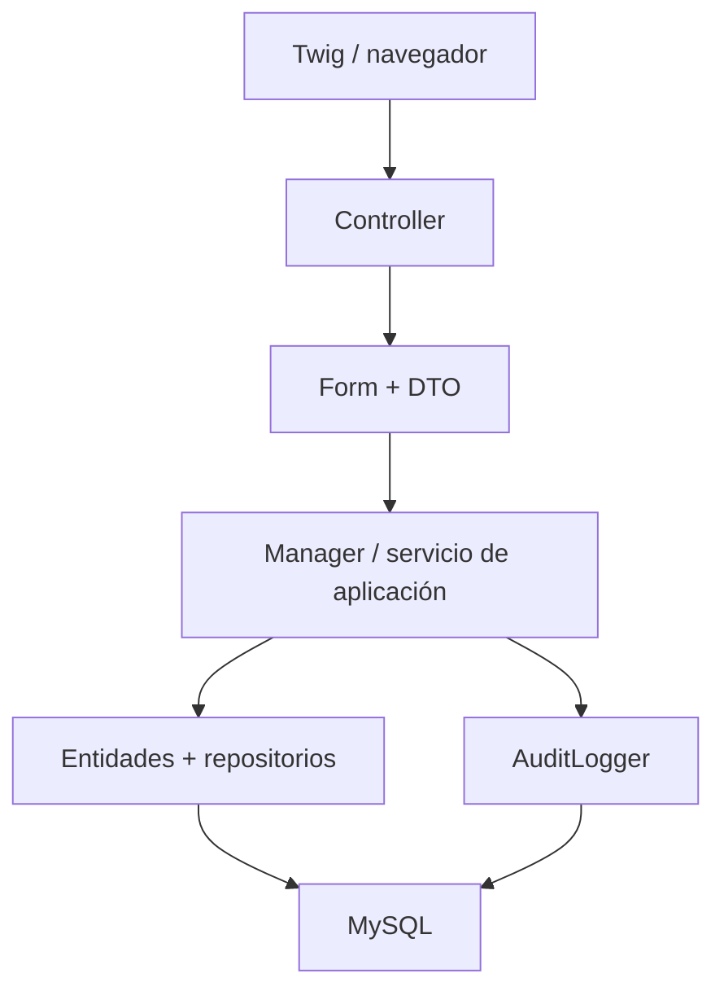
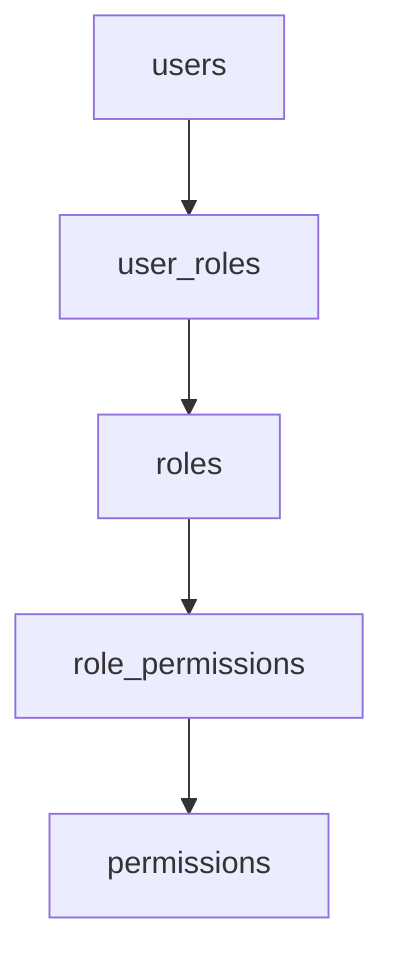
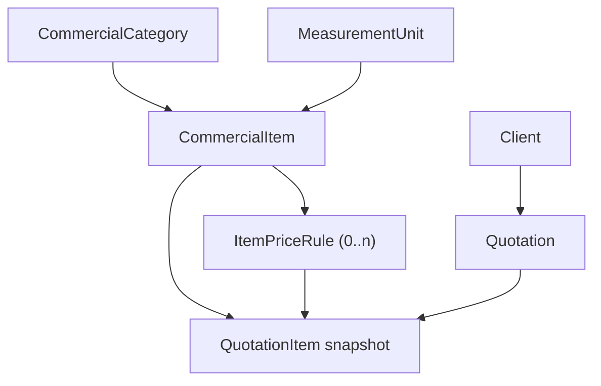
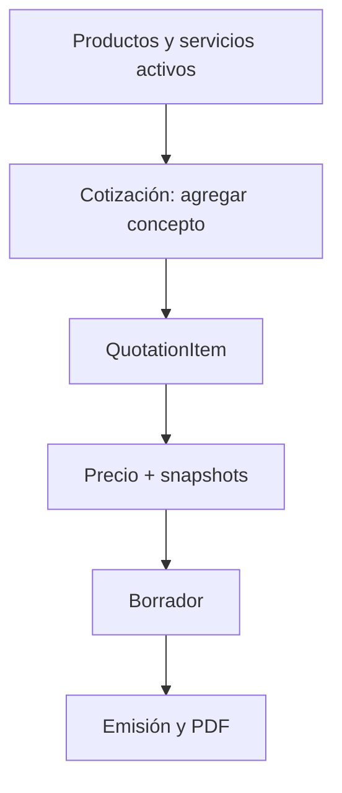
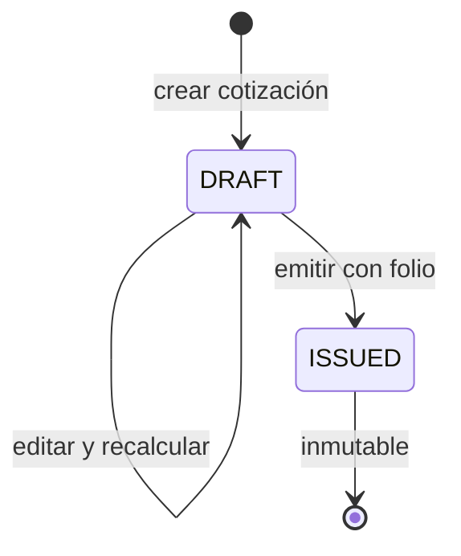

# PrintFlow - Contexto de continuidad, Catálogos y Cotizaciones

> Estado consolidado al 26 de julio de 2026. Este documento se preparó para retomar el proyecto en un chat nuevo sin reconstruir decisiones ya tomadas.
>
> La fuente de verdad sigue siendo el repositorio Git local <code>C:\PrintFlow</code> y sus migraciones aplicadas. Las copias de archivos compartidas sirven para contexto, pero algunas preceden los últimos cambios de emisión; para modificar código, siempre se debe leer primero la versión vigente en el repositorio.

---

## 1. Propósito de este documento

PrintFlow es una plataforma interna para una empresa de impresión. Su propósito es controlar el flujo comercial y operativo: clientes, catálogo de venta, cotizaciones, órdenes de trabajo, producción, materiales, inventario, usuarios y trazabilidad.

Este documento concentra:

- El cimiento técnico y las reglas que ya están estables.
- El estado efectivo del catálogo comercial y del cotizador.
- Los archivos nuevos, archivos modificados y migraciones recientes.
- La arquitectura de emisión, folios, auditoría y PDF.
- La corrección arquitectónica pendiente para que el sidebar represente bien los catálogos.
- Las pruebas que faltan antes de dar por cerrado el bloque de cotizaciones.
- Un punto de partida concreto para el siguiente chat.

No es una sustitución de las migraciones ni del código. Si existe una discrepancia, prevalecen el código actual, la salida de Doctrine y el historial Git.

---

## 2. Estado ejecutivo

| Área | Estado | Nota |
| --- | --- | --- |
| Base técnica, autenticación y RBAC | Estable | Symfony Security con sesión, CSRF, rate limiter y permisos en MySQL. |
| Diseño administrativo y componentes | Estable | Se reutilizan tokens, layouts, botones, tablas, formularios, badges, alertas y sidebar. |
| Clientes, contactos y direcciones | Estable | Cliente con información fiscal/comercial; contactos y direcciones fiscales/de entrega con reglas transaccionales. |
| Categorías comerciales y unidades de medida | Implementado | CRUD, filtros, estado, orden visual, permisos y auditoría. |
| Productos y servicios | Implementado técnicamente | Entidad única de conceptos comerciales, con tipo PRODUCT o SERVICE, precio base, estado y catálogo auxiliar. |
| Reglas de precio por cantidad | Implementado técnicamente | Rangos anidados al concepto; el cotizador resuelve el precio sin usar JavaScript como fuente de verdad. |
| Cotizaciones en borrador | Implementado | Cliente, partidas, snapshots, descuento, IVA, totales, auditoría y edición solo mientras sea borrador. |
| Emisión, folio y descarga de PDF | Integrado y migrado; pendiente prueba funcional visual | Los archivos pasaron sintaxis/lint y la migración se aplicó. Falta emitir y revisar el primer PDF real. |
| Navegación de Catálogos | Corrección pendiente | El backend existe, pero el sidebar todavía presenta un único acceso genérico llamado Catálogo. |
| Órdenes, producción, materiales, inventario y trazabilidad | Pendiente | Deben construirse después de cerrar catálogo/cotizador y respetar los snapshots históricos. |

### Resultado de validaciones reportadas

Se ejecutaron correctamente:

~~~powershell
php -l src\Entity\Quotations\Quotation.php
php -l src\Application\Quotations\QuotationManager.php
php -l src\Controller\Admin\Quotations\QuotationController.php
php -l src\Service\Quotations\QuotationFolioGenerator.php
php -l src\Service\Quotations\QuotationPdfRenderer.php

php bin\console lint:container
php bin\console lint:twig templates\admin\quotations
php bin\console doctrine:migrations:migrate
php bin\console doctrine:schema:validate
php bin\console debug:router | findstr quotations
~~~

El resultado confirmado fue:

- Sin errores de sintaxis en los cinco archivos PHP de cotizaciones.
- Contenedor de Symfony válido.
- Cinco plantillas Twig de cotizaciones con sintaxis válida.
- Migración <code>DoctrineMigrations\Version20260726113000</code> aplicada con éxito: tres consultas SQL.
- Mapeo de Doctrine correcto y esquema sincronizado.
- Rutas registradas para listado, alta, edición, emisión y descarga de PDF.

La validación anterior no sustituye la prueba en navegador: aún se debe crear un concepto, crear una cotización, emitirla y revisar visualmente el PDF descargado.

---

## 3. Stack y reglas transversales que no deben cambiarse

| Área | Decisión vigente |
| --- | --- |
| Framework | Symfony 7.4.14 LTS, aplicación server-rendered |
| PHP | Local 8.2.31; producción Hostinger 8.2.30 |
| Base de datos | MySQL 8.0.46 local, InnoDB y utf8mb4 |
| Base actual | <code>printflow_app</code> |
| Zona de negocio | <code>America/Mexico_City</code> |
| Fechas persistidas | UTC con <code>DateTimeImmutable</code>; conversión a zona de negocio al mostrar/filtrar |
| Vistas | Twig, Symfony Forms, Twig Components / UX y Stimulus |
| CSS/JS | AssetMapper, Bootstrap, Bootstrap Icons, jQuery, Notyf, SweetAlert2 y SortableJS locales |
| Seguridad | Symfony Security con sesión, CSRF, throttling y RBAC por permisos MySQL |
| Esquema | Doctrine ORM + Doctrine Migrations; nunca usar <code>doctrine:schema:update --force</code> |
| Despliegue previsto | Hostinger Business por SSH, Git y Composer; sin Docker |

### Identidad visual

- Verde de marca: <code>#27F52E</code>.
- Hover: <code>#16C61D</code>.
- Estado activo: <code>#10A816</code>.
- Fondo suave: <code>#E8FDEA</code>.
- Diseño administrativo: gris sobrio, jerarquía clara, acento verde y componentes reutilizables.

No se deben crear estilos aislados por cada pantalla si el caso cabe en un componente base. El estándar visual ya existe y las vistas de catálogo/cotizaciones deben conservarlo.

### Capas de la aplicación

| Capa | Responsabilidad |
| --- | --- |
| Controller | Permiso, request/response, CSRF, formulario, flash y redirección. |
| DTO + Form | Entrada y validación del caso de uso. |
| Manager | Invariantes, transacciones, coordinación, snapshots y auditoría. |
| Entity | Estado, relaciones, normalización local e invariantes pequeñas. |
| Repository | Consultas reutilizables y filtros. |
| AuditLogger | Dejar la bitácora persistida sin ejecutar <code>flush()</code>. |

Un controlador no debe calcular totales, asignar folios, escribir SQL ni capturar lógica de emisión.

---

## 4. Seguridad, permisos y auditoría

### Autenticación

1. <code>GET /login</code> muestra el login.
2. Symfony busca por <code>username</code>.
3. <code>UserChecker</code> rechaza cuentas inactivas/no aptas.
4. El formulario valida credenciales y CSRF <code>authenticate</code>.
5. Hay límite de cinco intentos en quince minutos.
6. El inicio/cierre de sesión se audita.
7. Fuera de <code>/login</code>, el acceso base requiere sesión con <code>ROLE_USER</code>.

### RBAC

La autorización funcional no depende de comprobar manualmente <code>ROLE_ADMIN</code>. Se usa:

~~~php
$this->denyAccessUnlessGranted('dominio.accion');
~~~

o:

~~~twig

    ...

~~~

La relación es:

Reglas que se deben conservar:

- <code>ROLE_ADMIN</code> es de sistema y no se administra desde la UI.
- Los roles propios usan <code>ROLE_</code> en mayúsculas.
- Los permisos usan minúsculas separadas por puntos.
- El <code>PermissionVoter</code> debe aceptar permisos de profundidad variable, por ejemplo <code>clients.contacts.view</code> y <code>catalog.items.update_price</code>; no volver al patrón de solo dos segmentos.
- Toda mutación usa POST (o un método explícito apropiado), permiso y token CSRF.
- Cambios de roles invalidan la sesión afectada para no conservar privilegios anteriores.

### Permisos relevantes actualmente

| Dominio | Permisos |
| --- | --- |
| Dashboard | <code>dashboard.view</code> |
| Usuarios | <code>user.view</code>, <code>user.create</code>, <code>user.update</code>, <code>user.deactivate</code>, <code>user.reset_password</code> |
| Roles | <code>role.view</code>, <code>role.manage</code> |
| Bitácora | <code>audit_log.view</code> |
| Clientes | <code>clients.view</code>, <code>clients.create</code>, <code>clients.update</code>, <code>clients.toggle_status</code> |
| Contactos | <code>clients.contacts.view</code>, <code>clients.contacts.create</code>, <code>clients.contacts.update</code>, <code>clients.contacts.toggle_status</code> |
| Direcciones | <code>clients.addresses.view</code>, <code>clients.addresses.create</code>, <code>clients.addresses.update</code>, <code>clients.addresses.toggle_status</code> |
| Catálogo | <code>catalog.view</code>, <code>catalog.categories.manage</code>, <code>catalog.units.manage</code>, <code>catalog.items.create</code>, <code>catalog.items.update</code>, <code>catalog.items.update_price</code>, <code>catalog.items.toggle_status</code> |
| Cotizaciones | Ya existían <code>quotations.view</code>, <code>quotations.create</code>, <code>quotations.update</code>; se agregaron <code>quotations.issue</code> y <code>quotations.download_pdf</code> |

### Bitácora

<code>src\Service\Audit\AuditLogger.php</code> registra actor, acción, tipo/id de entidad, valores previos/nuevos, IP, user agent y fecha. Sanea claves sensibles como contraseña, hash o token y no hace <code>flush()</code>.

Eventos relevantes de esta fase:

~~~text
commercial_category.created / updated / activated / deactivated / reordered
measurement_unit.created / updated / activated / deactivated / reordered
commercial_item.created / updated / price_updated / activated / deactivated
quotation.created / quotation.updated / quotation.issued
~~~

En la vista de bitácora debe existir el rótulo legible:

~~~twig
'quotation.created': 'Cotización creada',
'quotation.updated': 'Cotización actualizada',
'quotation.issued': 'Cotización emitida',
~~~

---

## 5. Módulos estables previos

### Usuarios, roles y bitácora

El módulo de acceso ya incluye usuarios, roles, permisos, estado de usuario, restablecimiento de contraseña y auditoría. Los roles se asignan mediante la relación M:N <code>user_roles</code> y los permisos mediante <code>role_permissions</code>.

### Clientes

El cliente es la entidad comercial principal. Ya incluye datos generales, fiscales y comerciales:

- Nombre comercial y razón social.
- RFC/identificador fiscal, régimen fiscal, código postal fiscal, correo de facturación y uso CFDI predeterminado.
- Categoría comercial y descuento predeterminado.
- Correo, teléfono, notas, estado y baja lógica.

El RFC se normaliza a mayúsculas; los correos a minúsculas; los vacíos se convierten a <code>null</code>. El código postal fiscal no se modifica automáticamente desde una dirección para evitar cambios fiscales no intencionales.

### Contactos

Un contacto pertenece a un cliente y puede ser principal. Las reglas son:

- No se registran contactos para un cliente inactivo.
- Un contacto inactivo no puede quedar principal.
- Al marcar uno principal, se retira la marca a los demás dentro de la transacción.
- La ruta valida que el contacto pertenezca al cliente.
- MySQL evita más de un contacto principal activo por cliente.

### Direcciones

Una dirección puede ser fiscal, de entrega o ambas. Las direcciones activas pueden marcarse predeterminadas, con un máximo de una fiscal y una de entrega por cliente. Al reemplazar una predeterminada, el manager libera temporalmente la anterior, evita choques de índices únicos y registra <code>client_address.default_changed</code>.

Las direcciones tienen snapshot disponible para integrarse a cotizaciones, aunque el selector específico de domicilio fiscal/entrega todavía debe completarse en el cotizador si no está ya integrado en la versión local.

---

## 6. Catálogo comercial: estado real y cómo se usa

### Concepto fundamental

Una **partida** no se crea como catálogo. Una partida es una línea de una cotización, persistida como <code>QuotationItem</code>.

Lo que se da de alta antes es un **producto o servicio vendible**, persistido como <code>CommercialItem</code>. Al agregarlo a una cotización, se crea la partida con cantidad, precio resuelto, subtotal y snapshots.

Por eso, para que aparezcan partidas en una cotización primero se debe contar con un producto o servicio activo que tenga categoría, unidad y precio base o rango aplicable.

### Modelo actual

| Entidad / tabla | Propósito | Reglas principales |
| --- | --- | --- |
| <code>commercial_categories</code> | Clasificación comercial | Código y nombre únicos, orden y estado. |
| <code>measurement_units</code> | Unidad de venta/cálculo | Código y nombre únicos, orden y estado. |
| <code>commercial_items</code> | Producto o servicio que puede cotizarse | Código único; tipo PRODUCT/SERVICE; categoría, unidad, precio base y estado. |
| <code>item_price_rules</code> | Precio por umbral de cantidad | Umbral, precio, estado; único por concepto/tipo/umbral. |

La migración <code>Version20260725163000</code> creó estas cuatro tablas y los permisos <code>catalog.*</code>. Usa FK restrictivas e índices para consulta de activos, categoría y unidad.

### Producto y servicio: una sola entidad

La decisión correcta es mantener **una sola tabla y un solo módulo** para ambos:

~~~text
CommercialItem.type = PRODUCT | SERVICE
~~~

No se deben crear dos tablas separadas porque ambos comparten código, nombre, descripción, categoría, unidad, precio, estado, auditoría y uso como partida de una cotización.

Ejemplos:

| Tipo | Ejemplo | Unidad |
| --- | --- | --- |
| Producto | Letrero terminado, tarjeta, lona vendida como pieza | pieza, m², metro lineal |
| Servicio | Impresión, diseño, instalación, corte | m², hora, servicio |

**Regla de negocio confirmada:** lona y vinil pueden ser materiales que se consumen dentro de un servicio. Sus anchos/largos en la información original son especificaciones de material. No se debe confundir el material de producción con el producto/servicio que se vende al cliente. Ese catálogo de materiales se modelará después dentro de inventario/producción.

### Precios

<code>CommercialItem</code> tiene <code>basePrice</code>. <code>ItemPriceRule</code> permite rangos activos por cantidad:

| Cantidad solicitada | Regla aplicable | Precio usado |
| --- | --- | --- |
| Menor al primer umbral | Ninguna | Precio base |
| Igual o mayor a un umbral | El umbral activo más alto que no excede la cantidad | Precio del rango |

Ejemplo:

| Precio base | Rango desde | Precio del rango | Cantidad cotizada | Precio resuelto |
| --- | --- | --- | --- | --- |
| 120.00 | 10.0000 | 110.00 | 12.5000 | 110.00 |
| 120.00 | 50.0000 | 100.00 | 60.0000 | 100.00 |

<code>CommercialItemPriceResolver</code> realiza esa resolución en el servidor. Las cantidades se normalizan con cuatro decimales y los importes con dos; no se usan <code>float</code> para estos valores.

### Rutas actuales de catálogo

| Función | Ruta | Permiso |
| --- | --- | --- |
| Productos y servicios | <code>/admin/catalogo/conceptos</code> | <code>catalog.view</code> |
| Nuevo producto/servicio | <code>/admin/catalogo/conceptos/nuevo</code> | <code>catalog.items.create</code> |
| Editar producto/servicio | <code>/admin/catalogo/conceptos/{id}/editar</code> | <code>catalog.items.update</code> |
| Cambiar estado | <code>/admin/catalogo/conceptos/{id}/estado</code> POST | <code>catalog.items.toggle_status</code> |
| Rangos de precio del concepto | <code>/admin/catalogo/conceptos/{item}/rangos-precio</code> | <code>catalog.items.update_price</code> |
| Categorías comerciales | <code>/admin/catalogo/categorias</code> | <code>catalog.view</code> y administración según acción |
| Unidades de medida | <code>/admin/catalogo/unidades</code> | <code>catalog.view</code> y administración según acción |

Los rangos de precio no deben ser una opción principal del sidebar. Son parte del detalle del producto/servicio, porque definen cómo se vende ese elemento. Solo sería razonable un módulo de listas de precios independiente si más adelante se implementan listas por cliente, canal, sucursal o vigencia compleja.

### Flujo operativo para crear una partida cotizable

1. Crear o seleccionar una categoría comercial activa.
2. Crear o seleccionar una unidad de medida activa.
3. Entrar a Productos y servicios.
4. Crear un concepto:
   - tipo PRODUCT o SERVICE;
   - código interno único;
   - nombre;
   - descripción opcional;
   - categoría;
   - unidad;
   - precio base;
   - activo.
5. Si aplica, desde el concepto registrar rangos de precio por cantidad.
6. Crear/editar la cotización y agregar el concepto con una cantidad válida.
7. El servidor resuelve el precio y guarda snapshots en la partida.

Si no existen conceptos activos, la pantalla de cotización debe comunicarlo claramente con un estado vacío y un enlace a Productos y servicios. Esa mejora de UX forma parte de la corrección de navegación pendiente.

---

## 7. Corrección arquitectónica pendiente: Catálogos en el sidebar

### Problema identificado

El código del catálogo comercial ya existe, pero el sidebar actual conserva un enlace genérico:

~~~text
Administración
- Usuarios
- Roles y permisos
- Clientes
- Catálogo
~~~

Ese acceso genérico lleva a categorías comerciales y oculta la intención del modelo. Para un usuario no es evidente dónde crear lo que después será una partida cotizable, ni que ya existen unidades y reglas de precio.

Esto es un problema de navegación y de lenguaje de dominio, no de modelo relacional. No se requiere dividir <code>commercial_items</code>, rehacer cotizaciones ni crear una migración para corregirlo.

### Estructura propuesta

La navegación actual debe evolucionar a:

~~~text
INICIO
- Inicio

ADMINISTRACIÓN
- Usuarios
- Roles y permisos

CATÁLOGOS
- Productos y servicios
- Categorías comerciales
- Unidades de medida

COMERCIAL
- Clientes
- Cotizaciones

CONTROL
- Bitácora
~~~

Los accesos futuros se agregarán al grupo adecuado, cuando exista su dominio real:

| Futuro catálogo | Dominio de uso | Ubicación visual recomendada |
| --- | --- | --- |
| Materiales e insumos | Inventario y producción | Catálogos o Inventario, según su flujo de stock |
| Procesos de producción | Órdenes y producción | Catálogos operativos / Producción |
| Acabados, máquinas o capacidades | Producción | Catálogos operativos / Producción |
| Listas de precio por cliente/canal | Comercial | Comercial, solo si se supera el modelo de rangos actual |

No deben mostrarse enlaces vacíos o módulos simulados antes de que tengan entidad, permiso, caso de uso y pantalla reales.

### Decisiones de implementación

1. Modificar únicamente el partial del sidebar, normalmente <code>templates/partials/_app_sidebar.html.twig</code>.
2. Mantener las rutas actuales. No cambiar <code>/admin/catalogo/conceptos</code> ni los nombres de ruta si no hay una razón de compatibilidad.
3. Cambiar el rótulo visible de **Catálogo** a **Catálogos**.
4. Mover Clientes a la sección **Comercial**, junto con Cotizaciones.
5. Crear la sección visual **Catálogos** y sus tres enlaces.
6. Los enlaces se condicionan por el permiso aplicable:
   - Productos y servicios: <code>catalog.view</code>.
   - Categorías: visible a quien pueda consultarlas; mostrar la acción de administración solo a <code>catalog.categories.manage</code>.
   - Unidades: visible a quien pueda consultarlas; mostrar la acción de administración solo a <code>catalog.units.manage</code>.
7. Usar claves distintas de navegación activa, por ejemplo <code>catalog_items</code>, <code>catalog_categories</code>, <code>catalog_units</code>, <code>clients</code> y <code>quotations</code>. No reutilizar la clave genérica <code>catalog</code> si se necesitan estados activos precisos.
8. No añadir CSS específico si la estructura actual del sidebar ya admite secciones y enlaces. Reusar <code>pf-sidebar__section</code> y <code>pf-sidebar__link</code>.

### Resultado esperado

La persona usuaria podrá identificar inmediatamente que debe crear un producto o servicio para que aparezca como concepto en la cotización. No se presentará una partida como si fuera un registro independiente de catálogo.

---

## 8. Cotizaciones: modelo y reglas de negocio

### Entidades principales

| Entidad | Rol |
| --- | --- |
| <code>Quotation</code> | Encabezado comercial, cliente, estado, vigencia, importes, folio, emisión, snapshots de cliente/direcciones y partidas. |
| <code>QuotationItem</code> | Una partida; conserva concepto asociado, cantidad, precio unitario, subtotal y snapshots del concepto/regla aplicada. |
| <code>QuotationStatus</code> | Estado del documento. El flujo actualmente integrado para emisión es DRAFT a ISSUED. |

<code>Quotation</code> tiene:

- Cliente y usuario creador.
- Estado, folio, fecha de emisión y vigencia.
- Moneda, actualmente MXN.
- Snapshot del cliente.
- Snapshots fiscal y de entrega disponibles.
- Notas.
- Porcentaje e importe de descuento.
- Tasa, importe y base gravable de IVA.
- Subtotal y total.
- Timestamps UTC.
- Relación ordenada de partidas.

Las restricciones relevantes incluyen folio único, índice por estado/vigencia, índice por cliente/fecha y FK restrictivas.

### Borrador y emisión

El diseño vigente es deliberadamente estricto:

Reglas:

- Solo una cotización editable puede actualizarse o emitirse.
- La emisión asigna el folio definitivo dentro de una transacción.
- Una cotización emitida no se vuelve a editar ni a numerar.
- El PDF solo se permite para cotizaciones emitidas.
- Los datos históricos se leen de snapshots de la cotización, no del catálogo o cliente vigente.

Los estados posteriores como enviada, aceptada, rechazada, vencida o cancelada siguen siendo una evolución futura. No deben añadirse sin definir antes sus transiciones, permisos, auditoría y su efecto sobre órdenes/producción.

### Creación y actualización de borradores

<code>QuotationManager</code> hace lo siguiente:

1. Verifica que el cliente esté activo.
2. Verifica que la vigencia no esté en el pasado respecto a <code>America/Mexico_City</code>.
3. Aplica el descuento indicado; si no se captura, usa el descuento predeterminado del cliente.
4. Para cada partida, valida el concepto activo y normaliza la cantidad.
5. Resuelve precio base o rango mediante <code>CommercialItemPriceResolver</code>.
6. Calcula los totales con <code>QuotationTotalsCalculator</code>, no desde el navegador.
7. Guarda snapshot de cliente, concepto, unidad, categoría y regla de precio aplicada.
8. Registra <code>quotation.created</code> o <code>quotation.updated</code>.

Esto protege el histórico: si mañana cambia el nombre, unidad, categoría o precio base de un concepto, la cotización anterior conserva la información con la que se creó.

---

## 9. Emisión y folio definitivo

### Formato de folio

~~~text
COT-AAAA-NNNNNN
Ejemplo: COT-2026-000001
~~~

El año se calcula desde la fecha de emisión convertida a <code>America/Mexico_City</code>. La fecha que se persiste sigue estando en UTC.

### Tabla de consecutivos

La migración reciente crea:

| Tabla | Campos | Propósito |
| --- | --- | --- |
| <code>quotation_folio_sequences</code> | <code>folio_year</code> PK, <code>last_number</code> | Mantener el consecutivo anual. |

No se creó una entidad Doctrine para esta tabla. El acceso está encapsulado en el servicio de infraestructura <code>QuotationFolioGenerator</code>.

### Concurrencia

<code>QuotationFolioGenerator</code> usa una operación MySQL atómica basada en:

~~~sql
INSERT INTO quotation_folio_sequences (...)
ON DUPLICATE KEY UPDATE
last_number = LAST_INSERT_ID(last_number + 1)
~~~

Después recupera <code>lastInsertId()</code> de la misma conexión. Así evita que dos emisiones simultáneas obtengan el mismo número dentro del año.

<code>QuotationManager::issue()</code> además:

1. Ejecuta <code>wrapInTransaction()</code>.
2. Recarga y bloquea la cotización con <code>LockMode::PESSIMISTIC_WRITE</code>.
3. Revalida que siga editable.
4. Construye la auditoría anterior.
5. Genera el folio.
6. Invoca el método de dominio <code>Quotation::issue()</code>.
7. Registra <code>quotation.issued</code>.
8. Hace <code>flush()</code> dentro de la misma transacción.

### Inmutabilidad en la entidad

La integración elimina setters públicos para cambiar arbitrariamente estado, folio o fecha de emisión. La entidad expone:

~~~php
getFolio()
hasBeenIssued()
issue(string $folio, DateTimeImmutable $issuedAt)
~~~

<code>issue()</code> normaliza el folio, exige que el documento siga editable, persiste la fecha en UTC y cambia el estado a ISSUED.

Esta decisión debe conservarse. Abrir setters de folio/estado después permitiría renumerar, emitir dos veces o modificar documentos ya entregados.

---

## 10. PDF de cotización

### Archivos y diseño

La descarga usa Dompdf y la plantilla:

~~~text
templates/admin/quotations/pdf.html.twig
~~~

El renderer:

- Solo genera PDF si <code>Quotation::hasBeenIssued()</code> es verdadero.
- Usa fuente DejaVu Sans.
- Deshabilita PHP embebido y acceso remoto.
- Genera tamaño Carta vertical.
- Entrega el archivo con disposición de descarga, sin caché pública.

La plantilla muestra:

- Datos configurados del emisor.
- Título y folio.
- Datos fiscales/comerciales del cliente desde el snapshot.
- Fecha de emisión y vigencia.
- Tabla de partidas desde los snapshots.
- Cantidad, unidad, precio unitario, importe, subtotal, descuento, IVA, total y moneda.
- Observaciones.
- Encabezado/pie persistentes y conteo de páginas.

### Referencia visual revisada

El archivo <code>Cotizacion_Mayo_260626_134428.pdf</code> fue revisado como referencia de presentación:

- Tiene siete páginas.
- Usa tamaño Carta, 612 x 792 puntos.
- Usa márgenes amplios, jerarquía documental sobria, encabezado y pie persistentes.
- Es una propuesta de alcance del proyecto, no una plantilla de datos que deba copiarse literalmente.

La plantilla nueva toma de esa referencia la formalidad documental, el tamaño Carta y el uso de encabezado/pie, sin reproducir el texto, condiciones económicas ni contenido de la propuesta original.

### Configuración del emisor

<code>config/services.yaml</code> incorpora una definición explícita para <code>QuotationPdfRenderer</code>, usando estas variables:

~~~dotenv
PRINTFLOW_QUOTATION_ISSUER_NAME="PrintFlow"
PRINTFLOW_QUOTATION_ISSUER_TAX_ID=""
PRINTFLOW_QUOTATION_ISSUER_EMAIL=""
PRINTFLOW_QUOTATION_ISSUER_PHONE=""
PRINTFLOW_QUOTATION_ISSUER_ADDRESS=""
~~~

Los valores reales no deben quedar versionados. En desarrollo/producción se colocan en <code>.env.local</code> o en las variables seguras del entorno correspondiente, y se limpia cache:

~~~powershell
php bin\console cache:clear
~~~

### Mejora arquitectónica recomendada para el histórico documental

El PDF actual lee los datos del emisor desde configuración en el momento de descarga. Por tanto, si mañana cambia razón social, RFC, dirección o teléfono, volver a descargar una cotización emitida podría mostrar un encabezado nuevo.

Para una reproducción legal/histórica estricta, antes de considerar cerrado el módulo se recomienda una de estas alternativas:

1. Al emitir, guardar un <code>issuer_snapshot</code> JSON dentro de <code>quotations</code>, y renderizar siempre desde ese snapshot.
2. Si se requiere evidencia inalterable de entrega, generar el binario al emitir y conservarlo en almacenamiento seguro junto con hash SHA-256, fecha de generación y metadatos.

La opción 1 es suficiente para la siguiente fase y requiere migración, método de entidad, cambio en emisión, PDF y auditoría. La opción 2 es una fase posterior si se habilita envío por correo y evidencia de envío.

---

## 11. Rutas de cotizaciones

| Ruta | Método | Permiso | Comportamiento |
| --- | --- | --- | --- |
| <code>/admin/cotizaciones</code> | GET | <code>quotations.view</code> | Lista documentos y acciones disponibles. |
| <code>/admin/cotizaciones/nueva</code> | GET/POST | <code>quotations.create</code> | Crea un borrador. |
| <code>/admin/cotizaciones/{id}/editar</code> | GET/POST | <code>quotations.view</code> + <code>quotations.update</code> | Edita solo borradores. |
| <code>/admin/cotizaciones/{id}/emitir</code> | POST | <code>quotations.issue</code> | Valida CSRF, emite y asigna folio. |
| <code>/admin/cotizaciones/{id}/pdf</code> | GET | <code>quotations.download_pdf</code> | Descarga solo una cotización emitida. |

La vista de edición debe mostrar la tarjeta/botón **Emitir cotización** solo si el documento es editable y el usuario tiene <code>quotations.issue</code>.

El listado debe resolver dos capacidades:

~~~twig


~~~

Así, un borrador muestra Editar y un documento emitido muestra PDF. Si el usuario no puede realizar ninguna acción, el listado no debe ocultar el documento; solo debe presentar el estado sin acciones disponibles.

---

## 12. Archivos creados y modificados en esta fase

### Archivos nuevos creados

| Ruta | Responsabilidad |
| --- | --- |
| <code>src/Service/Quotations/QuotationFolioGenerator.php</code> | Consecutivo anual MySQL atómico y formato de folio. |
| <code>src/Service/Quotations/QuotationPdfRenderer.php</code> | Renderiza una cotización emitida a PDF con Dompdf. |
| <code>templates/admin/quotations/pdf.html.twig</code> | Plantilla documental Carta de la cotización. |
| <code>migrations/Version20260726113000.php</code> | Tabla de consecutivos y permisos de emitir/descargar. |

No se creó <code>QuotationFolioSequence.php</code>; la secuencia es infraestructura SQL encapsulada por el generador, no una entidad de dominio.

### Archivos existentes modificados

| Ruta | Cambio aplicado |
| --- | --- |
| <code>src/Entity/Quotations/Quotation.php</code> | Se encapsula emisión mediante <code>issue()</code>; se agregan <code>getFolio()</code> y <code>hasBeenIssued()</code>; se retiran setters públicos de folio/estado/fecha de emisión. |
| <code>src/Application/Quotations/QuotationManager.php</code> | Inyección de <code>QuotationFolioGenerator</code>; nuevo caso de uso <code>issue()</code>; bloqueo pesimista; transacción; evento <code>quotation.issued</code>; <code>issued_at</code> en snapshot de auditoría. |
| <code>src/Controller/Admin/Quotations/QuotationController.php</code> | Rutas POST de emisión y GET de PDF; control de permisos, CSRF, manejo de error de dominio y cabeceras seguras de descarga. |
| <code>templates/admin/quotations/edit.html.twig</code> | Tarjeta de emisión debajo del formulario del borrador. |
| <code>templates/admin/quotations/index.html.twig</code> | Acciones condicionales Editar/PDF según estado y permiso. |
| <code>templates/admin/audit/logs/index.html.twig</code> o vista equivalente de bitácora | Etiquetas para los tres eventos de cotización, en particular <code>quotation.issued</code>. |
| <code>config/services.yaml</code> | Argumentos de configuración del emisor para <code>QuotationPdfRenderer</code>. |
| <code>.env</code> | Valores vacíos/documentados de emisor. |
| <code>.env.local</code> | Debe contener los valores reales de la empresa; no versionar secretos ni datos sensibles. |

### Corrección aplicada durante la migración

La primera ejecución de <code>Version20260726113000</code> falló antes de ejecutar SQL porque la migración tenía:

~~~php
use Doctrine\Schema\Schema;
~~~

La firma real de <code>AbstractMigration</code> espera:

~~~php
use Doctrine\DBAL\Schema\Schema;
~~~

Se corrigió el import y después la migración se ejecutó correctamente. No hubo rollback ni daño de esquema por el primer error, ya que fue un error de compilación previo al SQL.

### Contenido de la migración 20260726113000

1. Crea <code>quotation_folio_sequences</code>.
2. Inserta de forma idempotente:
   - <code>quotations.issue</code>.
   - <code>quotations.download_pdf</code>.
3. Asigna ambos permisos a <code>ROLE_ADMIN</code> mediante <code>INSERT IGNORE ... SELECT</code>.
4. El <code>down()</code> retira relaciones, permisos y la tabla.

No editar una migración ya aplicada. Si surge un cambio, debe ir en una migración nueva.

---

## 13. Prueba funcional pendiente para cerrar cotizaciones

Antes de avanzar a otro módulo se debe realizar esta prueba completa en navegador.

### Preparación

1. Configurar datos reales o de prueba coherentes del emisor en <code>.env.local</code>.
2. Ejecutar <code>php bin\console cache:clear</code>.
3. Confirmar que exista una categoría y unidad activas.
4. Crear un producto o servicio activo con precio base.

### Flujo principal

| Paso | Acción | Resultado esperado |
| --- | --- | --- |
| 1 | Crear una cotización con cliente activo y una partida. | Se guarda como borrador. |
| 2 | Abrir su edición. | Aparece el botón Emitir cotización si el usuario tiene el permiso. |
| 3 | Emitir. | Flash de éxito con un folio como <code>COT-2026-000001</code>. |
| 4 | Intentar volver a editar. | No se permite editar; el documento queda bloqueado. |
| 5 | Revisar listado. | Aparece PDF en lugar de Editar, según permisos. |
| 6 | Descargar PDF. | Datos de cliente, partidas, precios, IVA, total, folio, vigencia y fecha correctos. |
| 7 | Emitir una segunda cotización. | Folio consecutivo, por ejemplo <code>COT-2026-000002</code>. |
| 8 | Revisar Bitácora. | Aparece Cotización emitida con actor, folio, importes y fecha de emisión. |

### Casos de seguridad y rechazo

| Caso | Resultado esperado |
| --- | --- |
| POST de emisión sin CSRF válido | HTTP/denegación; no cambia estado ni consume folio. |
| Usuario sin <code>quotations.issue</code> | No ve/emite; denegación en servidor aunque construya la URL. |
| Usuario sin <code>quotations.download_pdf</code> | No ve PDF; denegación en servidor. |
| PDF de borrador | No se entrega; respuesta de no encontrado/denegación controlada. |
| Emitir dos veces el mismo borrador | La segunda solicitud es rechazada; no se asigna un segundo folio. |
| Concepto inactivo | No puede añadirse/cotizarse en un nuevo borrador. |
| Precio de catálogo cambiado después | El borrador puede recalcularse al guardar; una emitida conserva sus snapshots. |

### Revisión visual del PDF

Al descargar el primer PDF real se debe revisar:

- Tamaño Carta vertical.
- Márgenes sin contenido cortado.
- Encabezado y pie visibles en todas las páginas.
- Folio completo y legible.
- Tabla de partidas sin columnas encimadas.
- Repetición del encabezado de la tabla si hay múltiples páginas.
- Importes, porcentaje de IVA y total correctos.
- Texto largo de conceptos/observaciones sin salir del margen.
- Acentos, símbolo de moneda y caracteres especiales correctamente renderizados.

La revisión visual debe hacerse sobre el PDF generado, no solo sobre texto extraído ni sobre la plantilla Twig.

---

## 14. Riesgos y decisiones a vigilar

| Riesgo | Prevención / decisión |
| --- | --- |
| Editar una cotización emitida | Mantener <code>isEditable()</code>, método de dominio <code>issue()</code> y las restricciones de controlador. |
| Folio duplicado | Mantener transacción, bloqueo pesimista y generador atómico MySQL. |
| Historial que cambie al editar catálogo | Usar snapshots en <code>Quotation</code> y <code>QuotationItem</code>; nunca volver a resolver una emitida desde el catálogo actual. |
| PDF con encabezado actualizado retroactivamente | Implementar <code>issuer_snapshot</code> antes de requerir reproducción legal estricta. |
| Usuario sin saber dónde crear partidas | Aplicar la reorganización de Catálogos y el estado vacío con enlace a Productos y servicios. |
| Usar float para dinero/cantidad | Mantener DECIMAL y normalización de strings. |
| Permisos que den 403 de forma inesperada | No limitar el PermissionVoter a dos segmentos. |
| Migraciones históricas alteradas | Crear una nueva migración; no reescribir las ejecutadas. |
| Datos reales del emisor en Git | Colocarlos en <code>.env.local</code> o configuración segura del entorno. |
| Confundir materiales con conceptos de venta | Mantener producto/servicio separado del futuro catálogo de materiales/inventario. |

---

## 15. Siguiente orden de trabajo recomendado

1. **Cerrar funcionalmente Cotizaciones.**
   - Crear concepto de prueba.
   - Emitir dos cotizaciones.
   - Descargar y revisar el PDF real.
   - Confirmar bitácora y permisos.

2. **Aplicar la corrección de navegación de Catálogos.**
   - Reordenar sidebar sin tocar tablas ni rutas.
   - Cambiar el mensaje vacío del cotizador.
   - Confirmar estados activos de navegación.

3. **Cerrar el histórico documental.**
   - Decidir si se implementa <code>issuer_snapshot</code> ahora.
   - Si se requiere, agregarlo en una migración nueva y usarlo en PDF.

4. **Completar direcciones en cotización, si aún falta.**
   - Selector explícito de fiscal y entrega.
   - Snapshot de las dos direcciones al guardar el borrador.
   - Validar cliente/dirección y preservar información histórica.

5. **Continuar por fases de dominio.**
   - Fase 0: reglas de negocio transversales.
   - Fase 1: catálogo comercial, ya avanzado.
   - Fase 2: catálogos operativos.
   - Fase 3: cotizador, actualmente en cierre de emisión/PDF.
   - Fase 4: órdenes de trabajo.
   - Fase 5: inventario y materiales.
   - Fase 6: trazabilidad de producción.
   - Fase 7: reportes y operación.

No empezar órdenes o inventario sin cerrar emisión/PDF y la corrección de Catálogos, pues ambos definen las fuentes de información que esos módulos reutilizarán.

---

## 16. Comandos de referencia

### Diagnóstico seguro

~~~powershell
php bin\console doctrine:migrations:status
php bin\console doctrine:schema:validate
php bin\console lint:container
php bin\console lint:twig templates
php bin\console debug:router | findstr quotations
php bin\console debug:router | findstr catalogo
git status
git log --oneline -10
~~~

### Antes de aplicar una migración nueva

~~~powershell
php -l migrations\VersionYYYYMMDDHHMMSS.php
php bin\console doctrine:migrations:migrate --dry-run
php bin\console doctrine:migrations:migrate
php bin\console doctrine:schema:validate
~~~

### Reglas de despliegue

- Hacer pull del commit ya probado.
- Ejecutar Composer con dependencias de producción.
- Configurar variables reales de entorno.
- Limpiar cache de producción.
- Ejecutar migraciones revisadas.
- Nunca depender de un dump SQL como método de evolución del esquema.
- Un dump sí puede usarse como respaldo antes de una migración relevante.

---

## 17. Información que se debe pedir/leer al retomar en un chat nuevo

Antes de dar cambios de código, revisar las versiones actuales de:

| Objetivo | Archivos mínimos |
| --- | --- |
| Reorganizar Catálogos | <code>templates/partials/_app_sidebar.html.twig</code>, vistas de listado de conceptos/categorías/unidades y, si aplica, CSS de sidebar. |
| Mejorar estado vacío de cotizaciones | <code>templates/admin/quotations/_form.html.twig</code>, <code>QuotationType</code>, controlador y repositorios/queries que alimentan el selector. |
| Validar emisión/PDF | <code>Quotation.php</code>, <code>QuotationManager.php</code>, <code>QuotationController.php</code>, los dos servicios nuevos, vistas de cotización, <code>services.yaml</code> y la migración 20260726113000. |
| Snapshot del emisor | Entidad/migración <code>Quotation</code>, manager de emisión, renderer PDF, template PDF y configuración. |
| Continuar órdenes o inventario | Modelo de cotización cerrado, catálogo, reglas de precio, clientes/direcciones y este documento. |

También se debe revisar:

~~~powershell
git status
php bin\console doctrine:migrations:status
php bin\console doctrine:schema:validate
~~~

Esto evita trabajar sobre archivos adjuntos viejos, cambios sin commit o un esquema distinto.

---

## 18. Prompt de continuidad sugerido

Copiar este texto al iniciar un nuevo chat dentro de PrintFlow:

~~~text
Estoy continuando PrintFlow. Usa el archivo PrintFlow_Contexto_Continuidad_2026-07-26.md como contexto obligatorio y toma el repositorio local actual como fuente de verdad.

Estado: Clientes, contactos, direcciones, catálogo comercial y cotizaciones en borrador ya existen. Se integró emisión con folio anual atómico, permisos, auditoría y PDF; la migración Version20260726113000 ya fue aplicada y los lints pasaron. Falta la prueba funcional completa de emitir, bloquear, descargar y revisar visualmente el PDF.

Antes de proponer cambios, revisa los archivos actuales relevantes. No reescribas migraciones ya aplicadas. Mantén Symfony 7.4, Doctrine Migrations, MySQL, UTC para persistencia, America/Mexico_City para negocio, RBAC granular, CSRF, auditoría y snapshots históricos.

La siguiente corrección arquitectónica es reorganizar el sidebar: Catálogos debe contener Productos y servicios, Categorías comerciales y Unidades de medida; Comercial debe contener Clientes y Cotizaciones. No separar productos y servicios en tablas, no tratar una partida como catálogo y no crear rutas/tables nuevas solo por la reorganización visual.
~~~

---

## 19. Cierre

El catálogo y el cotizador ya tienen una base consistente: producto/servicio reutilizable, precios por cantidad, snapshots, cálculo servidor, borrador, emisión controlada, folio atómico, permisos, auditoría y PDF.

El siguiente avance debe ser deliberado: comprobar el flujo real completo y hacer que el sidebar explique la arquitectura que ya existe. Después se podrá avanzar a órdenes, materiales e inventario sin tener que desmontar el modelo comercial.
