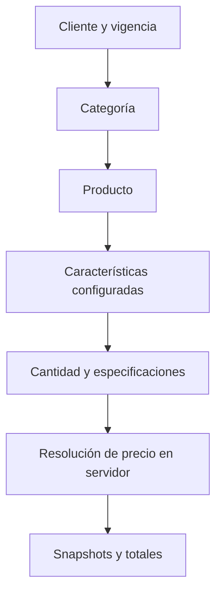

# PrintFlow — Contexto de continuidad: cotización interna

**Última actualización:** 18 de agosto de 2026  
**Propósito:** permitir continuar el trabajo de PrintFlow en otro chat sin
reanalizar ni duplicar lo ya desarrollado.

---

## 1. Decisiones de alcance vigentes

El foco actual es dejar **muy bien terminada la cotización interna**. No se
debe avanzar aún a trazabilidad ni a módulos de producción.

| Tema | Decisión vigente |
| --- | --- |
| Cotizador a modificar | El interno, bajo `/admin/cotizaciones`. |
| Cotizador público | `/cotizar` y `QuoteRequest` no se modifican. Es el flujo para usuarios externos/clientes. |
| Etiqueta visible del selector | **Producto**, no “Material”. |
| Flujo de captura | **Categoría → Producto → Características**. |
| Precios | Exclusivamente en servidor; no se calculan ni aceptan desde JavaScript. |
| Descuentos | Pospuestos. No cambiar su lógica en las siguientes tareas de cotización salvo autorización explícita. |
| Órdenes de servicio | El flujo existente se considera estable; no avanzar ni alterar más por ahora. |
| Trazabilidad, inventario y producción | Fuera de alcance actual. |

### Gran formato

Los trabajos internos prioritarios son Lona, Vinil y Banners.

| Trabajo | Cobro | Reglas acordadas |
| --- | --- | --- |
| Lona | m² | Ancho y alto terminados obligatorios; área calculada automáticamente; la cantidad se puede ajustar manualmente. |
| Vinil | m² | Mismas reglas que Lona. |
| Banner | Pieza | Ancho y alto se conservan como especificación; cantidad facturable manual. |

La solución nueva de características **no debe romper** este comportamiento.

---

## 2. Estado actual resumido

### Confirmado por Uriel

- Las fases 1 y 2 de características fueron integradas y funcionaban bien.
- El manejo previo de gran formato fue integrado y estaba funcionando.
- El estado de Git quedó resuelto; no volver a dedicar trabajo a la migración
  histórica ausente `Version20260816021000.php` salvo que aparezca un error
  nuevo y concreto.
- No se deben leer ni usar para este flujo los adjuntos PDF del chat como fuente
  de cambios sin una instrucción específica.

### Fase 3 entregada, pendiente de confirmación de integración

La Fase 3 se preparó en el paquete:

`PrintFlow-cotizacion-fase3-captura-categoria-producto-caracteristicas.zip`

Incluye parche, copias de archivos e instrucciones. Se validó:

- integridad del ZIP;
- consistencia del parche contra su estado integrado de referencia;
- sintaxis de `quotation-form_controller.js` con Node;
- ausencia de errores de espacios en el diff.

No se pudieron ejecutar PHP/Symfony/PHPUnit dentro del espacio de trabajo de
esta conversación porque PHP no está instalado aquí. **Después de aplicar el
paquete en `C:\PrintFlow`, hay que ejecutar las validaciones indicadas en sus
instrucciones y confirmar el resultado antes de iniciar la siguiente fase.**

### Estado por fase

| Fase | Estado | Resultado |
| --- | --- | --- |
| 0 — Gran formato | Integrada y validada funcionalmente | Perfil de especificación y cálculo de m² para Lona/Vinil; piezas para Banner. |
| 1 — Catálogo base de características | Integrada | Tablas, entidades, tipos de captura y catálogo inicial de características/opciones. |
| 2 — Administración y configuración por Producto | Integrada | Administración de características y asignación por Producto, con opciones permitidas y permisos. |
| 3 — Captura Categoría → Producto → Características | Entregada; falta confirmación en `C:\PrintFlow` | Formulario interno guiado, validación de servidor y snapshots versionados. |
| 4 — Cierre funcional de cotización | Pendiente de definición final | Datos reales del catálogo, pruebas end-to-end y ajustes de presentación/documento. |

---

## 3. Arquitectura relevante

PrintFlow es una aplicación Symfony con Doctrine ORM, migraciones Doctrine,
Twig y Stimulus. La base de datos usada durante la revisión fue MySQL/MariaDB.

### Entidades y responsabilidades principales

| Componente | Responsabilidad |
| --- | --- |
| `Client` | Cliente comercial de la cotización. Tiene condiciones como descuento predeterminado, pero este tema está fuera de alcance actual. |
| `CommercialCategory` | Primer nivel de clasificación comercial: por ejemplo, Etiquetas o Gran formato. |
| `CommercialItem` | Concepto comercial real usado para cotizar. Tiene categoría, unidad de medida, precio base, reglas de precio, tipo y perfil de especificación. En la interfaz de cotización se llama **Producto**. |
| `MeasurementUnit` | Unidad comercial del Producto, por ejemplo `M2` o `PZA`. |
| `ItemPriceRule` | Rangos/cantidades y precio aplicable. Normaliza cantidades hasta cuatro decimales. |
| `CommercialCharacteristic` | Definición de una característica reusable, por ejemplo Acabado o Ancho terminado. |
| `CommercialCharacteristicOption` | Opción controlada de una característica de tipo lista, por ejemplo `MATTE` / Mate. |
| `CommercialItemCharacteristic` | Configuración de qué característica se solicita para un Producto, si es obligatoria y su orden. |
| `CommercialItemCharacteristicOption` | Restricción de opciones permitidas de una característica para un Producto específico. |
| `Quotation` | Encabezado de cotización: cliente, vigencia, estado, totales y snapshots. |
| `QuotationItem` | Partida interna: Producto, cantidad, precio y snapshots congelados. |
| `QuotationManager` | Orquesta alta/edición de la cotización, recarga entidades activas y resuelve precio/totales en el servidor. |
| `QuotationItemSpecificationResolver` | Entrada única para resolver especificaciones de una partida. Mantiene compatibilidad con gran formato y delega a las características configuradas cuando corresponde. |

### Estructura útil del repositorio

```text
PrintFlow/
├── assets/
│   └── controllers/ui/
│       └── quotation-form_controller.js       # Interacción de partidas en la cotización interna
├── migrations/
│   ├── Version20260816150000.php              # Gran formato
│   ├── Version20260816153000.php              # Catálogo de características
│   └── Version20260816154000.php              # Permisos de administración de características
├── src/
│   ├── Application/
│   │   ├── Catalog/
│   │   │   ├── CommercialCharacteristicManager.php
│   │   │   └── CommercialItemCharacteristicManager.php
│   │   └── Quotations/
│   │       ├── QuotationData.php
│   │       ├── QuotationItemData.php
│   │       ├── QuotationItemSpecificationResolver.php
│   │       ├── QuotationItemCharacteristicsSpecificationResolver.php  # Fase 3
│   │       ├── QuotationManager.php
│   │       └── QuotationTotalsCalculator.php
│   ├── Controller/Admin/
│   │   ├── Catalog/
│   │   │   ├── CommercialCharacteristicController.php
│   │   │   └── CommercialItemCharacteristicController.php
│   │   └── Quotations/
│   │       └── QuotationController.php
│   ├── Entity/
│   │   ├── Catalog/
│   │   │   ├── CommercialCategory.php
│   │   │   ├── CommercialItem.php
│   │   │   ├── CommercialCharacteristic.php
│   │   │   ├── CommercialCharacteristicOption.php
│   │   │   ├── CommercialItemCharacteristic.php
│   │   │   └── CommercialItemCharacteristicOption.php
│   │   └── Quotations/
│   │       ├── Quotation.php
│   │       └── QuotationItem.php
│   ├── Enum/
│   │   ├── Catalog/CommercialCharacteristicInputType.php
│   │   └── Quotations/QuotationItemSpecificationProfile.php
│   ├── Form/Admin/
│   │   ├── Catalog/
│   │   └── Quotations/QuotationItemType.php
│   └── Repository/
│       └── Catalog/CommercialItemCharacteristicRepository.php
├── templates/
│   ├── admin/catalog/                         # Administración del catálogo
│   └── admin/quotations/
│       └── _form.html.twig                    # Formulario interno de cotización
└── tests/Unit/Application/Quotations/
    ├── QuotationItemSpecificationResolverTest.php
    └── QuotationItemCharacteristicsSpecificationResolverTest.php  # Fase 3
```

No tratar el árbol anterior como un inventario exhaustivo; es la ruta canónica
para continuar específicamente el módulo de cotización.

---

## 4. Separación: cotizador público e interno

| Flujo | Ruta / componente | Regla |
| --- | --- | --- |
| Público | `/cotizar`, `QuoteRequest` y relacionados | Clientes/usuarios externos. No tocarlo dentro de estas fases. |
| Interno | `/admin/cotizaciones`, `QuotationController`, `QuotationManager` | Personal de PrintFlow. Aquí se realizan las mejoras. |

Antes de modificar una ruta o un formulario, confirmar que pertenece al flujo
interno. Una modificación compartida debe justificarse explícitamente para no
alterar el cotizador público.

---

## 5. Modelo de datos y migraciones

### 5.1. Gran formato — Fase 0

La implementación de gran formato agregó un perfil técnico al Producto y un
snapshot técnico en cada partida.

- `CommercialItem.quotationSpecificationProfile`
  - `NONE`
  - `LARGE_FORMAT`
- `QuotationItem.specificationsSnapshot` (JSON)
- `QuotationItem.specificationSchemaVersion`
- `QuotationItemData.specifications` y `quantityMode` (`AUTO` / `MANUAL`)

Para perfiles `LARGE_FORMAT`:

1. Se normalizan `finished_width_cm` y `finished_height_cm`.
2. Se calcula `área = ancho × alto / 10000` con cuatro decimales.
3. Si la unidad del Producto es `M2` y el modo es `AUTO`, el área se usa como
   cantidad facturable.
4. Si el usuario modifica la cantidad, el modo pasa a `MANUAL` y no se vuelve a
   sobrescribir.
5. Para piezas, las dimensiones se guardan pero no reemplazan la cantidad.

### 5.2. Características comerciales — Fase 1

La migración `Version20260816153000.php` crea:

| Tabla | Propósito |
| --- | --- |
| `commercial_characteristics` | Catálogo maestro de características. |
| `commercial_characteristic_options` | Opciones de las características de lista. |
| `commercial_item_characteristics` | Relación Producto–Característica, obligatoriedad y orden. |
| `commercial_item_characteristic_options` | Opciones permitidas por Producto. |

Tipos disponibles en `CommercialCharacteristicInputType`:

| Tipo | Uso |
| --- | --- |
| `SELECT` | Lista de valores del catálogo; se valida contra las opciones permitidas del Producto. |
| `DECIMAL` | Número positivo con máximo cuatro decimales; puede tener unidad visual. |
| `TEXT` | Texto corto hasta 255 caracteres. |
| `BOOLEAN` | Valor Sí / No. |

El catálogo inicial contiene, entre otras, `FINISHED_WIDTH_CM`,
`FINISHED_HEIGHT_CM`, `BASIS_WEIGHT`, `ADHESIVE_TYPE`, `FINISH`, `CUT_TYPE` y
`LAMINATION`; y algunas opciones iniciales. Son una base técnica, **no sustituyen
los datos comerciales reales de PrintFlow**.

Importante: la Fase 1 no creó Productos ni precios. Estos se deben dar de alta
desde el catálogo comercial con sus categorías, unidades y reglas reales.

### 5.3. Administración por Producto — Fase 2

La Fase 2 permite:

- crear, editar, activar/desactivar características;
- administrar opciones para características de tipo `SELECT`;
- entrar en cada Producto comercial y seleccionar sus características;
- definir orden, obligatoriedad y opciones permitidas;
- impedir desactivar una característica u opción que siga en uso por un Producto
  activo;
- registrar las modificaciones en auditoría.

Permisos creados por `Version20260816154000.php`:

| Permiso | Uso inicial |
| --- | --- |
| `catalog.characteristics.manage` | Administración del catálogo de características. |
| `catalog.items.configure_characteristics` | Configurar características en un Producto. |

Inicialmente se asignaron a `ROLE_ADMIN`. Si otro rol debe administrar el
catálogo, agregar el permiso conscientemente; no se debe resolver mediante
validaciones solo de interfaz.

### 5.4. Estado previo de migraciones

En la verificación del 17 de agosto de 2026 se reportó la base
`u692972268_printflow_dev`, con 28 migraciones ejecutadas, 27 disponibles y una
migración ejecutada no disponible: `DoctrineMigrations\Version20260816021000`.

La revisión de Git confirmó que esa versión existía en la historia
(`a3c4b0b`, “Protege identificación pública de contactos”), y posteriormente
se decidió que el estado de Git ya estaba corregido. No rehacer esta reparación
sin evidencia nueva.

---

## 6. Funcionamiento de la cotización interna

### 6.1. Flujo de alto nivel



1. El usuario selecciona cliente, vigencia y datos generales.
2. Cada partida empieza con una **Categoría**.
3. El selector visible como **Producto** presenta los `CommercialItem` activos
   de la categoría elegida.
4. Al elegir un Producto, se cargan las características configuradas para ese
   Producto.
5. El formulario únicamente ayuda a capturar datos. El servidor vuelve a cargar
   el Producto activo y resuelve cantidad, precio por rango, descuento, IVA y
   total.
6. Se guardan snapshots para que una cotización histórica no cambie si después
   se edita el catálogo.

### 6.2. Protección del precio

`QuotationManager::applyData()` es la autoridad para guardar partidas. Debe
seguir cumpliendo estas reglas:

- No usar como fuente de verdad el precio, la categoría ni el Producto enviados
  por el navegador.
- Recuperar el Producto mediante
  `CommercialItemRepository::findActiveForQuotation()`.
- Resolver cantidad y especificaciones en
  `QuotationItemSpecificationResolver`.
- Resolver precio aplicable con `CommercialItemPriceResolver`.
- Calcular subtotal y totales en el servidor.
- Congelar `commercial_item_snapshot`, `price_rule_snapshot` y
  `specifications_snapshot`.

La Fase 3 añade además la comparación de la Categoría enviada contra la
Categoría real del Producto. Si no coinciden, se rechaza la partida.

### 6.3. Snapshots relevantes de cada partida

| Campo en `QuotationItem` | Contenido |
| --- | --- |
| `commercialItemSnapshot` | Código, nombre, categoría, unidad, tipo y perfil del Producto. |
| `priceRuleSnapshot` | Fuente del precio, regla de rango utilizada y precio unitario resuelto. |
| `specificationsSnapshot` | Especificaciones de gran formato o características configuradas. |
| `specificationSchemaVersion` | Versión del formato del snapshot. |

El formato nuevo de características usa:

```text
profile = COMMERCIAL_CHARACTERISTICS
schema_version = 2
```

Por cada característica se congela, cuando aplica:

- clave de formulario y código técnico;
- nombre y tipo de captura;
- unidad visual;
- valor enviado normalizado y valor de presentación;
- para listas: id, código y nombre de la opción permitida.

Los valores no configurados para ese Producto no se conservan. Por ello no se
puede inyectar una característica solamente modificando el HTML.

### 6.4. Compatibilidad entre características y gran formato

Cuando un Producto de gran formato también tiene características configuradas:

- las características adicionales se solicitan normalmente;
- los campos de ancho y alto se mantienen como captura de gran formato, para no
  duplicar la interfaz;
- si Ancho/Alto están configurados en el catálogo, el resolvedor usa esos datos
  de gran formato para validar y congelar la característica;
- el área automática por m² continúa funcionando;
- las dimensiones, el área y el origen de cantidad se guardan dentro del
  snapshot de características bajo `large_format`.

Esto evita que la nueva configuración de Producto elimine una capacidad ya
validada para Lona y Vinil.

---

## 7. Detalle de la Fase 3

### Objetivo

Consumir la configuración creada en las fases 1 y 2 dentro de la captura de
partidas internas, sin crear una segunda fuente de verdad ni tocar el cotizador
público.

### Cambios entregados

| Archivo / zona | Cambio |
| --- | --- |
| `QuotationItemData` | Agrega `commercialCategory` como dato obligatorio. |
| `QuotationData::fromQuotation()` | Restaura Categoría y especificaciones desde snapshots, incluidos los de schema 2. |
| `QuotationItemType` | Agrega selector Categoría; cambia etiqueta visible de Concepto a **Producto**; expone el id de categoría en cada opción. |
| `_form.html.twig` | Agrega panel dinámico de características y URL del contexto de Producto al controlador Stimulus. |
| `quotation-form_controller.js` | Filtra Productos por Categoría, conserva valores cuando corresponde, solicita metadatos del Producto y renderiza campos dinámicos. |
| `QuotationController` | Añade `GET /admin/cotizaciones/contexto-producto/{id}`. |
| `CommercialItemCharacteristicRepository` | Añade `findForQuotationItem()` como consulta semántica para el flujo de cotización. |
| `QuotationItemCharacteristicsSpecificationResolver` | Valida y congela valores de configuración, sin calcular precios. |
| `QuotationItemSpecificationResolver` | Delega a características configuradas y mantiene el fallback de gran formato y perfil `NONE`. |
| `QuotationManager` | Verifica la relación Categoría–Producto y persiste la versión correcta del snapshot. |
| Pruebas | Incluye pruebas de lista permitida, valor no permitido y gran formato con características. |

### Endpoint de contexto de Producto

```text
GET /admin/cotizaciones/contexto-producto/{id}
Nombre Symfony: admin_quotations_product_context
```

Requiere `quotations.create` o `quotations.update`. Devuelve únicamente el
Producto activo solicitado, su Categoría y las características configuradas con
sus opciones permitidas. No devuelve precio ni realiza cálculos comerciales.

### Consideración sobre “Producto” y Servicios

La interfaz usa “Producto” porque esa es la etiqueta solicitada. Internamente,
el selector no se restringe artificialmente solo al enum `PRODUCT`; conserva la
compatibilidad con conceptos de servicio que ya pudieran cotizarse. La
configuración de características sí está protegida en el catálogo para Productos
comerciales.

---

## 8. Catálogo comercial que falta cargar

El flujo técnico está preparado, pero aún falta contenido real de negocio.
Esto no se debe inventar en código ni en migraciones sin confirmación.

### Datos por definir/capturar

| Dato | Ejemplos iniciales | Responsable de confirmarlo |
| --- | --- | --- |
| Categorías reales | Etiquetas, Gran formato, Impresión, etc. | Comercial / administración de PrintFlow. |
| Productos reales | Vinil, Lona, Banner y sus variantes comerciales. | Comercial / administración. |
| Unidad de venta | `M2`, `PZA`, otras según el Producto. | Comercial. |
| Precio base y rangos | Por cantidad y unidad. | Comercial; no inferirlos. |
| Características por Producto | Acabado, adhesivo, laminado, corte, gramaje, ancho/alto. | Operación/comercial. |
| Opciones permitidas | Por ejemplo Mate/Brillante únicamente cuando aplique. | Operación/comercial. |
| Obligatoriedad y orden | Lo indispensable para cotizar correctamente cada Producto. | Operación/comercial. |

### Configuración inicial sugerida para probar

No es un catálogo definitivo. Sirve para la primera prueba end-to-end:

| Producto | Unidad | Perfil | Características sugeridas |
| --- | --- | --- | --- |
| Lona frontal | M2 | `LARGE_FORMAT` | Ancho terminado, Alto terminado, Acabado, Laminado protector, Corte. |
| Vinil adhesivo | M2 | `LARGE_FORMAT` | Ancho terminado, Alto terminado, Tipo de adhesivo, Acabado, Laminado protector, Corte. |
| Banner | PZA | `LARGE_FORMAT` | Ancho terminado, Alto terminado, Acabado, Corte. |

La configuración de Ancho/Alto es recomendable para documentar el Producto,
pero la interfaz de gran formato los muestra una sola vez para evitar duplicados.

---

## 9. Pruebas obligatorias al integrar la Fase 3

### Integración técnica

Desde `C:\PrintFlow`:

```powershell
git apply --check .\PrintFlow_cotizacion_fase3_captura_categoria_producto_caracteristicas\PrintFlow-cotizacion-fase3-captura-categoria-producto-caracteristicas.patch
git apply .\PrintFlow_cotizacion_fase3_captura_categoria_producto_caracteristicas\PrintFlow-cotizacion-fase3-captura-categoria-producto-caracteristicas.patch
php bin/console cache:clear
npm run build
php bin/console debug:router | Select-String "admin_quotations_product_context"
```

No se ejecuta una migración para la Fase 3.

Después ejecutar al menos:

```powershell
php -l src\Application\Quotations\QuotationItemData.php
php -l src\Application\Quotations\QuotationData.php
php -l src\Application\Quotations\QuotationItemSpecificationResolver.php
php -l src\Application\Quotations\QuotationItemCharacteristicsSpecificationResolver.php
php -l src\Application\Quotations\QuotationManager.php
php -l src\Controller\Admin\Quotations\QuotationController.php
php -l src\Form\Admin\Quotations\QuotationItemType.php
php bin/phpunit tests/Unit/Application/Quotations/QuotationItemSpecificationResolverTest.php
php bin/phpunit tests/Unit/Application/Quotations/QuotationItemCharacteristicsSpecificationResolverTest.php
```

### Prueba funcional manual

1. Configurar una característica de lista en un Producto activo, por ejemplo
   Acabado con Mate como opción permitida.
2. Crear una cotización interna nueva.
3. Elegir una Categoría y verificar que el selector **Producto** solo presente
   los elementos de esa Categoría.
4. Elegir un Producto configurado y comprobar que aparecen sus características.
5. Intentar guardar sin una característica obligatoria: debe impedirse.
6. Intentar enviar o manipular una opción no permitida: el servidor debe
   rechazarla.
7. Cotizar Lona/Vinil por `M2`: validar que ancho × alto calcula área y cantidad.
8. Cambiar manualmente la cantidad en Lona/Vinil: confirmar que al cambiar las
   medidas no se sobrescribe.
9. Cotizar Banner por pieza: confirmar que las medidas se guardan, pero la
   cantidad permanece manual.
10. Abrir y editar un borrador: verificar que Categoría, Producto,
    características, dimensiones y origen de cantidad se restauran.
11. Abrir `/cotizar`: confirmar que no cambió el flujo público.

---

## 10. Fases de trabajo: objetivo y pendientes

### Fase 0 — Gran formato

**Objetivo:** dar soporte a los tres trabajos de gran formato prioritarios y
resolver cantidades de m² de manera segura.

**Estado:** integrada. No eliminarla ni reemplazarla con cálculo de JavaScript.

### Fase 1 — Catálogo base de características

**Objetivo:** modelar características reutilizables y sus opciones controladas.

**Estado:** integrada. Incluye datos iniciales técnicos, pero no el catálogo
comercial final ni precios reales.

### Fase 2 — Administración y configuración por Producto

**Objetivo:** permitir que administración configure qué pide cada Producto sin
crear lógica nueva por cada tipo de trabajo.

**Estado:** integrada. Faltan configuraciones reales por Producto conforme se
defina el catálogo comercial.

### Fase 3 — Captura interna guiada

**Objetivo:** usar la configuración anterior en la cotización interna mediante
Categoría → Producto → Características, con validación de servidor y
compatibilidad con gran formato.

**Estado:** paquete entregado. Pendiente de aplicar, compilar assets y ejecutar
pruebas en `C:\PrintFlow`; confirmar resultado antes de declarar la fase cerrada.

### Fase 4 — Cierre funcional de cotización (propuesta; no iniciada)

**Objetivo:** convertir lo desarrollado en un flujo comercial listo para uso
diario, no abrir módulos nuevos.

Contenido recomendado, en este orden:

1. **Carga controlada de catálogo real.** Crear/validar Categorías, Productos,
   unidades, precios/rangos y configuraciones reales para Lona, Vinil y Banner.
2. **Pruebas de aceptación de cotización.** Casos reales con usuario interno:
   borrador, edición, emisión, revisión y consistencia de snapshots.
3. **Presentación de especificaciones.** Revisar cómo se muestran en detalle,
   correo y PDF de cotización. Los datos ya se congelan; falta decidir el diseño
   de presentación y, si procede, implementarlo sin tocar precios.
4. **Campos de contexto comercial pendientes.** Confirmar si la cotización debe
   elegir contacto, dirección fiscal y dirección de entrega. Los snapshots de
   dirección existen como previsión, pero ese selector no debe empezarse sin
   acordar reglas.
5. **Pulido UX y manejo de errores.** Basado en pruebas reales, no en supuestos.

**Criterio de salida de Fase 4:** una persona interna puede crear, editar,
emitir y revisar una cotización de Lona, Vinil y Banner con datos reales, sin
modificar manualmente el código ni perder las especificaciones cotizadas.

### Trabajo explícitamente posterior a la cotización

Solo retomar cuando Uriel lo autorice:

- ajustes de descuento;
- trazabilidad;
- inventario;
- producción;
- nuevas capacidades de órdenes de servicio;
- automatizaciones o módulos externos.

---

## 11. Riesgos y reglas para no duplicar ni romper trabajo

1. **Analizar antes de crear entidades o migraciones.** Las tablas y snapshots
   para características ya existen; la Fase 3 no necesita una tabla nueva.
2. **No duplicar validaciones en JavaScript.** La interfaz mejora la captura;
   reglas críticas viven en los resolvers y managers de servidor.
3. **No mezclar cotizador público e interno.** Verificar ruta, controlador y
   entidad antes de editar.
4. **No usar precios del cliente.** Un campo oculto, un atributo HTML o una
   respuesta JSON nunca pueden cambiar el precio final.
5. **Mantener snapshots históricos.** Un cambio de catálogo afecta nuevas
   cotizaciones; no debe reinterpretar una emitida.
6. **No asumir que un Producto tiene todas las características.** La
   configuración es explícita por Producto.
7. **No inventar catálogo comercial ni precios.** Pedir confirmación de los
   datos reales de negocio.
8. **Probar edición además de alta.** `QuotationData::fromQuotation()` es clave
   para restaurar snapshots al editar borradores o generar revisiones.
9. **Mantener gran formato.** Cualquier generalización de características debe
   preservar la fórmula de m² y el ajuste manual.
10. **No tocar descuentos por accidente.** El formulario ya tiene contexto de
    cliente y descuento predeterminado; es un tema separado.

---

## 12. Paquetes de continuidad disponibles

| Paquete | Contenido |
| --- | --- |
| `PrintFlow-cotizacion-gran-formato.zip` | Implementación de gran formato. |
| `PrintFlow-cotizacion-fase1-catalogo-caracteristicas.zip` | Tablas, entidades, enum y catálogo base de características. |
| `PrintFlow-cotizacion-fase2-administracion-caracteristicas.zip` | Administración y configuración por Producto. |
| `PrintFlow-cotizacion-fase3-captura-categoria-producto-caracteristicas.zip` | Flujo de captura Fase 3, parche e instrucciones. |

La Fase 3 se construyó sobre el estado donde ya estaban integradas las fases
previas. Siempre ejecutar `git apply --check` antes de aplicar un paquete.

---

## 13. Prompt para iniciar el siguiente chat

Copiar y pegar, adjuntando este documento y, si corresponde, el resultado de
los comandos de integración de la Fase 3:

```text
Continuamos el proyecto Symfony PrintFlow. Lee primero el documento de contexto
adjunto completo y respeta sus límites: estamos cerrando cotización interna;
no modifiques /cotizar ni QuoteRequest, no avances trazabilidad, inventario,
producción u órdenes de servicio, y no cambies descuentos sin que lo autorice.

Las fases 0, 1 y 2 ya están integradas. La Fase 3 implementa Categoría →
Producto → Características y se entregó como paquete. Primero analiza el
resultado de la integración/pruebas que adjunto y confirma si la Fase 3 quedó
correcta. No crees migraciones, entidades ni validaciones duplicadas sin
inspeccionar el código existente.

Después, propón el siguiente paso exclusivamente dentro de la Fase 4 de
cotización, indicando alcance, archivos afectados, reglas de servidor,
pruebas y qué decisión de negocio falta antes de escribir código.
```

---

## 14. Información de entorno conocida

- Raíz local habitual: `C:\PrintFlow`.
- Base de desarrollo reportada: `u692972268_printflow_dev`.
- Zona horaria usada en reglas de cotización: `America/Mexico_City`.
- Las migraciones se ejecutan con Doctrine.
- Los assets de Stimulus requieren compilación con `npm run build` tras cambios
  a `assets/controllers/ui/quotation-form_controller.js`.
- Para diagnósticos de migraciones, usar:

```powershell
php bin/console doctrine:migrations:status
php bin/console doctrine:query:sql "SELECT version, executed_at, execution_time FROM doctrine_migration_versions ORDER BY executed_at DESC LIMIT 8"
```

No ejecutar `doctrine:migrations:migrate` de manera automática si el objetivo
es solamente integrar la Fase 3: esa fase no incluye una migración nueva.
