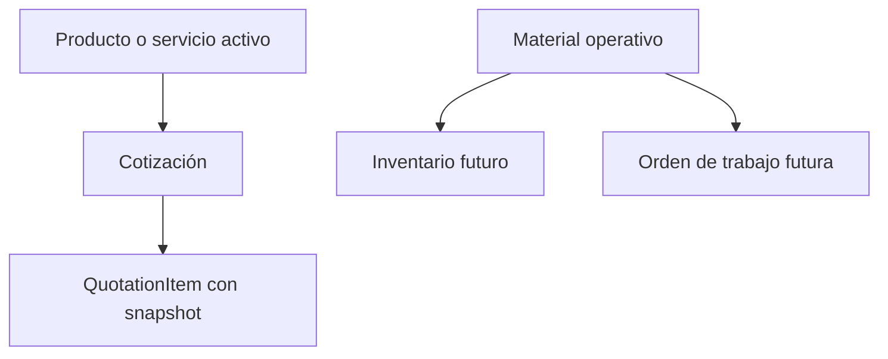
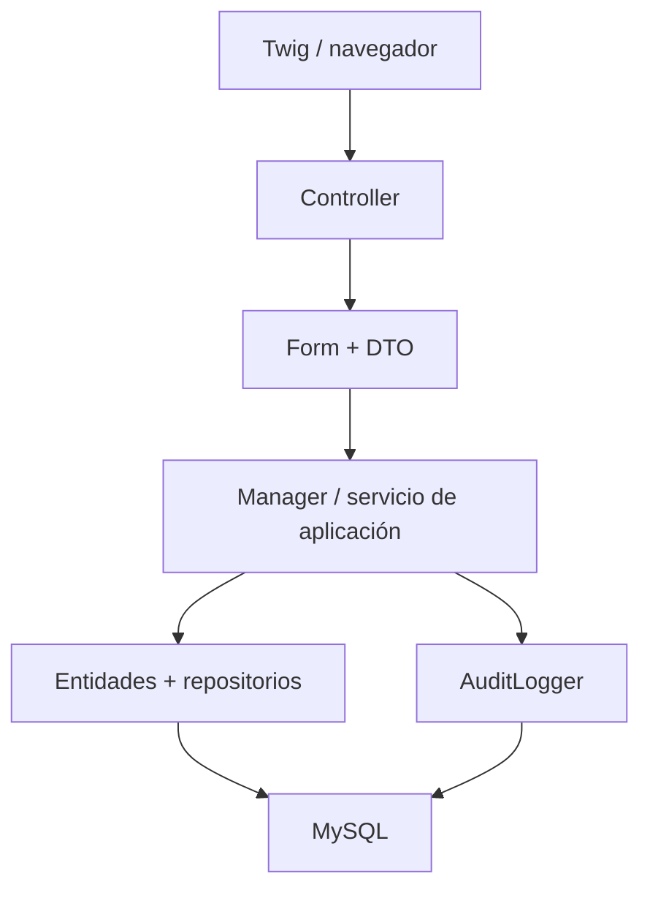
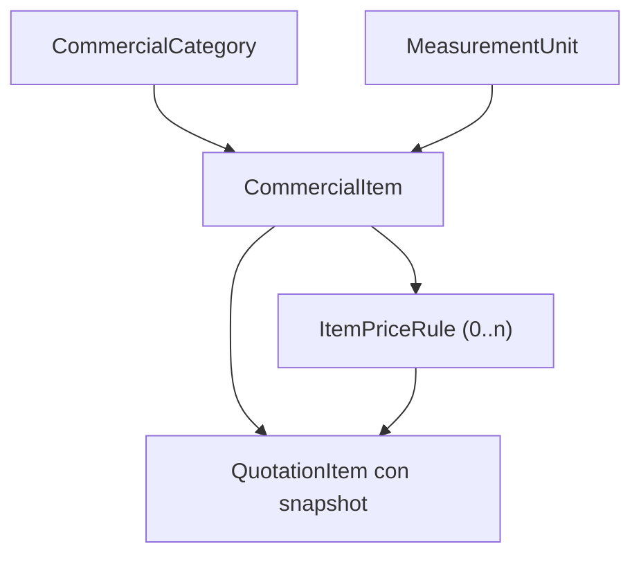
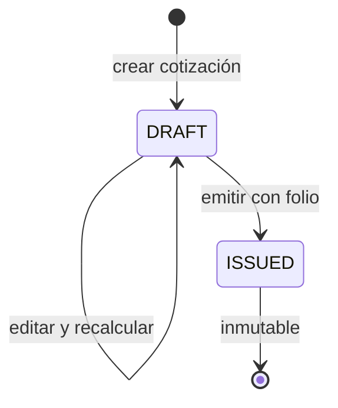
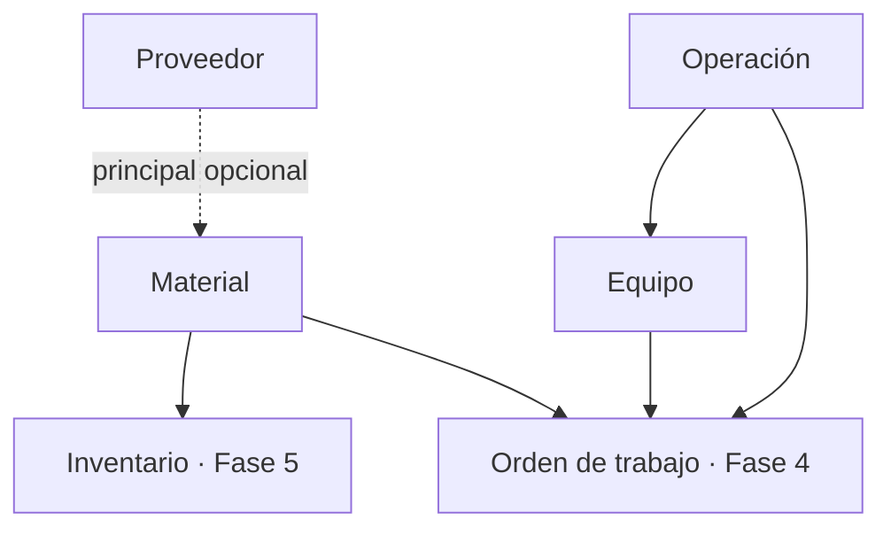
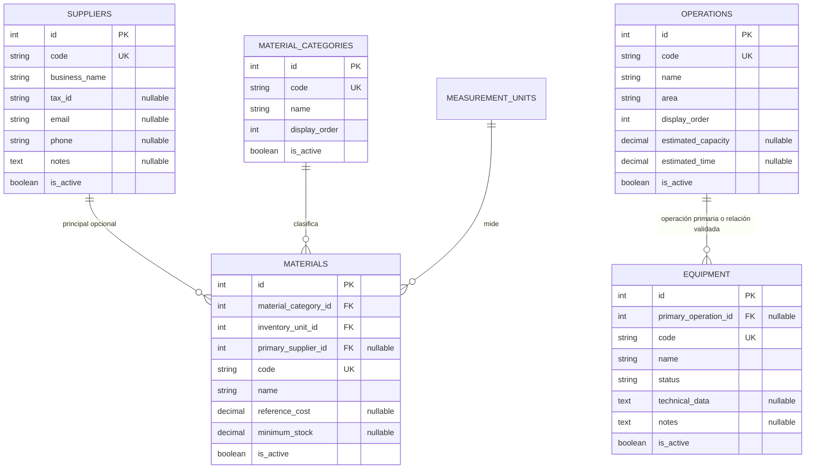

# PrintFlow — Cierre comercial e inicio de Fase 2: Catálogos operativos

> **Fecha de consolidación:** 26 de julio de 2026  
> **Estado:** documento de continuidad para iniciar la Fase 2 en un chat nuevo.  
> **Fuente de verdad:** el repositorio Git local `C:\PrintFlow`, sus migraciones aplicadas y su historial Git. Este documento consolida decisiones; no sustituye al código ni autoriza modificar una migración ya ejecutada.

---

## 1. Propósito y forma correcta de retomar

PrintFlow es una plataforma interna para una empresa de impresión. Debe conectar el flujo comercial con la operación: clientes, catálogo de venta, cotizaciones, órdenes, materiales, inventario, producción, equipos, usuarios y trazabilidad.

Este documento cierra el contexto de la etapa comercial ya construida y deja preparada la **Fase 2: Catálogos operativos**. Su función es evitar que el siguiente chat vuelva a abrir decisiones ya resueltas o confunda un concepto que se vende con un material que se consume.

Al iniciar cualquier modificación se debe seguir este orden:

1. Revisar `git status`, la versión vigente de los archivos implicados y `php bin/console doctrine:migrations:status`.
2. Tomar el repositorio como autoridad si existe discrepancia con este Markdown.
3. Diseñar las reglas del bloque antes de generar una migración.
4. Crear solo migraciones nuevas; nunca reescribir las versiones ya aplicadas.
5. Validar código, seguridad, auditoría, UI y recorrido funcional antes de declarar cerrado un módulo.

---

## 2. Estado ejecutivo al cerrar esta etapa

| Área | Estado | Situación vigente |
| --- | --- | --- |
| Fundación técnica, autenticación, RBAC y bitácora | Estable | Symfony Security con sesión, CSRF, throttling, permisos MySQL, `PermissionVoter` para permisos anidados y auditoría transversal. |
| UI administrativa | Estable | Tokens, layouts, formularios, tablas, botones, alertas, confirmaciones, sidebar responsivo y dependencias locales reutilizables. |
| Clientes, contactos y direcciones | Implementado y funcional | Datos comerciales/fiscales, contactos principales y direcciones fiscal/de entrega con reglas transaccionales y baja lógica. |
| Categorías comerciales y unidades de medida | Implementado | CRUD, filtros, estado, reordenamiento, permisos y auditoría. |
| Productos y servicios | Implementado | Una sola entidad `CommercialItem` con tipo `PRODUCT` o `SERVICE`, precio base y rangos de precio por cantidad. |
| Cotizaciones en borrador | Implementado | Cliente, partidas, snapshots, descuento, IVA, totales y edición restringida a borradores. |
| Emisión, folio y PDF | Integrado y migrado | Folio anual atómico, bloqueo pesimista, permisos, auditoría y descarga de PDF. Falta la prueba funcional completa en navegador y la revisión visual del primer PDF real. |
| Sidebar comercial y de catálogos | Corregido | Catálogos agrupa Productos y servicios, Categorías comerciales y Unidades de medida; Comercial agrupa Clientes y Cotizaciones. |
| Fase 2: catálogos operativos | Por iniciar | No deben existir todavía entidades, rutas, permisos ni migraciones asumidas para proveedores, materiales, operaciones o equipos. |

La Fase 2 es el siguiente bloque de construcción. No debe interpretarse como una excusa para reabrir el modelo comercial ni para iniciar inventario, órdenes o trazabilidad antes de su fase correspondiente.

---

## 3. Decisiones de dominio ya cerradas

### 3.1 Producto/servicio comercial no es material operativo

Una **partida** es una línea persistida en `QuotationItem`. No es un catálogo independiente.

Lo que se administra para vender es un **producto o servicio** (`CommercialItem`). Al agregarlo a una cotización, el sistema genera la partida con cantidad, precio resuelto, importe y snapshots históricos.

Un **material** pertenece al ámbito operativo. Puede ser lona, vinil, tinta, papel, laminado, placas o cualquier insumo consumido para ejecutar un trabajo. Aunque un material participe en el costo de un servicio, no debe convertirse en un `CommercialItem` por esa razón.



Consecuencias obligatorias:

- No separar productos y servicios en tablas distintas.
- No crear una partida como catálogo.
- No reutilizar `commercial_categories` para clasificar materiales.
- No usar un material como partida cotizable sin una decisión comercial explícita y un concepto vendible correspondiente.
- No añadir movimientos, reservas ni existencias transaccionales en la Fase 2: eso pertenece a la Fase 5 de inventario.

### 3.2 Historial y baja lógica

Los registros que puedan ser usados por cotizaciones, órdenes, inventario o auditoría no se borran físicamente de manera rutinaria. Se usan estados activos/inactivos, FKs restrictivas y snapshots donde corresponde.

Una cotización emitida siempre conserva el cliente, concepto, unidad, categoría, regla de precio e importes que tuvo al momento de emitirse. Nunca se debe volver a calcular desde el catálogo actual.

### 3.3 Fechas, dinero y zonas horarias

- Persistir fechas con `DateTimeImmutable` en UTC.
- Convertir a `America/Mexico_City` para presentación, filtros y reglas de calendario del negocio.
- Usar `DECIMAL` y normalización de strings para importes y cantidades; no usar `float`.
- La numeración de una cotización se determina por el año de negocio en `America/Mexico_City`, aunque `issued_at` persista en UTC.

---

## 4. Arquitectura técnica que se debe conservar

### 4.1 Stack confirmado

| Área | Decisión vigente |
| --- | --- |
| Framework | Symfony 7.4.14 LTS, server-rendered |
| PHP | 8.2.31 local; 8.2.30 en Hostinger |
| Datos | MySQL 8.0.46, InnoDB, utf8mb4; base local `printflow_app` |
| Persistencia | Doctrine ORM + Doctrine Migrations |
| Vistas | Twig, Symfony Forms, Twig Components / UX y Stimulus |
| Frontend | AssetMapper; Bootstrap, Bootstrap Icons, jQuery, Notyf, SweetAlert2 y SortableJS locales |
| Zona de negocio | `America/Mexico_City` |
| Despliegue previsto | Hostinger Business por SSH, Git y Composer; sin Docker |

No usar `doctrine:schema:update --force`, CDN como dependencia operativa ni un dump SQL como mecanismo de evolución de esquema.

### 4.2 Responsabilidad por capa



| Capa | Responsabilidad |
| --- | --- |
| Controller | Permiso, request/response, CSRF, formulario, flash y redirección. |
| DTO + Form | Captura y validación de entrada. |
| Manager | Invariantes, transacciones, coordinación de repositorios, cambios de estado y auditoría. |
| Entity | Estado, relaciones, normalización local, timestamps e invariantes pequeñas. |
| Repository | Consultas reutilizables, búsqueda, filtros y consultas de integridad. |
| AuditLogger | Persistir evidencia saneada sin ejecutar `flush()` propio. |

Un controlador no debe calcular totales, escribir SQL, resolver stock, asignar folios ni concentrar reglas de estado.

### 4.3 Seguridad y auditoría

La autorización funcional se aplica con `denyAccessUnlessGranted('dominio.accion')` o `is_granted('dominio.accion')`. No se sustituye por comprobar manualmente `ROLE_ADMIN`.

Reglas permanentes:

- `PermissionVoter` debe admitir permisos de profundidad variable, por ejemplo `clients.contacts.view` y `catalog.items.update_price`.
- Toda mutación debe usar `POST` o un método explícito apropiado, permiso y CSRF.
- Un enlace no se muestra si el usuario no tiene el permiso de consulta correspondiente; el servidor conserva igualmente la denegación.
- Los permisos se agregan por una migración nueva y se asignan de forma idempotente al rol administrador inicial, sin depender de IDs fijos.
- `AuditLogger` guarda actor, acción, entidad, valores anterior/nuevo, IP, user agent y fecha; sanea contraseñas, hashes y tokens.
- El manager conserva el control de la transacción y el `flush()` final.

### 4.4 Estándar de interfaz

- Extender `layouts/app.html.twig` y usar los bloques `app_navigation_active`, `app_breadcrumb` y `app_content`.
- Reutilizar `templates/form/printflow_theme.html.twig`.
- Usar `pf-page`, `pf-card`, `pf-table`, `pf-table-responsive`, `pf-table__actions`, `pf-form`, `pf-form-field` y `pf-form-actions` antes de añadir CSS de módulo.
- Usar componentes locales de flash, Notyf y SweetAlert2; no crear confirmaciones ad hoc por pantalla.
- Colores de marca: `#27F52E`, hover `#16C61D`, activo `#10A816` y fondo suave `#E8FDEA`.
- El sidebar es responsivo mediante `ui--sidebar`; los enlaces deben cerrar la navegación móvil con `data-action="ui--sidebar#close"`.

---

## 5. Módulos ya disponibles

### 5.1 Acceso, usuarios, roles y bitácora

Están disponibles login/logout, limitación de intentos, usuarios, restablecimiento de contraseña, roles, permisos M:N y bitácora. `ROLE_ADMIN` es de sistema y no se administra desde la interfaz.

Permisos existentes relevantes:

| Dominio | Permisos |
| --- | --- |
| Dashboard | `dashboard.view` |
| Usuarios | `user.view`, `user.create`, `user.update`, `user.deactivate`, `user.reset_password` |
| Roles | `role.view`, `role.manage` |
| Bitácora | `audit_log.view` |
| Clientes | `clients.view`, `clients.create`, `clients.update`, `clients.toggle_status` |
| Contactos | `clients.contacts.view`, `clients.contacts.create`, `clients.contacts.update`, `clients.contacts.toggle_status` |
| Direcciones | `clients.addresses.view`, `clients.addresses.create`, `clients.addresses.update`, `clients.addresses.toggle_status` |
| Catálogo comercial | `catalog.view`, `catalog.categories.manage`, `catalog.units.manage`, `catalog.items.create`, `catalog.items.update`, `catalog.items.update_price`, `catalog.items.toggle_status` |
| Cotizaciones | `quotations.view`, `quotations.create`, `quotations.update`, `quotations.issue`, `quotations.download_pdf` |

### 5.2 Clientes, contactos y direcciones

`Client` es la entidad comercial/fiscal principal. Incluye nombre comercial, razón social, RFC, régimen fiscal, código postal fiscal, correo de facturación, uso CFDI predeterminado, descuento predeterminado, teléfonos, notas, estado y baja lógica.

Reglas que deben preservarse:

- RFC en mayúsculas; correos en minúsculas; valores vacíos como `null`.
- Al desactivar un cliente se registra `deleted_at`; al reactivarlo se limpia.
- No se crean contactos o direcciones para clientes inactivos.
- Solo hay un contacto principal activo por cliente.
- Solo hay una dirección fiscal predeterminada activa y una dirección de entrega predeterminada activa por cliente.
- El cambio de predeterminada se hace dentro de transacción y queda en auditoría.
- Una dirección fiscal no actualiza automáticamente el código postal fiscal del cliente.

### 5.3 Catálogo comercial

El modelo vigente es:



| Entidad / tabla | Propósito | Reglas principales |
| --- | --- | --- |
| `commercial_categories` | Clasificación comercial | Código y nombre únicos, orden visual, estado. |
| `measurement_units` | Unidades de medida | Código y nombre únicos, orden visual, estado. |
| `commercial_items` | Producto o servicio vendible | Código único, tipo `PRODUCT`/`SERVICE`, categoría, unidad, precio base y estado. |
| `item_price_rules` | Precio por umbral de cantidad | Umbral, precio y estado; único por concepto/tipo/umbral. |

El servidor resuelve el precio mediante `CommercialItemPriceResolver`: toma el rango activo de mayor umbral que no exceda la cantidad; si no existe, usa `basePrice`.

### 5.4 Cotizaciones

`Quotation` representa el encabezado comercial y `QuotationItem` cada partida. Los importes se calculan en servidor por `QuotationTotalsCalculator`; el navegador no es fuente de verdad.

Flujo actualmente integrado:



Reglas confirmadas:

- Solo una cotización editable se puede actualizar o emitir.
- El cliente y el concepto deben estar activos al crear/editar un borrador.
- La vigencia no puede estar en el pasado en la zona de negocio.
- El descuento puede venir del formulario o del descuento predeterminado del cliente.
- El documento conserva snapshots de cliente, concepto, categoría, unidad y regla de precio aplicada.
- Emitir asigna `COT-AAAA-NNNNNN` dentro de una transacción, bloquea la fila y no permite volver a numerar.
- El PDF se descarga únicamente para una cotización emitida.

---

## 6. Navegación actual confirmada

La corrección arquitectónica del sidebar ya quedó definida en `templates/partials/_app_sidebar.html.twig`. No alteró tablas, rutas URL, entidades ni permisos existentes.

| Sección | Acceso | Ruta Symfony | Clave activa | Permiso de visibilidad |
| --- | --- | --- | --- | --- |
| Administración | Usuarios | `admin_users_index` | `users` | `user.view` |
| Administración | Roles y permisos | `admin_roles_index` | `roles` | `role.view` |
| Catálogos | Productos y servicios | `admin_catalog_items_index` | `catalog_items` | `catalog.view` |
| Catálogos | Categorías comerciales | `admin_catalog_categories_index` | `catalog_categories` | `catalog.view` |
| Catálogos | Unidades de medida | `admin_catalog_units_index` | `catalog_units` | `catalog.view` |
| Comercial | Clientes | `admin_clients_index` | `clients` | `clients.view` |
| Comercial | Cotizaciones | `admin_quotations_index` | `quotations` | `quotations.view` |
| Control | Bitácora | `admin_audit_index` | `audit` | `audit_log.view` |

No volver a presentar un enlace genérico llamado **Catálogo** que lleve a categorías y esconda el módulo real de Productos y servicios. Tampoco mostrar enlaces operativos vacíos antes de que exista su módulo, permiso y caso de uso.

Cuando una pantalla de cotización no tenga conceptos activos, debe comunicar ese estado y enlazar a **Productos y servicios**; no debe sugerir crear una partida como catálogo separado.

---

## 7. Migraciones y archivos relevantes de la etapa cerrada

### 7.1 Migraciones conocidas

| Versión | Contenido consolidado | Estado |
| --- | --- | --- |
| `Version20260719164200` | Lote inicial de acceso, RBAC y auditoría. | Aplicada. |
| `Version20260721223000` | Contactos de cliente y permisos `clients.contacts.*`. | Aplicada. |
| `Version20260721224500` | Parte del lote de direcciones. | Aplicada; consultar archivo vigente antes de tocarla. |
| `Version20260721230000` | Lote final de direcciones y permisos. | Aplicada. |
| `Version20260725163000` | `commercial_categories`, `measurement_units`, `commercial_items`, `item_price_rules` y permisos `catalog.*`. | Aplicada. |
| `Version20260726113000` | `quotation_folio_sequences` y permisos de emisión/descarga de PDF. | Aplicada. |

La lista es un mapa de contexto; el estado real siempre se consulta con `php bin/console doctrine:migrations:status`. Si aparece una migración adicional en el repositorio, se documenta y se respeta.

### 7.2 Cambios principales incorporados para cotizaciones

| Ruta | Responsabilidad |
| --- | --- |
| `src/Entity/Quotations/Quotation.php` | Método de dominio `issue()`, `getFolio()` y `hasBeenIssued()`; setters públicos de emisión retirados. |
| `src/Application/Quotations/QuotationManager.php` | Crear/editar borradores, recalcular, snapshots, emisión transaccional y auditoría. |
| `src/Service/Quotations/QuotationFolioGenerator.php` | Consecutivo anual MySQL atómico. |
| `src/Service/Quotations/QuotationPdfRenderer.php` | Generación de PDF de cotización emitida con Dompdf. |
| `src/Controller/Admin/Quotations/QuotationController.php` | Rutas, permisos, CSRF y respuestas de emisión/PDF. |
| `templates/admin/quotations/pdf.html.twig` | Plantilla tamaño Carta de la cotización. |
| `templates/admin/quotations/edit.html.twig` | Tarjeta/botón de emisión en un borrador. |
| `templates/admin/quotations/index.html.twig` | Acciones Editar o PDF según estado y capacidad. |
| `config/services.yaml` | Configuración explícita de `QuotationPdfRenderer`. |
| `.env.local` | Datos reales y no versionados del emisor. |

### 7.3 Rutas de cotizaciones

| Ruta | Método | Permiso | Finalidad |
| --- | --- | --- |
| `/admin/cotizaciones` | GET | `quotations.view` | Listar documentos y acciones disponibles. |
| `/admin/cotizaciones/nueva` | GET/POST | `quotations.create` | Crear borrador. |
| `/admin/cotizaciones/{id}/editar` | GET/POST | `quotations.view` + `quotations.update` | Editar únicamente borradores. |
| `/admin/cotizaciones/{id}/emitir` | POST | `quotations.issue` | Validar CSRF, emitir y asignar folio. |
| `/admin/cotizaciones/{id}/pdf` | GET | `quotations.download_pdf` | Descargar únicamente documentos emitidos. |

---

## 8. Pendiente de validación del bloque comercial

Antes de considerar las cotizaciones totalmente cerradas, debe hacerse una prueba real en navegador. Esta validación puede convivir con el arranque de diseño de Fase 2, pero no debe olvidarse ni sustituirse por lints.

### 8.1 Flujo funcional obligatorio

| Paso | Acción | Resultado esperado |
| --- | --- | --- |
| 1 | Configurar datos coherentes del emisor en `.env.local` y limpiar caché. | PDF con encabezado útil y datos no versionados. |
| 2 | Confirmar categoría, unidad y producto/servicio activos; crear un cliente activo. | Catálogo seleccionable para cotizar. |
| 3 | Crear cotización con al menos una partida. | Se guarda como `DRAFT`. |
| 4 | Abrir edición y emitir. | Flash con folio como `COT-2026-000001`. |
| 5 | Intentar editar de nuevo. | La edición está bloqueada. |
| 6 | Abrir listado. | Un borrador muestra Editar; una emitida muestra PDF según permiso. |
| 7 | Descargar PDF. | Datos, folio, vigencia, partidas, IVA, descuentos e importes correctos. |
| 8 | Emitir una segunda cotización. | Folio consecutivo, sin duplicados. |
| 9 | Revisar Bitácora. | Evento `quotation.issued` con actor, folio, importes y fecha. |

### 8.2 Casos de rechazo

- POST de emisión sin CSRF: denegación sin cambio de estado ni consumo de folio.
- Usuario sin `quotations.issue`: ni botón ni emisión por URL construida manualmente.
- Usuario sin `quotations.download_pdf`: ni botón ni descarga.
- PDF solicitado para borrador: respuesta controlada; nunca documento descargable.
- Segunda emisión del mismo borrador: rechazada sin segundo folio.
- Concepto inactivo: no seleccionable en un nuevo borrador.
- Cambio posterior de precio o nombre en catálogo: la emitida conserva sus snapshots.

### 8.3 Revisión visual del PDF

Comprobar directamente el PDF generado, no solo su plantilla Twig o texto extraído:

- Carta vertical, márgenes sin recortes, encabezado y pie en todas las páginas.
- Folio completo y legible.
- Columnas de partidas sin solaparse; encabezado repetido si hay más de una página.
- Acentos, moneda y caracteres especiales correctos.
- Importes, tasa e importe de IVA, descuentos y total correctos.
- Conceptos u observaciones extensos dentro del margen.

### 8.4 Dos decisiones que deben verificarse, no asumir

1. **Direcciones de cotización:** confirmar en el repositorio si ya se seleccionan explícitamente domicilio fiscal y entrega al crear/editar un borrador. Si falta, se completa con snapshots de ambas direcciones y validación de pertenencia al cliente.
2. **Histórico del emisor:** el PDF actual lee los datos del emisor desde configuración al descargar. Cuando se requiera reproducción histórica estricta, agregar una migración nueva con `issuer_snapshot` en `quotations` y llenarlo al emitir. Si se requiere evidencia inalterable de entrega, evaluar almacenar el binario y su hash SHA-256 en una fase posterior.

---

## 9. Fase 2 — Catálogos operativos

### 9.1 Objetivo

Modelar los recursos internos necesarios para ejecutar trabajos. Estos catálogos habilitan la operación; **no sustituyen ni modifican el catálogo comercial**.

El resultado buscado no es todavía controlar existencias ni transformar cotizaciones en órdenes. Es contar con proveedores, materiales, operaciones y equipos consistentes, activos y auditables para que las Fases 4, 5 y 6 puedan seleccionarlos sin crear datos improvisados.

### 9.2 Alcance aprobado

| Subfase | Alcance |
| --- | --- |
| 2.1 Proveedores | Alta, consulta, edición, estado, notas y, solo si el proceso lo justifica, contactos/direcciones propios. Su relación con materiales es opcional y no exclusiva. |
| 2.2 Materiales | Categorías operativas, unidad de inventario, código, costo de referencia, stock mínimo, proveedor principal opcional y estado. |
| 2.3 Operaciones | Etapas tales como preprensa, impresión, acabados y posproducción; área, orden sugerido y capacidad o tiempo estimado únicamente si el dato es confiable. |
| 2.4 Equipos | Alta, consulta, edición y baja lógica; operación/área aplicable, estado disponible/mantenimiento/inactivo, datos técnicos y observaciones. |
| 2.5 Integridad | Restricciones de eliminación, permisos granulares, auditoría, datos iniciales, UI y pruebas. |

### 9.3 Fuera de alcance por ahora

- Movimientos, existencias reales, reservas, consumos, ajustes, compras, costos promedio o alertas: Fase 5.
- Órdenes de servicio o trabajo y conversión de cotizaciones: Fase 4.
- Registro de transiciones por operación, responsable, tiempos reales o destino siguiente: Fase 6.
- Fórmulas de costo, desperdicio, conversión automática de unidades o consumo de materiales por producto: solo después de que negocio valide reglas y en la fase que corresponda.
- Enlaces de navegación vacíos y tablas preventivas no justificadas por un caso de uso real.

### 9.4 Dependencias futuras



---

## 10. Reglas de negocio que se deben cerrar antes de la primera migración de Fase 2

El siguiente chat debe iniciar leyendo el repositorio y después resolver estas preguntas con el negocio. No se debe inventar una respuesta técnica permanente donde el proceso real aún no la ha definido.

| Tema | Decisión necesaria | Regla provisional segura |
| --- | --- | --- |
| Proveedores | ¿Se requiere RFC, razón social, condiciones de pago, moneda, contacto y más de una dirección desde el primer uso? | Empezar con entidad principal y agregar contactos/direcciones solo si habrá casos reales; no copiar el módulo de clientes sin necesidad. |
| Código de proveedor | ¿Existe clave interna o basta RFC/nombre? | Si hay código, debe ser único y estable; RFC único solo cuando se capture. |
| Proveedor–material | ¿Un material puede tener varios proveedores y precios/códigos por proveedor? | Mantener `principal opcional` sin exclusividad. No crear una relación M:N ni precios de compra hasta contar con el requerimiento. |
| Categorías de materiales | ¿Qué familias se usarán realmente: sustratos, tintas, laminados, empaques, refacciones, etc.? | Crear un catálogo operativo distinto de `commercial_categories`. |
| Unidades de inventario | ¿Las unidades existentes cubren pieza, hoja, kg, litro, metro, m² y rollo? ¿Se requieren conversiones? | Reutilizar `measurement_units` si cubren la unidad física necesaria; no duplicar un catálogo de unidades ni convertir automáticamente sin una tabla y regla aprobada. |
| Stock mínimo | ¿Se maneja por material global, almacén, sucursal o presentación? | En Fase 2 solo guardar el mínimo de referencia del material; no simular almacenes ni existencias. |
| Costos | ¿El costo de referencia es último costo, costo estándar, por proveedor o por presentación? | Guardar un costo de referencia explícitamente etiquetado; no usarlo como costo contable ni recalcular históricos. |
| Operaciones | ¿Cuáles son etapas reales, su orden, área, entrada/salida y si pueden repetirse? | Registrar solo operaciones confirmadas; el orden es sugerido y no una máquina de estados todavía. |
| Capacidad / tiempo | ¿Qué medida es confiable: unidades/hora, m²/hora, minutos estimados u otra? | Campo opcional, sin usarlo para promesas o cálculos hasta validación. |
| Equipos | ¿Un equipo pertenece a una sola operación o puede ejecutar varias? | No asumir relación 1:1; definirlo antes del modelo. Mantener una operación primaria solo si refleja el negocio. |
| Mantenimiento | ¿Se requiere historial, agenda, responsables y costos? | Por ahora solo estado `AVAILABLE`, `MAINTENANCE` o `INACTIVE` y observaciones; el historial es una fase posterior. |

---

## 11. Modelo lógico propuesto para validar

El siguiente diagrama es una propuesta de diseño, no una migración autorizada. Sirve para conversar con negocio y seleccionar el modelo mínimo correcto.



### 11.1 Principios del modelo

1. **Proveedor y cliente son entidades distintas.** Pueden compartir algunos atributos, pero representan relaciones de negocio diferentes. No ligar un proveedor a `Client` ni heredar condiciones comerciales de ventas.
2. **Categoría comercial y categoría de material son distintas.** Una clasifica lo vendible; la otra, insumos y recursos de operación.
3. **La unidad puede ser común.** `measurement_units` ya es el catálogo maestro de unidades. Debe reutilizarse para inventario si sus registros y significado cubren la unidad física. Si la validación demuestra que sus reglas comerciales no son compatibles, se documentará una separación explícita antes de crear una tabla nueva.
4. **Proveedor principal es opcional.** Un material no queda bloqueado a un proveedor ni se deduce que solo pueda comprarse a uno.
5. **Costo de referencia no es historial de compras.** Fase 2 solo conserva el dato maestro; las compras y costos históricos requieren su propio modelo posterior.
6. **Operación y equipo son catálogos de preparación.** No registran todavía la ejecución de una orden ni disponibilidad por fecha.
7. **Estado de equipo y baja lógica son conceptos separados.** `MAINTENANCE` expresa indisponibilidad temporal; `INACTIVE` o `is_active = false` expresa que ya no se ofrece para nuevas selecciones. El modelo final debe evitar combinaciones ambiguas.

### 11.2 Decisiones de relación que no deben adelantarse

- Si un equipo puede ejecutar varias operaciones, crear la relación M:N solo después de confirmarlo; no forzar una operación primaria falsa.
- Si un material necesita varios proveedores, códigos de proveedor, presentaciones o precios por proveedor, modelar ese caso como relación propia con fechas y auditoría, no como campos repetidos en `materials`.
- Si una unidad necesita conversión (por ejemplo, rollo a m²), definir factor, precisión, redondeo, vigencia y responsable. Sin esas reglas, se captura en la unidad real y no se convierte.
- Si existen almacenes o sucursales, no agregarlos de forma preventiva: pertenecen al diseño de inventario y alteran el significado de `minimum_stock`.

---

## 12. Plan de implementación recomendado para la Fase 2

La fase se construirá por bloques coherentes y verificables. Cada bloque lleva su propia migración nueva, permisos, auditoría, UI y validación; no se deja seguridad o datos iniciales como tarea manual posterior.

### 12.1 Subfase 2.1 — Proveedores

**Resultado:** catálogo de proveedores consultable y administrable sin asumir aún el esquema completo de compras.

1. Cerrar campos mínimos y si contactos/direcciones son necesarios desde esta fase.
2. Diseñar entidad, índices de código/RFC/nombre y política de baja lógica.
3. Implementar repositorio de listado y filtros por texto/estado.
4. Implementar DTO, Form, `SupplierManager`, controlador y vistas.
5. Registrar permisos y eventos de auditoría.
6. Crear datos semilla validados, si ya están disponibles.

**Reglas mínimas esperadas:** código único si se usa; RFC normalizado y único solo si está informado; no baja física de proveedor referenciado; un proveedor inactivo no debe poder seleccionarse como principal en materiales nuevos.

### 12.2 Subfase 2.2 — Categorías y materiales

**Resultado:** material operativo activo, clasificado y preparado para inventario futuro, sin registrar existencia transaccional.

1. Crear el catálogo de categorías de materiales si el negocio lo confirma.
2. Verificar si la unidad de inventario puede reutilizar `MeasurementUnit`.
3. Definir código, nombre, descripción, categoría, unidad, costo de referencia, stock mínimo, proveedor principal opcional, estado y observaciones.
4. Validar que categoría, unidad y proveedor principal estén activos al crear/editar.
5. No permitir desactivar una categoría/unidad/proveedor usado por un material activo sin resolver antes la relación de negocio.
6. Implementar filtros, alta, edición, cambio de estado y auditoría.

**Reglas mínimas esperadas:** código único; importes/cantidades `DECIMAL`; el stock mínimo no es existencia; no usar `float`; proveedor principal opcional; no eliminación física si existe referencia histórica.

### 12.3 Subfase 2.3 — Operaciones

**Resultado:** catálogo ordenado de operaciones reales, listo para que una futura orden de trabajo lo seleccione.

1. Acordar áreas, códigos, nombres, orden y si el orden es global o por área.
2. Confirmar si se requerirá capacidad o tiempo estimado y la unidad de medición correspondiente.
3. Implementar estado, orden visual, filtros y restricciones de uso.
4. Usar reordenamiento reutilizable solo si el orden tiene valor real y se cumplen las mismas garantías de transacción, bloqueo, CSRF y auditoría que en los catálogos existentes.

**Reglas mínimas esperadas:** código único; una operación inactiva no se selecciona en órdenes futuras; no se borra si hay historial; el orden sugerido no reemplaza el flujo productivo que se modelará después.

### 12.4 Subfase 2.4 — Equipos

**Resultado:** equipos administrables y asociables a la operación/área correcta sin simular un módulo de mantenimiento completo.

1. Definir campos técnicos que realmente se consultarán: marca, modelo, serie, capacidad, área, observaciones y otros aprobados.
2. Confirmar cardinalidad con operaciones: una primaria o varias soportadas.
3. Definir y validar el ciclo de estados: disponible, mantenimiento e inactivo.
4. Implementar baja lógica, filtros, edición, permisos y auditoría.

**Reglas mínimas esperadas:** un equipo en mantenimiento o inactivo no podrá seleccionarse para una nueva ejecución futura; no eliminar físicamente equipos que ya tengan historia; los datos técnicos no deben usarse en cálculos automáticos sin validación.

### 12.5 Subfase 2.5 — Integridad y cierre

1. Poblar datos iniciales validados por el negocio.
2. Probar permisos positivos y negativos, CSRF, estado, auditoría, filtros y responsive.
3. Revisar que los catálogos activos son los únicos ofrecidos a los flujos posteriores.
4. Verificar que una referencia futura impide borrado físico y permite conservar historia.
5. Actualizar este documento, el diagrama ER, el catálogo de permisos y las notas de despliegue.

---

## 13. Seguridad, permisos y auditoría propuestos para Fase 2

Los nombres se deben confirmar al diseñar la primera migración, pero el nivel de granularidad no debe disminuir. Una propuesta consistente es:

| Dominio | Permisos propuestos |
| --- | --- |
| Proveedores | `suppliers.view`, `suppliers.create`, `suppliers.update`, `suppliers.toggle_status` |
| Contactos/direcciones de proveedor, si existen | `suppliers.contacts.view/create/update/toggle_status` y/o `suppliers.addresses.view/create/update/toggle_status` |
| Categorías de material | `materials.categories.view`, `materials.categories.manage` |
| Materiales | `materials.view`, `materials.create`, `materials.update`, `materials.update_cost`, `materials.toggle_status` |
| Operaciones | `operations.view`, `operations.create`, `operations.update`, `operations.toggle_status`, `operations.reorder` si aplica |
| Equipos | `equipment.view`, `equipment.create`, `equipment.update`, `equipment.toggle_status`, `equipment.change_availability` si se separa del estado general |

Los permisos definitivos deben corresponder a casos de uso reales. No crear un permiso para una acción que la UI y el manager no distinguen, ni ocultar una operación sensible detrás de un permiso genérico de consulta.

Eventos de auditoría esperados:

```text
supplier.created / supplier.updated / supplier.activated / supplier.deactivated
supplier_contact.created / supplier_contact.updated / supplier_contact.activated / supplier_contact.deactivated
supplier_address.created / supplier_address.updated / supplier_address.activated / supplier_address.deactivated
material_category.created / material_category.updated / material_category.activated / material_category.deactivated / material_category.reordered
material.created / material.updated / material.cost_updated / material.activated / material.deactivated
operation.created / operation.updated / operation.activated / operation.deactivated / operation.reordered
equipment.created / equipment.updated / equipment.available / equipment.maintenance_started / equipment.maintenance_ended / equipment.deactivated
```

Solo se implementan eventos que correspondan al flujo definitivo. Si el estado de equipos se modela de otra forma, se ajustan los nombres antes de codificar.

---

## 14. Estructura sugerida de código para la nueva fase

No crear carpetas o archivos hasta haber revisado el repositorio vigente y aprobado el modelo. Cuando se inicie, conservar el agrupamiento por dominio:

```text
src/
├── Application/
│   ├── Suppliers/
│   ├── Materials/
│   ├── Operations/
│   └── Equipment/
├── Controller/Admin/
│   ├── Suppliers/
│   ├── Materials/
│   ├── Operations/
│   └── Equipment/
├── Entity/
│   ├── Suppliers/
│   ├── Materials/
│   ├── Operations/
│   └── Equipment/
├── Form/Admin/
│   ├── Suppliers/
│   ├── Materials/
│   ├── Operations/
│   └── Equipment/
├── Repository/
│   ├── Suppliers/
│   ├── Materials/
│   ├── Operations/
│   └── Equipment/
└── templates/admin/
    ├── suppliers/
    ├── materials/
    ├── operations/
    └── equipment/
```

Los DTOs pueden seguir el patrón ya usado por los módulos actuales, dentro de `src/Application/<Dominio>/` si representan la entrada del caso de uso. Se debe conservar el estilo que usen los archivos existentes, no crear una segunda convención.

Cada CRUD nuevo debe incluir:

1. Entidad, repositorio, migración, índices, FKs y restricciones.
2. DTO, Form Type, manager con invariantes/transacción y `AuditLogger`.
3. Controlador con permisos, CSRF, flash y redirecciones.
4. Vistas que reutilicen layout, formulario, tabla, badges y confirmaciones existentes.
5. Enlace de sidebar solo cuando el módulo sea utilizable y esté condicionado por permiso de consulta.

---

## 15. Datos iniciales y migraciones de Fase 2

### 15.1 Regla de migración

Cada bloque persistente se incorpora mediante una **nueva** migración Doctrine revisada. Una migración debe:

- Declarar `abortIf` cuando incluya SQL específico de MySQL.
- Crear tablas con InnoDB/utf8mb4, FKs, índices y únicos necesarios.
- Registrar permisos de manera idempotente.
- Asignar los permisos iniciales a `ROLE_ADMIN` con SQL idempotente y sin IDs fijos.
- Tener `down()` razonable, sin prometer eliminar información que ya podría ser histórica en un ambiente real.

Antes de aplicarla:

```powershell
php -l migrations\VersionYYYYMMDDHHMMSS.php
php bin\console doctrine:migrations:migrate --dry-run
php bin\console doctrine:migrations:migrate
php bin\console doctrine:schema:validate
```

### 15.2 Datos semilla

Los datos iniciales no se capturan a ciegas. Antes de ingresarlos, solicitar una fuente revisada con:

- Proveedores: código, nombre/razón social, RFC si corresponde, correo, teléfono, notas y estado.
- Materiales: código, nombre, categoría operativa, unidad, costo de referencia, mínimo, proveedor principal y estado.
- Operaciones: código, nombre, área, orden y capacidad/tiempo únicamente cuando sean confiables.
- Equipos: código, nombre, operación/área, estado, datos técnicos y observaciones.

Si se usa un CSV o carga masiva, debe validarse, ser repetible o estar documentada, y registrar claramente qué usuario/proceso hizo la importación. No insertar datos de producción por SQL manual sin trazabilidad.

---

## 16. Validación de cada subfase y criterio de salida

### 16.1 Validaciones técnicas

```powershell
php -l src\Ruta\Archivo.php
php bin\console doctrine:schema:validate --skip-sync
php bin\console lint:container
php bin\console lint:twig templates
php bin\console debug:router
php bin\console doctrine:migrations:status
git status
```

### 16.2 Casos funcionales mínimos

| Área | Casos que deben demostrarse |
| --- | --- |
| Proveedores | Alta, edición, inactivación/reactivación, búsqueda, auditoría, rechazo de duplicado y denegación sin permiso. |
| Materiales | Validación de categoría/unidad/proveedor activos, costo y mínimo `DECIMAL`, cambio de estado, auditoría y rechazo de código duplicado. |
| Operaciones | Alta, edición, estado, orden si se implementa, auditoría y no selección de inactivos. |
| Equipos | Alta, cambio de estado, mantenimiento, edición, auditoría y no selección futura cuando no está disponible. |
| Seguridad | Acciones mutantes con CSRF inválido fallan; rutas protegidas niegan acceso sin el permiso exacto. |
| Regresión | Siguen funcionando login, roles, usuarios, clientes, contactos, direcciones, catálogo comercial y cotizaciones. |
| Interfaz | Tablas responsivas, filtros consistentes, sidebar correcto en móvil y escritorio, feedback visible para errores y éxitos. |

### 16.3 Criterio de salida de Fase 2

La fase estará cerrada únicamente cuando:

- Proveedores, materiales, operaciones y equipos activos se puedan seleccionar por los flujos posteriores autorizados.
- No exista borrado físico de recursos referenciados por historia.
- Estados, relaciones y restricciones de uso sean consistentes.
- Permisos, CSRF y auditoría cubran cada mutación sensible.
- Los datos iniciales estén validados y documentados.
- Se hayan ejecutado validaciones técnicas, funcionales, de seguridad y de regresión.
- El diagrama ER y este documento se actualicen con los nombres reales de tablas, migraciones, rutas, archivos y decisiones tomadas.

---

## 17. Riesgos que deben evitarse

| Riesgo | Prevención |
| --- | --- |
| Confundir insumos con conceptos de venta | Mantener separados `Material` y `CommercialItem`; conectarlos solo mediante reglas futuras aprobadas. |
| Crear tablas preventivas | No incorporar almacenes, compras, conversiones, fórmulas o mantenimiento histórico sin caso de uso validado. |
| Duplicar unidades | Reutilizar `measurement_units` si cubre el significado operativo; separar solo con justificación explícita. |
| Proveedor exclusivo por accidente | Usar proveedor principal opcional; no imponer exclusividad. |
| Borrar recursos históricos | Baja lógica, FKs restrictivas, auditoría y snapshots cuando corresponda. |
| Permisos demasiado genéricos | Diseñar permisos por caso de uso y verificar tanto UI como servidor. |
| Lógica en controlador o JavaScript | Mantener reglas, transacciones y auditoría en managers PHP. |
| Modificar migraciones aplicadas | Crear una corrección nueva y ejecutar `--dry-run`. |
| Inventario falso | No usar mínimo o costo de referencia como si fueran existencia, reserva o valuación contable. |
| Navegación adelantada | No agregar enlaces sin un módulo real, protegido y probado. |

---

## 18. Archivos que se deben leer al iniciar el nuevo chat

Antes de proponer o generar cambios para Fase 2, compartir o inspeccionar las versiones vigentes de:

| Objetivo | Archivos mínimos |
| --- | --- |
| Fuente de verdad | `git status`, historial reciente, `php bin/console doctrine:migrations:status`, `php bin/console doctrine:schema:validate` |
| Convenciones de catálogo | Entidades, managers, controladores, repositorios, forms y templates de `Catalog`; en especial `CommercialCategory`, `MeasurementUnit` y sus equivalentes. |
| Convenciones de clientes | `Client`, `ClientManager`, contacto/dirección, sus repositorios/forms/controladores y migraciones relacionadas. |
| Seguridad y auditoría | `PermissionVoter.php`, `AuditLogger.php`, migraciones de permisos, vista de bitácora y `security.yaml` si es necesario. |
| UI y navegación | `templates/layouts/app.html.twig`, `templates/partials/_app_sidebar.html.twig`, tema de formularios y los componentes de tabla/formulario/confirmación. |
| Dependencias futuras | Entidades y managers de cotizaciones únicamente como referencia de snapshots e inmutabilidad; no para fusionar dominios. |
| Cierre comercial pendiente | `Quotation.php`, `QuotationManager.php`, `QuotationController.php`, renderer/generador de folio, vistas de cotización, `services.yaml` y `Version20260726113000`. |

Si el repositorio no está disponible en el nuevo entorno, se debe pedir primero esa información. No se deben fabricar rutas, nombres de clases ni migraciones basadas solo en un documento adjunto.

---

## 19. Prompt de continuidad para iniciar Fase 2

Copiar este texto en el nuevo chat dentro del proyecto PrintFlow:

```text
Estoy continuando PrintFlow e iniciaré la Fase 2: Catálogos operativos. Usa el archivo PrintFlow_Contexto_Fase_2_Catalogos_Operativos_2026-07-26.md como contexto obligatorio y toma el repositorio local C:\PrintFlow como fuente de verdad.

Estado confirmado: clientes, contactos, direcciones, categorías comerciales, unidades, productos y servicios, precios por cantidad y cotizaciones ya existen. El sidebar ya quedó reorganizado: Catálogos contiene Productos y servicios, Categorías comerciales y Unidades de medida; Comercial contiene Clientes y Cotizaciones. No cambiar esa organización para crear rutas o tablas nuevas.

Las cotizaciones tienen borrador, snapshots, emisión con folio anual atómico, permisos, auditoría y PDF. Sigue pendiente hacer la prueba funcional completa de emitir, bloquear edición, descargar el PDF y revisarlo visualmente. No reescribas Version20260726113000 ni otra migración aplicada.

Quiero comenzar Fase 2 con proveedores. Antes de proponer código, revisa los archivos actuales del módulo Catalog, el módulo Clients, PermissionVoter, AuditLogger, el sidebar, las migraciones, el estado de Doctrine y el estilo real del repositorio. Mantén Symfony 7.4, Doctrine Migrations, MySQL, UTC para persistencia, America/Mexico_City para negocio, RBAC granular, CSRF, auditoría y baja lógica.

No confundas material operativo con CommercialItem: productos y servicios se venden; los materiales se consumen en operación e inventario. No diseñes almacenes, movimientos, compras, conversiones de unidad ni mantenimiento histórico hasta que negocio valide esos requisitos. Diseña primero la Subfase 2.1 de proveedores con un modelo consistente, migración nueva, permisos, auditoría, UI y pruebas.
```

---

## 20. Cierre

La etapa comercial queda estructurada con una base sólida: catálogo único de productos/servicios, reglas de precio por cantidad, clientes y direcciones, cotizaciones con snapshots, emisión inmutable, folio anual atómico, permisos, auditoría, PDF y navegación que expresa correctamente el dominio.

La Fase 2 debe conservar ese nivel de disciplina: empezar por proveedores, validar los datos reales del negocio antes de modelar materiales, no adelantar inventario ni órdenes, y construir cada catálogo con migración, seguridad, auditoría, UI y pruebas desde el inicio.
