# PrintFlow · Ruta técnica de desarrollo

> **Versión:** 1.1  
> **Fecha:** 24 de julio de 2026  
> **Estado del documento:** planificación técnica viva

## Propósito

Este documento define la ruta de desarrollo de **PrintFlow**, una plataforma interna para una empresa de impresión. Su objetivo es conectar el proceso comercial y el operativo: registrar clientes, cotizar conceptos, convertir cotizaciones aceptadas en órdenes, controlar materiales y seguir cada trabajo hasta su entrega.

La ruta está organizada por **fases funcionales dependientes**, no por pantallas aisladas. Cada fase establece qué debe definirse antes de programar, qué se construye, las reglas de integridad, entregables y criterios para aprobar el avance.

> Este documento debe actualizarse al cerrar cada fase para reflejar el estado real del repositorio, las migraciones aplicadas y las decisiones de negocio vigentes.

---

## 1. Estado actual

### 1.1 Base implementada

| Bloque | Estado | Capacidades disponibles |
| --- | --- | --- |
| Fundación técnica | Implementado | Symfony 7.4 LTS, PHP 8.2, MySQL 8, Twig, Doctrine Migrations, entorno local y despliegue previsto en Hostinger. |
| Diseño y UI | Implementado | Tokens visuales, componentes reutilizables, layouts, formularios, tablas, botones, alertas y estilos propios de PrintFlow. |
| Acceso y seguridad | Implementado | Inicio/cierre de sesión, CSRF, throttling, usuarios, roles, permisos RBAC, voter de permisos anidados y bitácora. |
| Clientes | Implementado | Clientes activos/inactivos, contactos, direcciones fiscales y de entrega, direcciones predeterminadas y auditoría. |
| Operación comercial | Pendiente | Catálogo, cotizador, PDF, correo e historial comercial. |
| Operación productiva | Pendiente | Órdenes, materiales, inventario, equipos, trazabilidad, tablero y alertas. |

### 1.2 Arquitectura vigente

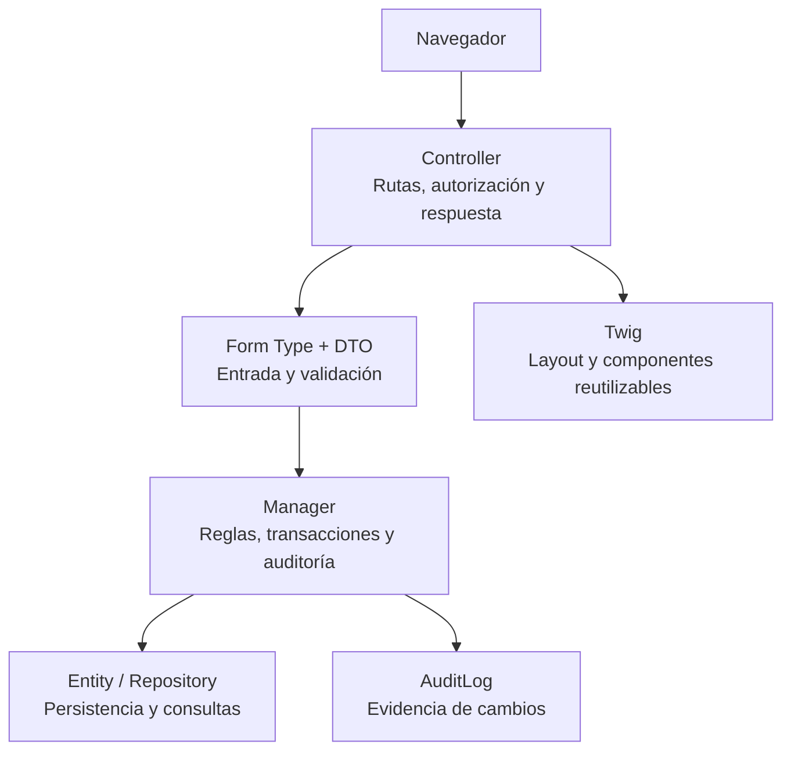

**Regla central:** la lógica de negocio no debe concentrarse en controladores, plantillas ni JavaScript. El `Manager` coordina reglas, transacciones y auditoría; el cliente solo mejora la experiencia de captura.

### 1.3 Principios que deben conservarse

1. Los permisos son granulares y se resuelven por RBAC; ser `ROLE_ADMIN` no sustituye una comprobación explícita de permiso.
2. Los permisos pueden tener varios niveles, por ejemplo `clients.addresses.view`; el `PermissionVoter` debe seguir aceptando atributos de esa forma.
3. Los cambios persistentes se entregan mediante una nueva migración Doctrine. Una migración aplicada no se edita.
4. Los registros con historial se desactivan o conservan; no se eliminan físicamente si ya son referencia de otro proceso.
5. Los importes, datos comerciales y documentos históricos se congelan como *snapshots*; nunca deben depender de que el catálogo actual siga igual.
6. Bootstrap, jQuery y demás dependencias de interfaz se conservan locales y versionadas; producción no depende de CDN.

---

## 2. Mapa general de fases

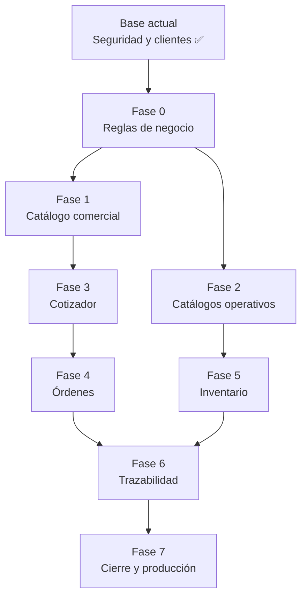

| Orden | Fase | Resultado de negocio |
| ---: | --- | --- |
| 0 | Definición funcional | Reglas aprobadas que evitan rehacer datos, cálculos y flujos. |
| 1 | Catálogo comercial | Conceptos, unidades y precios confiables para cotizar. |
| 2 | Catálogos operativos | Proveedores, materiales, operaciones y equipos disponibles. |
| 3 | Cotizador | Cotizaciones con partidas, cálculo, PDF, correo e historial. |
| 4 | Órdenes | Trabajo comercial convertido en órdenes controlables. |
| 5 | Inventario | Existencias, movimientos, reservas, consumo y alertas. |
| 6 | Trazabilidad | Seguimiento por trabajo, etapa, responsable y destino. |
| 7 | Cierre y producción | Reportes, calidad, capacitación y publicación controlada. |

### Dependencias no negociables

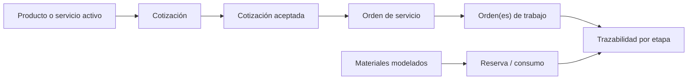

Una solicitud que agregue reglas de precio, documentos, canales de comunicación, integraciones o etapas no previstas debe evaluarse como **cambio de alcance** antes de incorporarse.

---

## 3. Fase 0 · Definición funcional del negocio

### Objetivo

Convertir las necesidades reales del negocio en reglas verificables antes de crear tablas o pantallas. Esta fase evita que el catálogo, los descuentos, el inventario y la trazabilidad nazcan con supuestos incorrectos.

### Subfases

| Subfase | Decisiones que deben cerrarse | Resultado esperado |
| --- | --- | --- |
| 0.1 Catálogo | Si productos y servicios comparten entidad o requieren estructuras distintas; categorías, unidades, variantes, acabados, cantidades mínimas y datos visibles al cliente. | Matriz de atributos por tipo de concepto. |
| 0.2 Precios | Precio fijo, por unidad, por rangos, por m², por fórmula o mixto; IVA, redondeos, descuentos y responsables de autorizar excepciones. | Política de precios y descuentos. |
| 0.3 Cotización | Folios, estados, vigencia, condiciones, aceptación/rechazo, vencimiento, datos congelados y requisitos de PDF/correo. | Ciclo de vida de cotización aprobado. |
| 0.4 Producción | Etapas reales, responsables, prioridad, pausas, incidencias, destino siguiente y definiciones de terminado/entregado. | Mapa operacional validado. |
| 0.5 Datos iniciales | Conceptos, operaciones, materiales, proveedores, equipos, logotipo y textos legales. | Fuentes de carga limpias y responsables identificados. |

### Entregables

- Matriz de reglas de catálogo, precio, impuestos, descuentos y vigencia.
- Diagrama de estados de cotización y de producción.
- Catálogo inicial depurado.
- Ejemplos aprobados de cotización y de documentos comerciales.
- Lista priorizada de excepciones reales del proceso.

### Criterio de salida

No quedan decisiones abiertas que puedan alterar el modelo de precios, el ciclo de vida de una cotización o el flujo productivo.

### Riesgos controlados

- Entidades con campos que el negocio no usa.
- Cálculos incompatibles con la operación real.
- Migraciones costosas de corregir después de tener cotizaciones u órdenes históricas.

---

## 4. Fase 1 · Catálogo comercial de productos y servicios

### Objetivo

Construir la fuente controlada de conceptos que pueden cotizarse. Debe ser reutilizable, auditable y separada de los datos históricos de una cotización.

### Subfases

| Subfase | Construcción técnica |
| --- | --- |
| 1.1 Modelo de datos | Categorías, unidades de medida y conceptos comerciales. Cada concepto requiere tipo, código interno único, nombre, descripción, unidad, precio base, estado y atributos aprobados en Fase 0. |
| 1.2 Reglas de precio | Implementar el mecanismo mínimo aprobado: precio base y, cuando aplique, rangos o reglas extensibles sin romper registros existentes. |
| 1.3 Administración | Listados con búsqueda/filtros, alta, edición, consulta y desactivación. Debe impedirse la eliminación destructiva de un concepto ya usado. |
| 1.4 Seguridad y auditoría | Permisos por operación; auditoría en altas, cambios de precio y estados. |
| 1.5 Datos semilla | Importar o capturar el catálogo inicial validado y documentar el proceso de carga. |

### Modelo lógico previsto

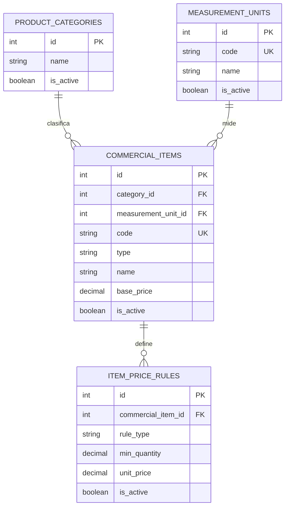

### Entregables

- Migración versionada, entidades, repositorios, managers, DTOs y formularios.
- Pantallas administrativas bajo los componentes visuales existentes.
- Permisos y auditoría.
- Datos iniciales y documentación de carga.
- Pruebas de reglas de precio, estado y restricciones de uso.

### Criterios de salida

- Un usuario autorizado puede administrar conceptos del catálogo.
- Un concepto inactivo no puede seleccionarse en nuevas cotizaciones.
- Los cambios de precio y de estado quedan auditados.
- La base queda lista para conservar *snapshots* en futuras cotizaciones.

---

## 5. Fase 2 · Catálogos operativos

### Objetivo

Modelar los recursos necesarios para ejecutar los trabajos. Estos catálogos habilitan la operación interna; no sustituyen el catálogo comercial.

### Subfases

| Subfase | Alcance |
| --- | --- |
| 2.1 Proveedores | Alta, edición, contactos/direcciones si son necesarios, estado y notas. Relación opcional con materiales; no asumir exclusividad. |
| 2.2 Materiales | Categorías, unidad de inventario, código, costo de referencia, stock mínimo, proveedor principal opcional y estado. Conversiones solo si el negocio las valida. |
| 2.3 Operaciones | Etapas/operaciones como preprensa, impresión, acabados y posproducción; área, orden sugerido, capacidad o tiempo estimado cuando el dato sea confiable. |
| 2.4 Equipos | Alta, consulta, edición y baja lógica; tipo de operación/área, estado disponible/mantenimiento/inactivo, datos técnicos y observaciones. |
| 2.5 Integridad | Catálogos activos, restricciones de eliminación, permisos, auditoría y datos iniciales. |

### Relación de los recursos operativos

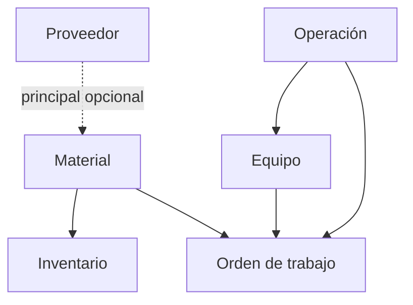

### Criterios de salida

- Materiales, operaciones y equipos activos son seleccionables por los flujos posteriores.
- Un elemento ya referenciado por historia no puede desaparecer físicamente.
- Los catálogos se gestionan con el mismo estándar de seguridad, auditoría y UI.

---

## 6. Fase 3 · Cotizador y gestión comercial

### Objetivo

Crear, calcular, consultar, enviar y conservar cotizaciones profesionales que representen un acuerdo comercial verificable.

### Subfases

| Subfase | Alcance técnico y funcional |
| --- | --- |
| 3.1 Modelo de cotización | Encabezado, partidas, folio, cliente, contacto, dirección, vigencia, estado, observaciones, condiciones, subtotal, descuento, IVA y total. |
| 3.2 Captura y cálculo | Borradores, conceptos activos, cantidades, reglas de precio y descuentos autorizados. Los totales críticos se calculan y persisten en PHP. |
| 3.3 Ciclo de vida | Estados: borrador, enviada, aceptada, rechazada, vencida y cancelada. Definir transiciones permitidas, actor, motivo y bloqueo de edición. |
| 3.4 PDF y correo | Vista imprimible consistente, PDF reproducible, envío por correo y evidencia de destinatario, fecha y versión. |
| 3.5 Historial | Listado por cliente, fechas, estado, folio y responsable; detalle de cálculo y auditoría de cambios. |

### Máquina de estados de cotización

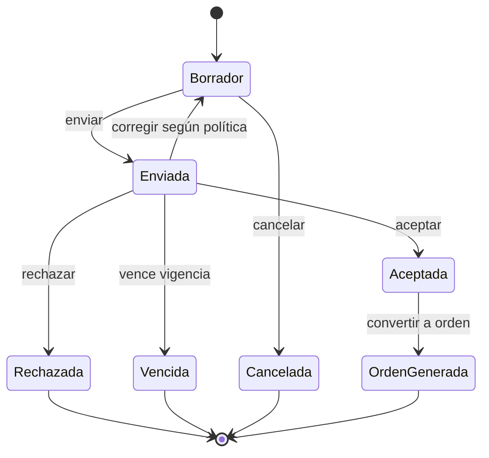

### Regla de conservación histórica

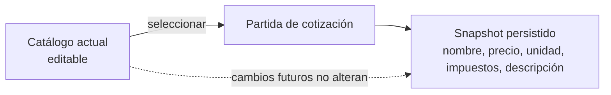

### Criterios de salida

- El PDF coincide con los importes persistidos.
- La cotización histórica no cambia si el catálogo se modifica después.
- Toda aceptación, rechazo, envío o cancelación conserva evidencia.
- Los descuentos y cambios de estado requieren permiso y motivo conforme a la política aprobada.

---

## 7. Fase 4 · Órdenes de servicio y órdenes de trabajo

### Objetivo

Transformar una cotización aceptada en trabajo operativo controlable, manteniendo el contexto comercial original.

### Subfases

| Subfase | Alcance |
| --- | --- |
| 4.1 Conversión | Generar una orden de servicio únicamente desde una cotización aceptada. Crear folio y copiar el snapshot de origen de forma inmutable. |
| 4.2 Orden de servicio | Cliente, entrega, partidas, condiciones, fechas objetivo, estado, responsable y documento. Mantener historial de modificaciones relevantes. |
| 4.3 Órdenes de trabajo | Descomponer una orden en uno o más trabajos internos con especificaciones, cantidades, prioridad, archivos/referencias y relación con la orden. |
| 4.4 Estados y cierre | Pendiente, en proceso, terminada, entregada y cancelada; impedir entregas con trabajos abiertos salvo autorización explícita. |
| 4.5 Comunicación | Documento de orden y eventos de notificación cuando el flujo lo requiera. |

### Trazabilidad comercial a operativa

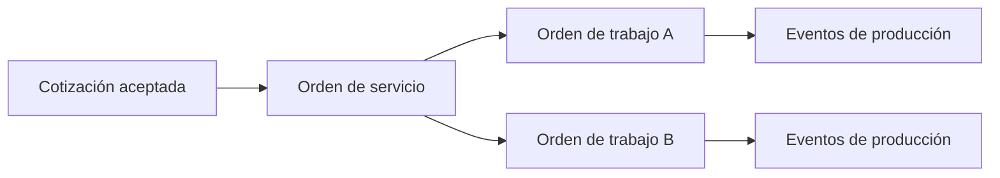

### Criterios de salida

- No se crea una orden desde cotizaciones en estados no permitidos.
- El vínculo `cotización → orden de servicio → orden de trabajo` es inmutable y auditable.
- No se generan duplicados activos sin una regla explícita de negocio.

---

## 8. Fase 5 · Inventario de materiales

### Objetivo

Controlar existencias y consumo con trazabilidad. El inventario se basa en movimientos, no en una cifra editable sin evidencia.

### Subfases

| Subfase | Alcance |
| --- | --- |
| 5.1 Kardex | Movimientos de entrada, salida, ajuste, reserva y liberación con material, cantidad, unidad, motivo, referencia de origen, actor, fecha y saldo. |
| 5.2 Existencias | Calcular o mantener stock por material a partir de movimientos bajo transacción. Proteger concurrencia para evitar doble descuento. |
| 5.3 Consumo por trabajo | Relacionar materiales requeridos/consumidos con órdenes de trabajo; definir reserva y descuento real. |
| 5.4 Alertas | Comparar existencias contra stock mínimo; alertas visibles y correo solo con destinatarios, plantilla y frecuencia aprobados. |
| 5.5 Excepciones | Ajustes autorizados, negativos excepcionales, devoluciones, mermas y permisos. |

### Flujo de inventario

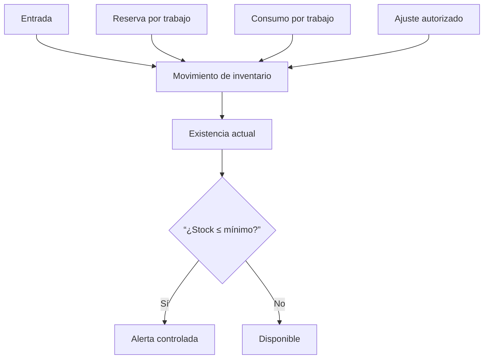

### Criterios de salida

- Cada variación de stock tiene origen, actor y motivo.
- No existen saldos negativos salvo permiso excepcional y evidencia.
- Una operación concurrente no descuenta existencias dos veces.
- Las alertas no se disparan repetidamente sin control de estado.

---

## 9. Fase 6 · Trazabilidad interna de producción

### Objetivo

Dar visibilidad operacional a cada orden de trabajo: qué se está haciendo, en qué etapa, quién es responsable, qué falta y cuál es su siguiente destino.

### Subfases

| Subfase | Alcance |
| --- | --- |
| 6.1 Flujo de etapas | Operaciones aplicables, etapa actual, destino siguiente y transiciones permitidas. Registrar inicio, pausa, reanudación, fin e incidencias. |
| 6.2 Asignación | Responsable, equipo y prioridad cuando aplique. Conservar responsable anterior y motivo de reasignación. |
| 6.3 Tablero operativo | Vista por etapa, responsable, fecha objetivo, estado y prioridad; destacar detenidos, retrasados y faltantes. |
| 6.4 Previsualización | Especificaciones, partida origen, cantidades, materiales, archivos/referencias y observaciones sin abandonar la operación. |
| 6.5 Cierre y entrega | Validar etapas requeridas, consumo y condiciones antes de cerrar trabajo u orden. |

### Ejemplo de flujo por trabajo

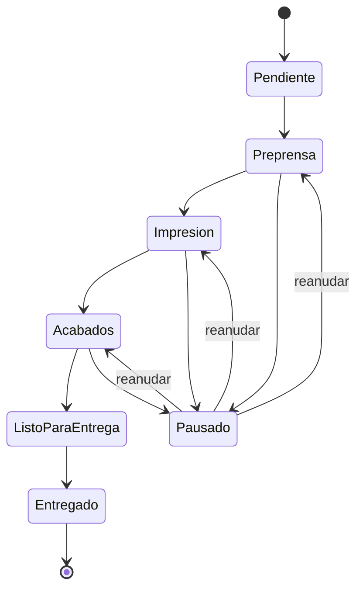

> Las etapas reales y sus transiciones deben salir de Fase 0. El diagrama anterior representa una estructura de referencia, no una configuración definitiva.

### Criterios de salida

- Cada trabajo muestra etapa, siguiente destino, responsable y su historial.
- No se permiten transiciones no configuradas ni cierres sin controles requeridos.
- El tablero permite detectar retrasos, pausas e incidencias sin interpretar manualmente la bitácora.

---

## 10. Fase 7 · Reportes, endurecimiento y salida a producción

### Objetivo

Cerrar PrintFlow como sistema operable, seguro y mantenible: reportes, calidad, respaldos, capacitación, publicación controlada y soporte inicial.

### Subfases

| Subfase | Alcance |
| --- | --- |
| 7.1 Reportes | Cotizaciones por estado/periodo, conversión a orden, órdenes por etapa, retrasos, consumo/bajo inventario y actividad administrativa. |
| 7.2 Calidad | Pruebas de reglas críticas, validación de migraciones, PHP, Twig, contenedor, recorridos funcionales y corrección de incidencias antes de publicar. |
| 7.3 Seguridad | Revisión de permisos, usuarios inactivos, CSRF, contraseñas, secretos, datos sensibles, carga de archivos y configuración de correo. |
| 7.4 Operación | Respaldo/restauración MySQL, retención de PDFs/archivos, monitoreo básico, bitácora y protocolo de incidencias. |
| 7.5 Publicación | Variables de entorno, dominio/HTTPS, PHP/Composer, caché, assets, migraciones, correo y plan de reversión. |
| 7.6 Entrega | Manual de usuario, capacitación, checklist de producción y evidencia de publicación. |

### Secuencia de liberación

### Criterios de salida

- Migraciones aplicadas sin diferencias de esquema.
- Accesos validados por perfil.
- Respaldo probado antes de cambios productivos.
- Flujos críticos aprobados con usuarios del negocio.
- Monitoreo, bitácora y procedimiento de incidencias disponibles.

---

## 11. Reglas técnicas obligatorias por módulo

| Disciplina | Regla técnica |
| --- | --- |
| Migraciones | Cada cambio persistente requiere migración Doctrine nueva, revisada y razonablemente reversible. Nunca modificar una migración ya ejecutada en un ambiente compartido. |
| Modelo de datos | Usar claves foráneas, índices y restricciones únicas. Aplicar baja lógica cuando exista historia; evitar borrado de registros referenciados. |
| Aplicación | Crear DTO, Form Type, Manager, Repository y Controller en el dominio adecuado. El Manager coordina transacciones, reglas y auditoría. |
| Seguridad | Registrar permisos granulares, asignarlos a roles, aplicar `is_granted`/`denyAccessUnlessGranted` y no sustituir permisos por comprobaciones genéricas de rol. |
| Auditoría | Registrar actor, acción, entidad, valores anteriores/nuevos saneados y fecha para cambios sensibles, estados, descuentos, inventario y transiciones. |
| UI | Extender `layouts/app.html.twig`, reutilizar `form/printflow_theme.html.twig` y componentes existentes antes de crear estilos propios por módulo. |
| Cálculos | Ejecutar en PHP bajo reglas centralizadas, probar y persistir importes/snapshots. JavaScript solo apoya captura y previsualización. |
| Calidad | Validar PHP, Twig, contenedor, esquema, migración y recorridos funcionales antes de cerrar un módulo. |

### Secuencia estándar de construcción

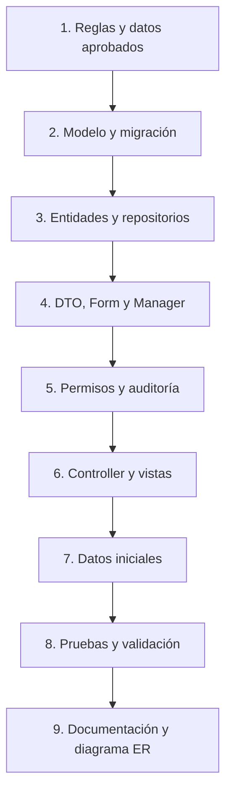

---

## 12. Arquitectura de datos proyectada

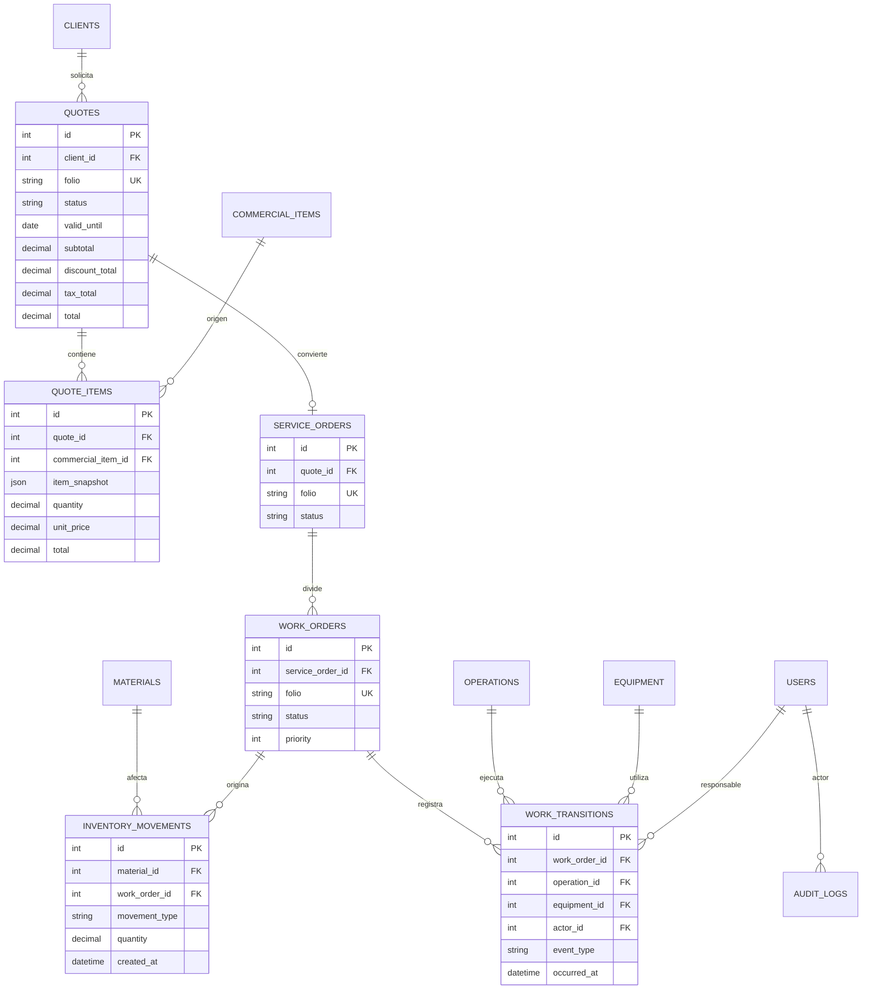

La estructura exacta se definirá por fase, mediante migraciones revisadas. El diagrama establece las relaciones y reglas de conservación esperadas; no autoriza crear tablas sin cerrar los requisitos de Fase 0.

---

## 13. Validación antes de cada entrega

| Nivel | Evidencia mínima |
| --- | --- |
| Técnico | `php -l` en archivos modificados, `doctrine:schema:validate --skip-sync`, `lint:container`, `lint:twig`, migración aplicada en prueba y `cache:clear`. |
| Reglas críticas | Pruebas automatizadas de cálculos, permisos, transiciones, restricciones de integridad e inventario. |
| Funcional | Recorrido realista: usuario autorizado/no autorizado, alta, edición, inactivación, consulta e historial. |
| Regresión | Login, roles, clientes, contactos y direcciones continúan funcionando. |
| Documental | Actualización del contexto técnico, diagrama ER, catálogo de permisos, manual de usuario y notas de despliegue. |

Una fase solo se considera terminada cuando su funcionalidad, datos, permisos, auditoría, pruebas y documentación están aprobados. Una pantalla visualmente terminada no es evidencia suficiente.

---

## 14. Plan inmediato

| Prioridad | Actividad | Resultado esperado |
| ---: | --- | --- |
| 1 | Taller de Fase 0 | Matriz aprobada de catálogo, precios, IVA, descuentos, vigencia, estados y flujo productivo. |
| 2 | Preparar datos iniciales | Archivo depurado de categorías, unidades y conceptos; lista de operaciones, materiales, proveedores y equipos. |
| 3 | Diseño técnico de Fase 1 | Modelo ER, permisos, reglas de precio, migración propuesta, pantallas y casos de prueba antes de codificar. |
| 4 | Construcción de Fase 1 | Catálogo comercial completo y listo para el cotizador. |
| 5 | Revisión de hito | Demostración, validación funcional, ajustes controlados y actualización de esta documentación. |

### Información que debe aportar el negocio

- Servicios/productos actuales, códigos, unidades, precios, cantidades mínimas, acabados y cotizaciones reales.
- Políticas de IVA, descuentos, vigencia, anticipos, condiciones comerciales y responsables de autorizar excepciones.
- Áreas, operaciones, responsables, equipos, orden de etapas, criterios de entrada/salida e incidencias frecuentes.
- Inventario inicial: material, unidad, existencia, mínimo, proveedor, costo de referencia y reglas de merma/devolución.
- Logotipo, datos fiscales, textos legales, ejemplos de documentos, destinatarios de alertas y cuentas de correo autorizadas.
- Accesos de producción: dominio, hosting, base de datos, correo, responsables y ventana de publicación.

## Decisión recomendada

El siguiente hito es aprobar la **Fase 0**. Con sus decisiones cerradas se podrá diseñar y construir la **Fase 1: Catálogo comercial** sobre un modelo estable, sin tener que mover o reescribir módulos ya terminados.
