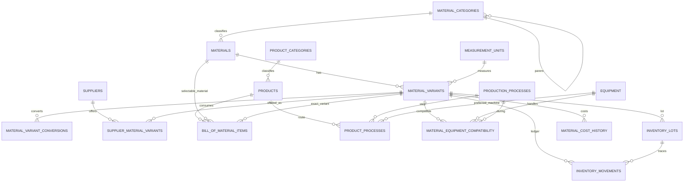

# PrintFlow — modelo objetivo de inventario, costos y producción

> Propuesta independiente del esquema legado. No debe desplegarse sin ejecutar la estrategia de transición descrita al final.

## 1. Diagnóstico

El modelo actual coloca unidad, costo, stock mínimo y proveedor principal en `materials`. Eso hace que “vinil blanco 1.52 × 50 m” termine siendo a la vez concepto, presentación comprable y existencia. Sus efectos son: duplicación por ancho/proveedor, costos sin contexto, conversiones implícitas, imposibilidad de elegir variantes, inventario no auditable y dificultad para calcular una lista de materiales (BOM).

El modelo objetivo separa:

- **Material**: definición técnica estable (`Vinil imprimible blanco brillante`).
- **MaterialVariant**: artículo comprable/almacenable (`rollo 1.52 × 50 m, marca X`).
- **Product**: lo vendido o fabricado (`Etiqueta impresa y laminada`).
- **SupplierOffering**: relación comercial variante–proveedor, con costo y vigencia.
- **InventoryMovement**: hecho inmutable que explica cada cambio de inventario.
- **BillOfMaterialItem** y **ProductProcess**: receta y ruta productiva.

No se recomienda conservar `reference_cost`, `minimum_stock`, `measurement_unit_id` ni `primary_supplier_id` en `materials`: pertenecen a variante, oferta o política de reposición.

## 2. Decisiones que dependen del negocio

Estas decisiones se fijan como recomendación antes de generar o ejecutar SQL:

1. **Valuación**: promedio móvil por variante. Cada recepción conserva su costo original y lote; la salida física prioriza lotes antiguos o próximos a caducar. No se recalculan movimientos históricos.
2. **Apartados**: registrar movimientos `RESERVATION`/`RELEASE` que afectan disponibilidad, pero no existencia física. La consulta distingue `on_hand`, `reserved` y `available`.
3. **Ubicación única**: en esta etapa todo el inventario se encuentra en Producción. No se modelan almacenes, ubicaciones ni transferencias.
4. **Moneda**: todos los importes son MXN. No se modelan monedas ni tipos de cambio; los documentos conservan `currency_code_snapshot = 'MXN'` cuando necesitan evidencia histórica.
5. **Variantes**: marca se guarda en variante. Solo subirla a material si PrintFlow decide que un concepto jamás mezcla marcas.
6. **Colores/acabados/adhesivos**: catálogos normalizados; no texto libre salvo `technical_notes`.
7. **Lotes**: obligatorios según la variante. Cada recepción controlada genera `internal_lot_number` y puede conservar `manufacturer_lot_number`; nunca se inventa un lote para variantes sin control.
8. **Cálculos**: usar métodos predefinidos, tipados y versionados con `calculation_parameters` JSON validados. No existe un método genérico `FORMULA` ni se ejecutan expresiones arbitrarias.
9. **BOM**: puede apuntar a material (variante elegible) o variante exacta, pero nunca a ambos ni a ninguno.
10. **Productos configurables**: dimensiones y opciones elegidas se congelan en cotización/orden; el catálogo conserva solo valores predeterminados.
11. **Consumo e inventario negativo**: producción puede capturar consumo y merma reales en campos opcionales. Si `actual_quantity` queda vacío, se contabiliza lo planeado y se marca `ESTIMATED`, nunca como real. Se prohíbe existencia negativa salvo autorización excepcional auditada.
12. **Categorías**: MySQL no previene ciclos con un `CHECK`; un trigger y el servicio de aplicación recorren ancestros.
13. **Proveedor preferido**: MySQL no ofrece índices únicos parciales. Se materializa una clave generada que solo existe cuando la oferta está activa y marcada como preferida; la compra definitiva congela proveedor, presentación, costo, vigencia y `MXN`.

## 3. Diagrama entidad–relación



## 4. Lista definitiva y diccionario resumido

El diccionario físico completo —tipos, nulabilidad, PK, FK, `CHECK`, índices y comentarios— está en [schema.sql](schema.sql). Las tablas son:

| Área | Tablas | Responsabilidad |
|---|---|---|
| Catálogos | `brands`, `manufacturers`, `colors`, `finishes`, `adhesive_types`, `measurement_units` | Datos reutilizables y conversiones universales por dimensión. |
| Materiales | `material_categories`, `materials`, `material_variants`, `material_variant_conversions` | Concepto, presentación física y conversiones específicas. |
| Compra/costos | `suppliers`, `supplier_material_variants`, `material_cost_history`, `material_variant_costs` | Ofertas, historial y promedio móvil actual por variante. |
| Productos | `product_categories`, `products`, `bill_of_material_items` | Artículo vendible y BOM parametrizable. |
| Producción | `production_processes`, `equipment`, `equipment_processes`, `material_equipment_compatibility`, `product_processes` | Capacidades, compatibilidad y ruta. |
| Inventario | `inventory_lots`, `inventory_movements`, `production_material_usages` | Lote, libro mayor y comparación planeado/real en Producción. |

### Atributos generales frente a atributos de variante

En `materials`: categoría, nombre técnico, tipo funcional, unidades predeterminadas, peligrosidad, controles requeridos, desperdicio predeterminado, almacenamiento y notas técnicas.

En `material_variants`: marca/SKU/código de barras, color, acabado, adhesivo, ancho, largo, espesor, gramaje, volumen, peso, presentación, unidades, factores/conversiones, costo de referencia, reabasto, vida útil y estado. Una dimensión nullable significa “no aplica”, no cero.

### Precisiones

| Dato | Tipo recomendado |
|---|---|
| Dinero unitario/histórico | `DECIMAL(19,6)` |
| Totales monetarios | `DECIMAL(19,4)` |
| Cantidad de inventario | `DECIMAL(20,6)` |
| Factores de conversión | `DECIMAL(24,12)` |
| Dimensiones | `DECIMAL(16,6)` |
| Porcentajes | `DECIMAL(7,4)` (0–100) |

## 5. Cardinalidades y reglas

- Categoría 1:N materiales y categoría 1:N subcategorías.
- Material 1:N variantes; una sola variante activa predeterminada.
- Proveedor N:M variantes mediante `supplier_material_variants`.
- Producto N:M materiales/variantes mediante `bill_of_material_items`.
- Producto 1:N pasos; proceso 1:N pasos; equipo 0:N pasos.
- Equipo N:M procesos mediante `equipment_processes`.
- Variante N:M combinaciones equipo/proceso mediante compatibilidad.
- Variante 1:N lotes, movimientos y costos históricos.
- Todas las FK operativas usan `RESTRICT`; solo hijos puramente configurativos usan `CASCADE`.
- La moneda operativa única es MXN; no existe conversión cambiaria en esta etapa.
- No existen transferencias: todo el saldo corresponde al área de Producción.
- Los documentos futuros deben congelar `name_snapshot`, `unit_code_snapshot`, `unit_cost_mxn`, `currency_code_snapshot = 'MXN'` y las conversiones usadas.

## 6. Unidades y conversiones

`measurement_units` convierte únicamente dentro de una dimensión mediante una unidad base: mm→m, cm→m, g→kg. `ROLLO`, `CAJA` y `CARTUCHO` son dimensión `COUNT`; no existe conversión universal desde ellas.

`material_variant_conversions` contiene equivalencias contextuales. El factor significa `cantidad_destino = cantidad_origen × factor`. Se exige factor positivo y par único. La aplicación recorre un grafo de conversiones de la variante, evita ciclos durante la resolución y redondea únicamente al final.

Ejemplo para rollo de 1.52 × 50 m:

- `1 ROLLO → 50 ML`, factor 50.
- `1 ML → 1.52 M2`, factor 1.52.
- Por tanto `1 ROLLO → 76 M2`; puede persistirse como atajo, pero debe validarse contra la ruta calculada.

## 7. Ejemplos reales sin costos o existencias ficticias

| Material | Variante estructurada | Inventario/consumo |
|---|---|---|
| Vinil imprimible blanco brillante | ancho 1.52 m, largo 50 m, color blanco, acabado brillante | ROLLO / ML o M2 |
| Lona frontlit | ancho y largo de rollo, gramaje en g/m² | ROLLO / M2 |
| Laminado mate | ancho y largo, acabado mate, adhesivo y durabilidad | ROLLO / M2 |
| Tinta ecosolvente cian | color cian, volumen 775 ml, cartucho y SKU | CARTUCHO / ML_VOL |
| PPF | ancho/largo, acabado, espesor y uso exterior | ROLLO / M2 |

Para **Etiqueta impresa y laminada**, la BOM sugerida incluye:

1. Sustrato imprimible: `AREA`, variante seleccionable, cantidad base 1 m²/m².
2. Tinta compatible: `AREA`, consumo técnico por m².
3. Laminado: `AREA`, opcional según configuración.
4. Empaque: `FIXED`, cantidad por pedido o lote.

Ruta: impresión → estabilización → laminado → corte de contorno → depilado → empaque. Cada paso valida equipo, proceso y compatibilidad de la variante elegida.

## 8. Ejemplo de consumo, desperdicio y costo

Pedido de etiquetas con área neta de `8.400000 m²`, desperdicio de sustrato `7.5 %`:

```text
consumo_teorico = 8.400000 × 1.000000 = 8.400000 m²
desperdicio     = 8.400000 × 7.5000 / 100 = 0.630000 m²
consumo_efectivo= 9.030000 m²
costo_material  = consumo_efectivo × costo_promedio_por_m²
```

Si la existencia está en ML y el rollo mide 1.52 m, `9.03 m² / 1.52 = 5.940789… ML`. La aplicación conserva escala 12 durante conversiones, redondea a escala 6 para el movimiento y multiplica por el costo MXN congelado en la unidad de inventario. Tinta, laminado y empaque se calculan por separado.

Producción ve el cálculo y campos opcionales, sin una pregunta previa:

```text
Consumo calculado: 9.030000 m²
Consumo real:      [          ] m²
Merma real:        [          ] m²
Motivo:            [                         ]
```

Si captura `actual_quantity`, el movimiento usa esa cantidad y `quantity_source` identifica `MEASURED`, `DERIVED` o `MACHINE`. Si deja el campo vacío, `actual_quantity` permanece `NULL`, `posted_quantity` toma `planned_quantity` y el origen es `ESTIMATED`. `waste_quantity`, cuando existe, es la porción del consumo real identificada como merma; no se suma de nuevo al consumo.

## 9. Doctrine, migración y fixtures

- [DoctrineModel.php](DoctrineModel.php) contiene entidades de referencia con atributos ORM para los agregados y relaciones centrales. Está fuera de `src/`, por lo que no colisiona con el modelo actual.
- [VersionInventoryModelProposal.php](VersionInventoryModelProposal.php) es una migración Doctrine propuesta que carga el SQL; debe copiarse a `migrations/` solo al aprobar transición y nombres.
- [fixtures.sql](fixtures.sql) carga únicamente unidades y categorías/catálogos técnicos. No inventa proveedores, costos ni existencias; MXN es una política fija, no un catálogo seleccionable.

## 10. Estrategia de transición recomendada

1. Mantener las 13 políticas aprobadas como criterios de aceptación y cerrar códigos/unidades.
2. Crear tablas nuevas con sufijo temporal o en una base de ensayo.
3. Convertir cada `materials` legado en material + variante; generar un reporte de nombres ambiguos para revisión humana.
4. Migrar proveedor principal como oferta preferida, sin inventar costo o vigencia.
5. Migrar `reference_cost` legado solo como `reference_cost_mxn` con `source_type='LEGACY'`; no llamarlo costo de compra.
6. No migrar `minimum_stock` al material: asignarlo a la variante confirmada.
7. Adaptar cotizaciones y órdenes para apuntar a `products` y congelar snapshots.
8. Ejecutar conciliación, pruebas de conversión y doble lectura antes del corte.
9. Retirar columnas legadas únicamente en una migración posterior y reversible mediante respaldo.
