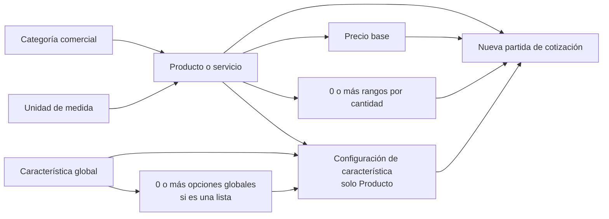
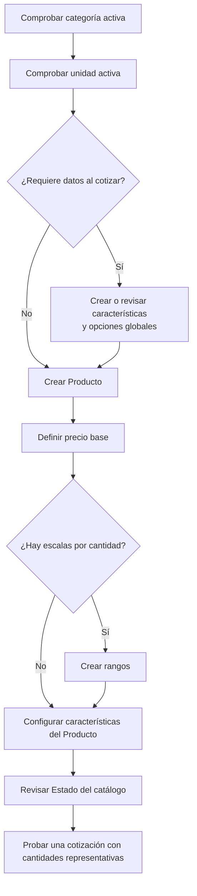
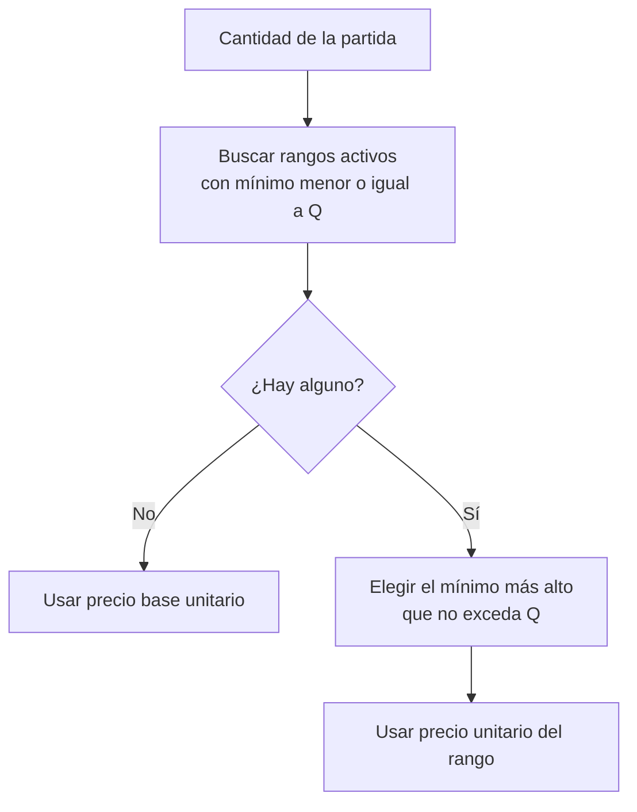

# Manual de usuario — Catálogos de PrintFlow

**Dirigido a:** personal que administra el catálogo comercial y desarrolladores que mantienen PrintFlow.  
**Alcance:** módulo **Catálogos** de la interfaz administrativa: **Estado del catálogo**, **Productos y servicios**, **Categorías comerciales**, **Unidades de medida** y **Características de producto**, incluidos los **precios y rangos** y las características asignadas a cada producto.

> **Cómo usar este manual:** sigue la [guía de inicio rápido](#3-guía-de-inicio-rápido) si vas a dar de alta tu primer producto. Usa las casillas de comprobación del [ejemplo completo](#46-ejemplo-completo-crear-un-producto-con-todas-sus-relaciones) para revisar la configuración antes de cotizar. Los importes del ejemplo son ilustrativos; define precios reales con tu área comercial.

## 1. Introducción y propósito

Un **concepto comercial** es aquello que PrintFlow puede ofrecer en una cotización: un **Producto** o un **Servicio**. Cada concepto tiene un código, un nombre, una categoría, una unidad de venta y un precio base. Puede tener **rangos de precio por cantidad**; los Productos también pueden solicitar **características** al capturar una partida.

El módulo permite administrar esas relaciones desde un solo lugar y revisar su coherencia antes de usarlas en nuevas cotizaciones. Por ejemplo, una lona impresa puede pertenecer a una categoría de impresión, venderse por pieza, solicitar acabado y tener un precio menor a partir de cierta cantidad.

**Conceptos que conviene distinguir:**

| Término | Qué representa | Ejemplo |
|---|---|---|
| **Categoría comercial** | Agrupa productos y servicios para encontrarlos y administrarlos. | Impresión digital |
| **Unidad de medida** | Define cómo se expresa la cantidad vendida y su dimensión. | Pieza (`PZA`), metro cuadrado (`M2`) |
| **Característica global** | Dato reutilizable que se puede solicitar para varios Productos. | Acabado |
| **Opción global** | Valor de una característica de tipo lista. | Mate, brillante |
| **Configuración por Producto** | Decide si la característica es obligatoria y, para listas, qué opciones se permiten en ese Producto. | Acabado obligatorio; solo mate y brillante |
| **Precio base** | Precio unitario cuando no aplica ningún rango activo. | MXN $120.00 por pieza |
| **Rango de precio** | Precio unitario que entra en vigor desde una cantidad mínima. | Desde 100 piezas, MXN $95.00 por pieza |

> **Alcance funcional:** este catálogo define conceptos para vender y cotizar. Los **Materiales** operativos y su inventario pertenecen a otro módulo; crear un Producto comercial aquí no crea automáticamente un material o una lista de materiales.

## 2. Requisitos previos o qué necesitas antes de empezar

1. Una cuenta con acceso a la administración de PrintFlow. Para ver Catálogos se requiere el permiso `catalog.view`. Los botones de creación, edición, precios y características dependen de permisos adicionales; consulta la [referencia técnica](#7-referencia-para-desarrolladores).
2. Una definición comercial: nombre del Producto o Servicio, **código único**, categoría, unidad de venta, descripción y **precio base en MXN**.
3. Si el Producto pide datos al cotizar, una lista de las características necesarias y, para las de tipo lista, sus posibles opciones.
4. Si hay descuentos por volumen expresados como precios unitarios fijos, los umbrales de cantidad y el precio aplicable desde cada uno.
5. Para **Gran formato**, decidir si se cobrará por `M2` y si el cotizador interno debe capturar ancho y alto terminados.

**Antes de crear registros**, usa los buscadores de **Categorías comerciales**, **Unidades de medida** y **Características de producto**. Reutilizar un registro activo evita códigos duplicados y mantiene las cotizaciones consistentes.

## 3. Guía de inicio rápido

1. En el menú lateral, abre **Catálogos → Categorías comerciales**. Busca la categoría adecuada; si no existe, pulsa **Nueva categoría**, completa **Código técnico**, **Nombre** y, si ayuda, **Descripción**; termina con **Crear categoría**.
2. Abre **Catálogos → Unidades de medida**. Busca la unidad de venta; si falta, pulsa **Nueva unidad**, define identidad, dimensión y captura de cantidades; termina con **Crear unidad**.
3. Abre **Catálogos → Características de producto**. Si el Producto necesita datos controlados y aún no existen, crea cada característica. Para **Lista de opciones**, entra en **Configurar → Opciones** y registra sus valores.
4. Abre **Catálogos → Productos y servicios → Nuevo producto o servicio**. Captura la identidad, selecciona **Producto**, categoría, unidad y perfil de cotización, e indica el **Precio base unitario (MXN)**. Pulsa **Crear y continuar**.
5. En **Configuración general**, entra en **Precio y rangos**. Revisa el precio base y añade los umbrales necesarios con **Nuevo rango**.
6. En **Características**, pulsa **Agregar característica → Continuar**, indica si es obligatoria y, si es una lista, selecciona sus opciones permitidas. Repite para cada característica; usa **Ordenar captura** si hay más de una.
7. Vuelve a **General** y verifica categoría, unidad, perfil, precio, cantidad de rangos y características. Después abre **Catálogos → Estado del catálogo → Actualizar diagnóstico** y revisa las observaciones del Producto.

## 4. Instrucciones paso a paso de uso principal

### 4.1 Categorías comerciales

Las categorías organizan los conceptos comerciales. En **Catálogos → Categorías comerciales** puedes **Buscar** por código, nombre o descripción; filtrar por **Estado**; pulsar **Filtrar** o **Limpiar**; y consultar cuántos productos o servicios activos usa cada categoría.

**Para crear una categoría:**

1. Pulsa **Nueva categoría**.
2. Escribe un **Código técnico** único, con letras, números, guion o guion bajo; máximo 40 caracteres. Ejemplo: `IMPRESION_DIGITAL`.
3. Escribe un **Nombre** claro, de hasta 100 caracteres, y una **Descripción** opcional.
4. Pulsa **Crear categoría**. La categoría nueva se agrega al final del orden visible.
5. Si el orden importa, vuelve a la lista y usa **Ordenar categorías**. Desde la fila también puedes **Editar** o cambiar entre **Desactivar** y **Reactivar**, según el estado.

**Regla importante:** una categoría con Productos o Servicios activos no se puede desactivar. Antes, cambia esos conceptos a otra categoría activa o desactívalos. Al crear o editar un concepto solo se pueden asignar categorías activas; la categoría actual puede mostrarse durante una edición aunque haya quedado inactiva.

### 4.2 Unidades de medida

En **Catálogos → Unidades de medida** puedes buscar por código, nombre o símbolo, filtrar por **Dimensión** y **Estado**, consultar el uso activo y acceder a **Ordenar unidades**. La unidad de venta del concepto también aparece junto a los umbrales de precio.

**Para crear una unidad:**

1. Pulsa **Nueva unidad** y completa **Código técnico** único (hasta 30 caracteres), **Nombre** (hasta 80) y **Símbolo** (hasta 20). Ejemplo: `PZA`, Pieza, `pza`.
2. Elige **Dimensión**: **Conteo y presentación**, **Longitud**, **Área**, **Tiempo**, **Volumen** o **Masa**.
3. Si es una unidad derivada convertible, selecciona una **Unidad base** activa de la *misma* dimensión e indica el **Factor hacia la unidad base**. Ejemplo: 1 cm = 0.01 m, por lo que el factor de centímetro hacia metro es `0.01`.
4. Si no necesita conversión, deja **Unidad base** en **Sin unidad base** y el factor en `1`. Las unidades de **Conteo y presentación** no admiten conversión universal.
5. Marca o desmarca **Permitir cantidades fraccionarias**. Ajusta **Precisión de captura** entre 0 y 12 decimales; sin fracciones, la precisión se guarda como 0.
6. Pulsa **Crear unidad**. Si necesitas cambiar el orden, usa **Ordenar unidades** dentro de su dimensión.

La unidad base debe ser una unidad principal: no puede depender a su vez de otra base. No se puede desactivar una unidad usada por Productos o Servicios activos, Materiales operativos activos o unidades derivadas activas. Para reactivar una unidad derivada, su base debe estar activa.

> **Contrato técnico `M2`:** el cotizador reconoce el código `M2` para cobro por metro cuadrado. Esa unidad debe permanecer como base de **Área**, sin unidad base y con factor `1`; su código y conversión aparecen protegidos al editarla.

### 4.3 Características de producto: definición global y opciones

Las características globales se crean una sola vez y pueden reutilizarse en varios Productos. En **Catálogos → Características de producto** puedes buscar por nombre, código o unidad; filtrar por **Tipo de captura** y **Estado**; abrir **Configurar** para ver **General**, **Opciones** y **Productos**; y usar **Ordenar características**.

| **Tipo de captura** | Qué ve quien cotiza | ¿Requiere opciones globales? | Ejemplo |
|---|---|---|---|
| **Lista de opciones** | Selección entre valores permitidos. | Sí: registra opciones y elige al menos una al asignarla al Producto. | Acabado: mate o brillante |
| **Número decimal** | Campo numérico. | No. | Gramaje, ancho |
| **Texto corto** | Campo de texto. | No. | Referencia de color |
| **Sí / No** | Valor binario. | No. | Incluye instalación |

**Para crear una característica:**

1. Pulsa **Nueva característica**.
2. Escribe un **Código técnico** único, de hasta 60 caracteres, con letras, números y guion bajo; un **Nombre visible** único, de hasta 100; el **Tipo de captura**; y, si aporta contexto, una **Unidad visible** de hasta 20 caracteres.
3. Pulsa **Crear característica**. En su pantalla **Configurar**, revisa el tipo y la unidad.
4. Si elegiste **Lista de opciones**, entra en **Opciones → Nueva opción**. Para cada valor registra **Código técnico** único dentro de esa característica y **Nombre visible**. Usa **Ordenar opciones** cuando quieras controlar su presentación.
5. En la pestaña **Productos**, comprueba en qué Productos se usa. El listado permite abrir cada configuración relacionada.

**Ejemplo:** crea la característica `ACABADO` con nombre **Acabado** y tipo **Lista de opciones**; añade `MATE` (**Mate**) y `BRILLANTE` (**Brillante**). No necesitas repetir esas opciones al crear otro Producto: allí seleccionarás cuáles admite.

El **nombre visible** puede cambiar. Mientras una característica esté configurada en Productos, su código, tipo y unidad quedan protegidos. Si ya tiene opciones, tampoco se puede convertir a otro tipo. Una opción permitida en Productos conserva su código técnico. No se puede desactivar una característica u opción utilizada por un Producto activo hasta retirarla de esos Productos.

> **Gran formato:** los códigos `FINISHED_WIDTH_CM` y `FINISHED_HEIGHT_CM` identifican ancho y alto terminados. Son características decimales con unidad `cm`; su código, tipo y unidad forman parte del contrato técnico del cotizador. Mantén esos valores al configurarlas.

### 4.4 Productos y servicios: identidad y relaciones

En **Catálogos → Productos y servicios**, el listado permite **Buscar** por nombre, código, categoría o unidad; filtrar por **Tipo**, **Categoría**, **Unidad** y **Estado**; y entrar en **Configurar**. Cada fila muestra el precio base, los rangos activos, el número de características del Producto y su estado. El filtro inicial muestra registros **Activos**; cambia **Estado** a **Inactivos** o **Todos** si no encuentras uno.

**Para crear un concepto:**

1. Pulsa **Nuevo producto o servicio**.
2. En **Identidad comercial**, captura **Nombre**, **Código**, **Tipo** (**Producto** o **Servicio**) y **Categoría comercial** activa. El código debe ser único, tener hasta 80 caracteres y usar letras, números, puntos, guiones o guiones bajos; se almacena en mayúsculas.
3. En **Uso en cotización**, selecciona la **Unidad de medida** activa y **Especificaciones en cotización interna**: **Sin especificaciones técnicas** o **Gran formato (ancho y alto terminados)**. El perfil de Gran formato afecta la cotización interna (`/admin/cotizaciones`).
4. Captura **Precio base unitario (MXN)** y una **Descripción** opcional. El precio admite hasta dos decimales y puede ser `0.00`, aunque el diagnóstico lo marcará para revisión.
5. Pulsa **Crear y continuar**. PrintFlow abre **Configuración general** del nuevo registro.

Desde **Configurar → General**, usa **Editar información** para cambiar identidad, clasificación, unidad, perfil o descripción. El precio se modifica desde **Precio y rangos**. Las **Características** configurables solo aplican a **Productos**; un **Servicio** puede tener precio base y rangos, pero no esa pestaña. Si intentas cambiar un Producto a Servicio mientras tiene características configuradas, primero debes retirarlas.

**Estado:** usa **Desactivar** cuando no deba ofrecerse en nuevas cotizaciones; **Reactivar** lo devuelve al catálogo disponible. Para reactivarlo, su categoría y su unidad deben estar activas. Los controles de estado piden confirmación.

### 4.5 Precio base y rangos por cantidad

En **Configurar → Precio y rangos** puedes guardar el **Precio base** y crear, editar, desactivar o reactivar rangos. El único tipo de regla disponible en esta pantalla es **Precio por cantidad**: cada rango tiene una **Cantidad mínima** y un **Precio unitario (MXN)**.

**Cómo se elige el precio:** PrintFlow busca el rango **activo** cuya cantidad mínima sea la mayor que no supere la cantidad cotizada. Si no encuentra uno, usa el precio base. El rango fija el precio unitario de *toda* la cantidad de la partida; no divide una misma partida en tramos marginales.

**Para crear rangos:**

1. Verifica el importe de **Precio base**. Si necesitas cambiarlo, escribe el valor y pulsa **Guardar precio**.
2. Pulsa **Nuevo rango**. Indica **Cantidad mínima** mayor que cero, con hasta cuatro decimales, y **Precio unitario (MXN)** con hasta dos decimales.
3. Pulsa **Crear rango**. Repite para cada umbral. No puedes registrar dos rangos con la misma cantidad mínima para el mismo concepto, aunque uno esté inactivo.
4. En la tabla **Rangos de precio**, revisa **Aplica desde**, **Precio unitario** y **Estado**. Usa **Editar** para corregir un umbral o importe; **Desactivar** para dejar de aplicarlo en nuevas cotizaciones; **Reactivar** para volver a usarlo.

**Ejemplo con unidad `PZA`:** precio base MXN $120.00; desde 10 piezas, MXN $110.00; desde 100 piezas, MXN $95.00.

| Cantidad cotizada | Regla elegida | Precio unitario | Importe de cantidad × precio, antes de otros ajustes |
|---:|---|---:|---:|
| 1 | Precio base | MXN $120.00 | MXN $120.00 |
| 9 | Precio base | MXN $120.00 | MXN $1,080.00 |
| 10 | Desde 10 | MXN $110.00 | MXN $1,100.00 |
| 50 | Desde 10 | MXN $110.00 | MXN $5,500.00 |
| 100 | Desde 100 | MXN $95.00 | MXN $9,500.00 |
| 120 | Desde 100 | MXN $95.00 | MXN $11,400.00 |

> **Importante:** estos rangos son precios unitarios del catálogo. Los descuentos, impuestos y demás ajustes de una cotización pertenecen a sus propios flujos y pueden cambiar el total final. Si desactivas el rango de 100, una cantidad de 120 usará el rango activo de 10; si desactivas todos, usará el precio base.

### 4.6 Ejemplo completo: crear un producto con todas sus relaciones

**Caso ilustrativo:** **Lona promocional por pieza**, código `LONA-PROMO-PZA`, categoría **Impresión digital**, unidad **Pieza (`PZA`)**, precio base MXN $120.00, acabados **Mate** y **Brillante**, con rangos desde 10 y 100 piezas.

- [ ] **Preparar categoría.** En **Categorías comerciales**, busca **Impresión digital**. Si no existe, crea `IMPRESION_DIGITAL` y confirma que esté activa.
- [ ] **Preparar unidad.** En **Unidades de medida**, busca `PZA`. Si no existe, crea **Pieza** con símbolo `pza`, dimensión **Conteo y presentación**, **Sin unidad base**, factor `1`, sin fracciones y precisión `0`.
- [ ] **Preparar característica.** En **Características de producto**, busca **Acabado**. Si no existe, crea `ACABADO` como **Lista de opciones** y registra `MATE` y `BRILLANTE`. Comprueba que la característica y ambas opciones estén activas.
- [ ] **Crear Producto.** En **Productos y servicios → Nuevo producto o servicio**, captura nombre, código, **Tipo: Producto**, categoría, **Unidad de medida: PZA**, **Especificaciones en cotización interna: Sin especificaciones técnicas**, descripción y **Precio base: 120.00**. Pulsa **Crear y continuar**.
- [ ] **Revisar General.** Verifica que los datos recién guardados correspondan al producto deseado.
- [ ] **Crear rangos.** En **Precio y rangos → Nuevo rango**, registra **10** a **110.00** y **100** a **95.00**. Confirma que ambos estén **Activos**.
- [ ] **Asignar característica.** En **Características → Agregar característica**, elige **Acabado** y pulsa **Continuar**. Marca **Solicitar esta característica obligatoriamente al cotizar**, selecciona **Mate** y **Brillante**, y pulsa **Configurar característica**.
- [ ] **Validar.** Regresa a **General**. Debes ver **2 rangos activos** y **1 característica configurada**. Abre **Estado del catálogo**, pulsa **Actualizar diagnóstico** y revisa cualquier observación. Después prueba cantidades **1**, **10** y **100** en una cotización para verificar el precio unitario esperado y la captura de **Acabado**.

**Si el Producto se cobra por superficie:** utiliza una unidad `M2` correctamente configurada y el perfil **Gran formato (ancho y alto terminados)**. En la cotización interna se capturan ancho y alto terminados en centímetros; el área se calcula como `ancho_cm × alto_cm / 10 000`. Con unidad `M2` y modo de cantidad automático, esa área determina la cantidad a la que se aplica el precio y el rango. En modo manual se usa la cantidad capturada. Configura también `FINISHED_WIDTH_CM` y `FINISHED_HEIGHT_CM` como características del Producto para mantener alineado el catálogo; el diagnóstico avisa si faltan, aunque el perfil todavía solicita las medidas.

### 4.7 Estado del catálogo: revisión final

Abre **Catálogos → Estado del catálogo** y pulsa **Actualizar diagnóstico** después de cambios importantes. El diagnóstico es **de solo lectura**. Muestra totales de **Incompletos**, **Atención**, **Sin uso** y **Sin observaciones**; permite filtrar por **Catálogo** y **Estado** y enlaza con el registro que requiere revisión.

- **Incompleto:** inconsistencia que puede impedir o degradar el uso, como una lista sin opciones activas, una unidad técnicamente inconsistente o un Producto activo con dependencia inactiva.
- **Atención:** configuración válida que merece comprobación, como precio base `0.00`, Producto sin características o perfil Gran formato sin las características técnicas asociadas.
- **Sin uso:** registro activo que aún no participa en un flujo conocido. Puede ser intencional; revísalo antes de tomar medidas.

La ausencia de observaciones confirma que el diagnóstico actual no detectó sus reglas conocidas. **Prueba también una cotización** para verificar el comportamiento comercial esperado.

## 5. Preguntas frecuentes (FAQ)

### 1. No encuentro un Producto que sé que existe. ¿Qué hago?

En **Productos y servicios**, cambia **Estado** de **Activos** a **Todos**, pulsa **Limpiar** y busca por nombre o código. Comprueba también los filtros **Tipo**, **Categoría** y **Unidad**. Si está inactivo, abre **Configurar** y revisa si procede **Reactivar**.

### 2. No aparece la categoría o la unidad al crear el Producto.

Comprueba que el registro exista y esté **Activo**. El formulario de alta ofrece categorías y unidades disponibles activas. Si no existe, créalo en su catálogo; si está inactivo, reactívalo tras resolver sus dependencias.

### 3. No puedo desactivar una categoría, unidad, característica u opción.

Revisa su columna **Uso** o su pestaña **Productos**. PrintFlow protege los registros usados por elementos activos. Cambia o desactiva primero los conceptos dependientes; para una opción o característica, retírala de los Productos activos antes de desactivarla.

### 4. El precio de la cotización no coincide con el precio base.

Abre **Configurar → Precio y rangos** y compara la cantidad cotizada con los mínimos de los rangos **Activos**. Se aplica el mínimo más alto que no excede la cantidad. Si es Gran formato por `M2`, revisa además si la cantidad viene del área calculada o de captura manual. Verifica por separado descuentos, impuestos y otros ajustes de la cotización.

### 5. Aparece «Ya existe un rango con esta cantidad mínima».

Busca el mismo mínimo en la tabla **Precio y rangos**, incluidos los rangos **Inactivos**. **Edita** ese rango o elige otro umbral; desactivarlo no libera la cantidad mínima para un segundo registro del mismo concepto.

### 6. No puedo configurar una característica de lista porque pide opciones permitidas.

En **Características de producto → Configurar → Opciones**, crea o reactiva al menos una opción. Luego vuelve a **Productos y servicios → Configurar → Características** y selecciona una o más **Opciones permitidas**. Para características de número, texto o Sí/No, este paso no aplica.

### 7. El botón **Precio y rangos**, **Nueva característica** o **Agregar característica** no aparece.

Puede faltar el permiso correspondiente. Solicita a quien administra los accesos que compruebe `catalog.items.update_price`, `catalog.characteristics.manage` o `catalog.items.configure_characteristics`. **Agregar característica** solo aparece para registros de tipo **Producto**.

### 8. ¿Por qué no puedo cambiar el código, tipo o unidad de una característica?

La definición queda protegida cuando se usa en Productos. Los códigos `FINISHED_WIDTH_CM` y `FINISHED_HEIGHT_CM` además forman parte del contrato técnico de Gran formato. Ajusta el **Nombre visible** si solo necesitas mejorar la etiqueta; si el cambio técnico es necesario, revisa primero las configuraciones dependientes.

### 9. ¿Qué significa que **Estado del catálogo** marque «Sin uso» o «Atención»?

**Sin uso** indica un registro activo sin uso conocido; **Atención** señala una configuración válida que merece revisión. Abre la observación y comprueba su contexto. No son instrucciones automáticas para borrar o desactivar registros.

## 6. Seguridad y buenas prácticas

- Asigna permisos por función: consulta, creación, administración de precios y configuración de características pueden darse por separado. Los cambios de precio deben quedar en manos de personal autorizado.
- Usa **códigos técnicos estables y únicos**. Evita reciclar códigos para un significado diferente: características, unidades y reglas del cotizador pueden depender de ellos.
- Define primero categoría, unidad y opciones; después crea el Producto. Mantén activas sus dependencias mientras se use en nuevas cotizaciones.
- Antes de publicar un precio, revisa **moneda MXN**, unidad de venta, mínimos, importes y si cada rango está activo. Comprueba cantidades justo **antes**, **en** y **después** de cada umbral.
- Usa **Desactivar** para retirar un concepto de nuevas cotizaciones cuando sea apropiado; revisa el impacto sobre registros relacionados antes de cambiar estados.
- Tras editar una característica o su nombre visible, comprueba los Productos que la usan y prueba una captura de cotización. Si es **Gran formato**, conserva el contrato `M2`, `FINISHED_WIDTH_CM` y `FINISHED_HEIGHT_CM`.
- Revisa **Estado del catálogo** y una cotización de prueba después de una alta o un cambio relevante. El diagnóstico ayuda a detectar inconsistencias, pero la prueba confirma el resultado comercial.

## 7. Referencia para desarrolladores

Esta sección conecta las instrucciones con la implementación. La interfaz es la referencia para usuarios finales; el código define las validaciones exactas y sirve al mantener integraciones.

### 7.1 Modelo y rutas

| Concepto | Entidad principal | Ruta administrativa |
|---|---|---|
| Estado del catálogo | `CatalogHealthEvaluator` / reporte | `/admin/catalogo` |
| Productos y servicios | `CommercialItem` | `/admin/catalogo/conceptos` |
| Categorías comerciales | `CommercialCategory` | `/admin/catalogo/categorias` |
| Unidades de medida | `MeasurementUnit` | `/admin/catalogo/unidades` |
| Características globales y opciones | `CommercialCharacteristic`, `CommercialCharacteristicOption` | `/admin/catalogo/caracteristicas` |
| Configuración por Producto | `CommercialItemCharacteristic`, `CommercialItemCharacteristicOption` | `/admin/catalogo/conceptos/{item}/caracteristicas` |
| Rangos de precio | `ItemPriceRule` | `/admin/catalogo/conceptos/{item}/rangos-precio` |

La definición global de característica y sus opciones es independiente de la relación con cada Producto. Esa relación guarda la obligatoriedad, el orden de captura y las opciones permitidas. Los rangos de un concepto son únicos por **concepto + tipo de regla + cantidad mínima** y se activan/desactivan, sin eliminación desde la pantalla.

### 7.2 Permisos y reglas clave

| Permiso | Acción |
|---|---|
| `catalog.view` | Consultar listados, configuraciones y diagnóstico. |
| `catalog.categories.manage` | Crear, editar, ordenar y cambiar estado de categorías. |
| `catalog.units.manage` | Crear, editar, ordenar y cambiar estado de unidades. |
| `catalog.characteristics.manage` | Administrar características globales y opciones. |
| `catalog.items.create` | Crear Productos o Servicios con precio base inicial. |
| `catalog.items.update` | Editar información general de Productos o Servicios. |
| `catalog.items.update_price` | Modificar precio base y rangos. |
| `catalog.items.configure_characteristics` | Asignar, configurar, ordenar o retirar características de Productos. |
| `catalog.items.toggle_status` | Desactivar o reactivar Productos o Servicios. |

Los formularios validan códigos únicos y formato de importes; los gestores comprueban dependencias activas y contratos técnicos. El resolvedor de precio selecciona el rango activo aplicable de mayor mínimo y usa el precio base si no hay coincidencia. Las operaciones de administración relevantes registran cambios mediante el servicio de auditoría. El perfil de especificaciones de una partida interna es `NONE` o `LARGE_FORMAT`.

**Puntos de entrada en el repositorio:**

- [Controladores de Catálogos](../src/Controller/Admin/Catalog/) y [plantillas de Catálogos](../templates/admin/catalog/).
- [Formularios](../src/Form/Admin/Catalog/) y [datos/gestores de aplicación](../src/Application/Catalog/).
- [Entidades del catálogo](../src/Entity/Catalog/), [repositorios](../src/Repository/Catalog/) y [enumeraciones](../src/Enum/Catalog/).
- [Resolución de especificaciones de cotización](../src/Application/Quotations/QuotationItemSpecificationResolver.php) y [contrato de características técnicas](../src/Application/Catalog/CommercialCharacteristicTechnicalContract.php).

> **Nota de mantenimiento:** hay un resolvedor `CatalogPriceResolver` en `src/Service/Catalog/`; el flujo de cotización revisado inyecta `CommercialItemPriceResolver` desde `src/Application/Catalog/`. Al modificar precios, verifica el flujo llamador y sus pruebas antes de asumir que ambos servicios tienen el mismo uso.
